# 另类融资演算:对 Tiny、Indie 和 Earnest 的定量比较

> 原文：<https://medium.com/swlh/alternative-funding-calculus-a-quant-comparison-of-tiny-indie-and-earnest-8d61d35d5ad5>

Photo by [Erol Ahmed](https://unsplash.com/photos/aIYFR0vbADk?utm_source=unsplash&utm_medium=referral&utm_content=creditCopyText) on [Unsplash](https://unsplash.com/search/photos/math?utm_source=unsplash&utm_medium=referral&utm_content=creditCopyText)

在之前的中，我描述了新一波的资金来源正在涌现。今天，我们将把一个名为“Array”的虚构初创公司放在显微镜下，考虑一个筹资策略，并根据公开的条款清单比较从三个替代基金筹集资金的财务结果。

*注:本帖于 2019 年 5 月 23 日使用新版* [*峰会*](https://usesummit.com) *进行了修订，修正了 Earnest Capital 之前计算“创始人收益”的条款。感谢*[*Tyler Tringas*](https://medium.com/u/8d56c3254158?source=post_page-----8d61d35d5ad5--------------------------------)*认真资本的澄清。*

I **magine 你有了自己的初创公司:Array，**一款面向分布式团队的视频会议工具。你对这个问题有一种真正的热情，因为你(像其他人一样)知道每一个现有的网络会议解决方案都很糟糕。更好的是，您已经解决了真正的症结所在，这需要使用 C++重写标准 WebRTC 库的一部分。这意味着这个想法是目前大多数网络开发孩子无法接受的*方式*。这很好，因为你对超过你想要的速度不感兴趣。

这样你就有了一个有技术护城河的真正的产品。Array 还有什么好的地方？让我们细数一下。

你对设计和用户界面/UX 的突破如此兴奋，以至于你计划**对这项服务收取比 GoToMeeting 等其他解决方案更高的费用**。每个团队每月 299 美元(最多 10 个用户)听起来不错。也就是说，你不打算卖给企业，因为他们会要求你不想做的事情，对你来说，习惯是令人厌恶的。

你和你的联合创始人都是技术人员，但你不认为营销是一个肮脏的词，所以你花了相当多的时间保护你的才华横溢的沃兹不受任何此类干扰。

产品？检查。定位？检查。[团队](/swlh/hack-hustle-and-bundle-potent-teams-in-vulnerable-markets-d16f33e8dc9c)？检查。

E **对阵的早期反应一直是积极的。**每月有 150 多名潜在客户访问您的网站并注册订阅您的简讯。早期用户(享受免费试用)已经为你的下一个主页写了推荐信。你刚刚写了一篇杀手级的内容营销文章，用 8 页纸简洁地解释了为什么分布式团队是未来，因为未来主义者的分布式团队实际上更平均地分配了未来。而你的产品，是做那个的。*哇！*人见人爱。

生活是美好的，但考虑到你的目标是自由地专注于这项事业，你会感到有点停滞不前——Array 每年赚不到 20 万美元到 30 万美元(ARR ),这是你和你的联合创始人及家人的衣食住行所需的费用。因此，你正在认真考虑一些新的、对创业者友好的融资选择，如 [Tiny Seed](https://tinyseed.com/) 、 [Indie.vc](http://www.indie.vc/) 和 [Earnest Capital](https://earnestcapital.com/) 。

但是在你参与之前，你想知道——你真正要付出什么代价，要怎样才能挣脱束缚？自举是不是更好？一套术语会比另一套更适合你吗？知道总有一些给予和索取，哪些条款值得你关注？

到 **在决定阵列的最佳融资形式时，您要考虑两个因素:您的上市速度和您的盈利能力。**

速度分析:拿钱可以让你走得更快，毫无疑问。另一方面，你不确定你有没有加快速度去实现你的梦想。你的神秘的低级护城河足够宽，一个暴发户不会轻易过来偷走这个机会。也就是说，像 Slack 这样的大型创新企业——其视频工具在你的目标组织中被广泛使用，如果他们采取主动，可能有能力和手段推出杀手级产品。

**速度裁决:**我们可能有强大的防御来自周末暴发户，但我们应该在现任者将阵列作为杀手级功能包括在他们的市场内平台之前进入市场。

**其次，你考虑盈利能力。**如果你打算将现有公司挤出市场，你需要大规模地投入大量的营销和公关资金。这将保持利润薄，直到你占主导地位。你还需要更强大的竞争优势——吸引数百万用户并把他们从现有服务中带走。也许是比更好的体验更有力量的东西？你不确定那是什么，但有可能吗？当然，也许吧。如果是这样的话，一个更大的产品团队，再加上一两个成长黑客，将是必要的……也是昂贵的。

另一方面，这个市场的本质不是赢家通吃，至少现在不是。你应该花费数百万去实现它吗？你可以，但你必须去实现你的梦想吗？你能建立一些令人兴奋的盈利的东西，而不是以最高的可能比率获得客户吗？你能平衡这些并感到满足吗？

**利润裁决:**你的软件将处于溢价点，这意味着如果你成功，你的单位经济将是健康的。有了这个假设和速度判断(你没有*达到荒唐的速度)，你决定适度获利——不把每一分钱都投入到业务中以尽可能快的速度增长——可能是有意义的。*

考虑到这一策略，您可以通过创建一个 2 年增长预测来比较融资选项，该预测使用您当前的每月邮件列表注册数(155)、估计转换率(5-15%)、团队规模(2)、当前 MRR(2，400 美元)、固有产品病毒率(k=1.0)和目标价位(每月 99-499 美元，每年 20%的时间计费，每月 80%)。你不用打开 Google Sheets 或 Excel，而是使用 [Summit](https://usesummit.com) 来完成繁重的工作。

你要回答的第一个问题是，你应该筹集多少现金。您将“Bootstrapping”设置为您的融资模型，这将假设您只有 10，000 美元的现金余额可以使用。

基于这些输入的 24 个月现金预测:

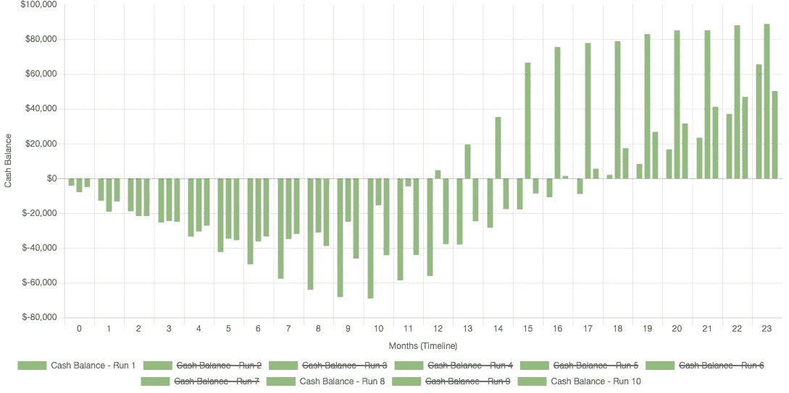

该预测包含 10 次运行，代表了市场时机和势头的范围(整体)(因为事情从来不会按照计划进行)。此图中的 3 次运行代表弱-中-强传播。

解释一下这张图表:如果你和你的联合创始人下个月全职工作，税前工资为 10 万美元，你的银行账户将在大约 8 到 10 个月内跌至大约负 7 万美元。这是假设你的假设都不乐观。

同时，在这些情景中，您的净收入显示收支平衡发生在第 9-12 个月之间(紫色区域移动到 0 美元以上):

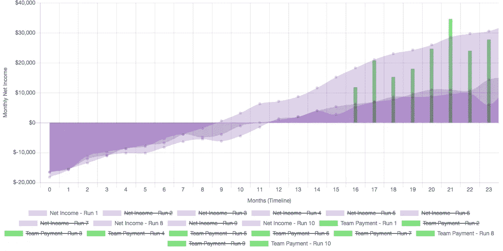

绿色的长条是给你的团队的分红，是地平线上希望的纪念碑。

最后，收入，显示所有 10 次运行，以说明异常值与一致值:

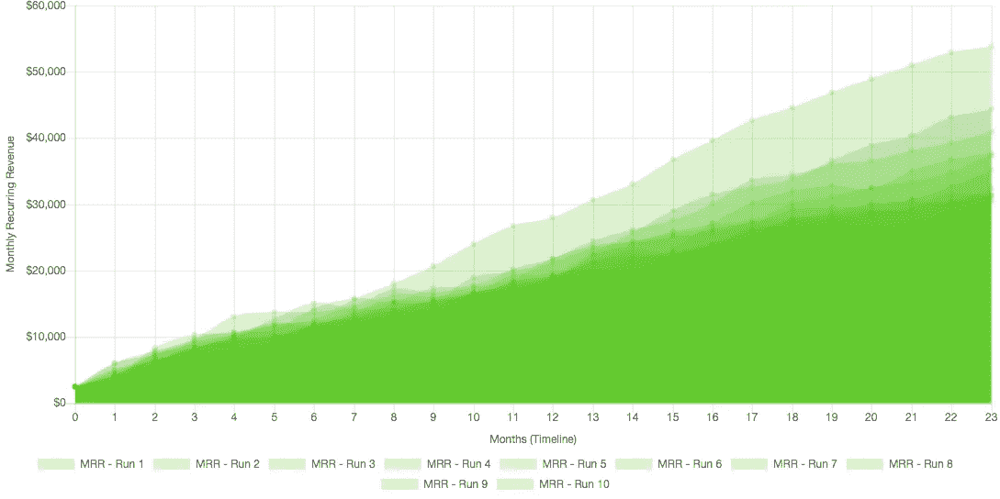

不是曲棍球棒，但在最好的情况下，你的 ARR 略高于$ 600，000，在最差的情况下，你的 ARR 为$ 360，000，表现并不糟糕。平均价格约为 40 万美元。在这种情况下，你会有利润来支付股息，或者雇佣帮手。在任何情况下，你都活着，都在成长——如果你能走到那一步的话。

如果负 70，000 美元是最低点，从替代资金来源筹集 100，000-150，000 美元可能是有意义的。让我们比较一下从每个人身上拿走 14 万美元:

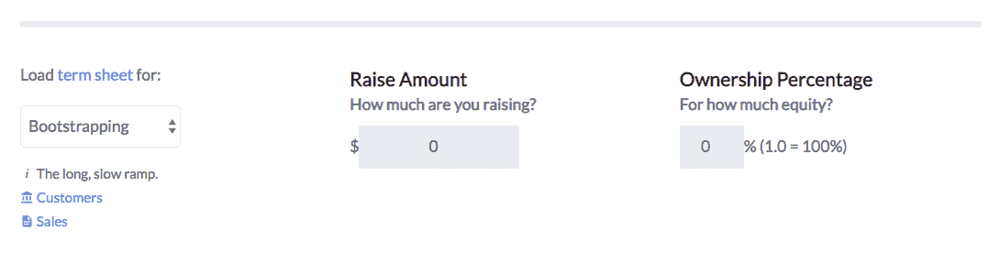

**Source**: SimSaaS

## 细小的

更多的现金应该可以让你快速增长，但为了保持保守，你决定保持几乎相同的增长假设，首先选择 TinySeed 并输入 14 万美元以获得 12%的所有权。他们的条款也让 TinySeed 有资格获得分红，就像你的团队一样。例如，如果您选择支付 100，000 美元作为股息(就[美国]税收目的而言，比收入更好)，您将获得 88，000 美元，TinySeed 将获得 12，000 美元的差额。

你决定做出的一个改变是:有了新的现金，你将把你每月预算的 10%(非可变开支)分配给付费的潜在客户收购，估计 CPA 为 50 美元，把潜在客户推到你的漏斗顶端，以提高 ARR(和你自己的稀释回报):

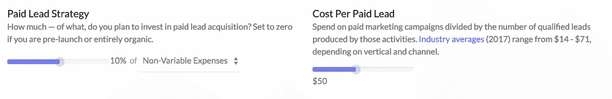

假设你在达到盈利之前不分红，假设你只有在超过 3 个月的费用时才分红，未来看起来是这样的:

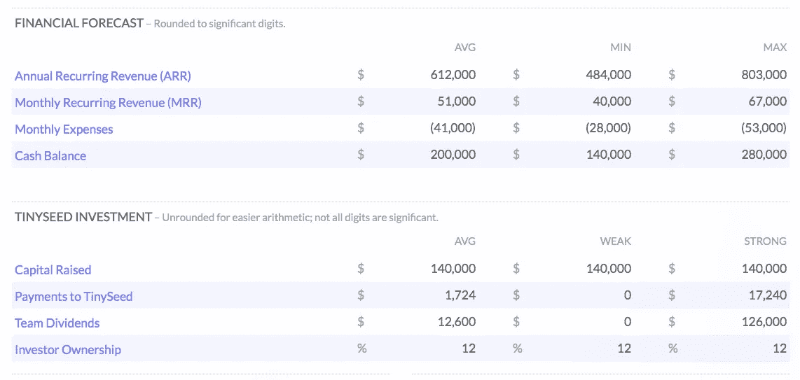

使用上述策略——即使在盈利和获得动力的情况下，也要保持业务有 3 个月的现金供应，在一般情况下，你向你和你的队友支付了 12，600 美元，同时向 TinySeed 支付了 1，724 美元，这是他们原始投资的 12.3%。在弱势情况下，即您仍在进行 475，000 美元以上的 ARR 业务，您选择支付 0 美元以节省现金。强情形是弱情形在数值上令人满意的 10 倍。

当然，你的现金预测看起来要好得多；在所有情况下，你都可以挺过“低谷”:

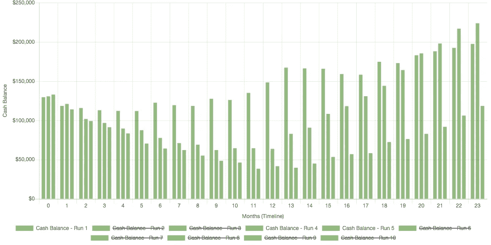

## 真实资本

太好了。到目前为止一切顺利。你再运行一次，使用保证金作为资金来源，就像这样:

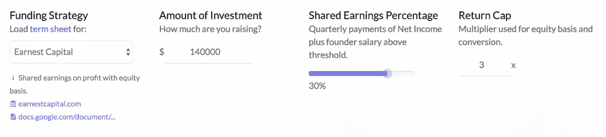

使用相同的支付红利的逻辑，盒子分数结果是:

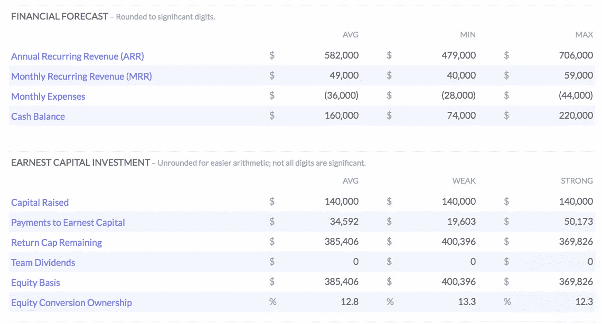

举例来说，以下是净收入背景下向 Earnest(深绿色)付款的时间:

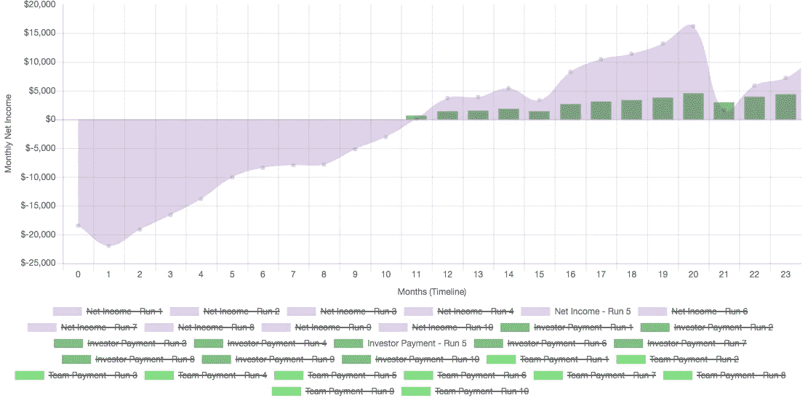

NOTE: Earnest’s terms specify payments on a Quarterly schedule (Monthly shown here).

你现在可以看到，尽管在相同的框架下推出，并向相同的受众进行营销，但这两种替代风险投资的资金来源在运营融资方面有很大不同。

按编号绘画:

*   一般情况下，你向 Earnest 支付的费用是 34，000 美元，而向 TinySeed 支付的费用约为 2，000 美元。
*   3x 回报上限的余额(14 万 x 3 = 42 万美元)为 38.5 万美元。
*   从绝对意义上来说，团队红利很小，但仍然值得注意——0k 美元(认真的)对 12k 美元(微不足道的)。
*   Earnest 的“股本基础”为 38.5 万美元。
*   向 Earnest 支付的款项已将他们的可转换所有权降至 12.8%，这是基于将他们的股权基础转换为 300 万美元的估值上限(从普通条款清单中提取)。

他们的股本基础会缩水到什么程度？根据他们的条款，他们的股份将以 14 万美元(他们的初始投资额)除以条款清单中的估值上限。因此，在你全额支付 42 万美元的上限后，14 万美元作为他们股权基础的下限将使他们最终获得 4.6%的剩余股份。

## Indie.vc v3

带着这些权衡，你转而求助于西雅图另类融资模式的先驱:Indie.vc。

你考虑从[Bryce](https://medium.com/u/510b99e51849?source=post_page-----8d61d35d5ad5--------------------------------)and company 筹集 14 万美元，就像这样:

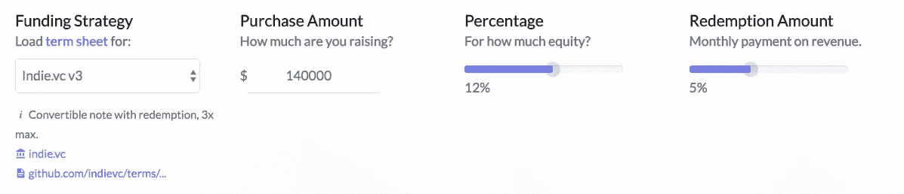

用同样的增长假设预测未来，记分牌看起来是这样的:

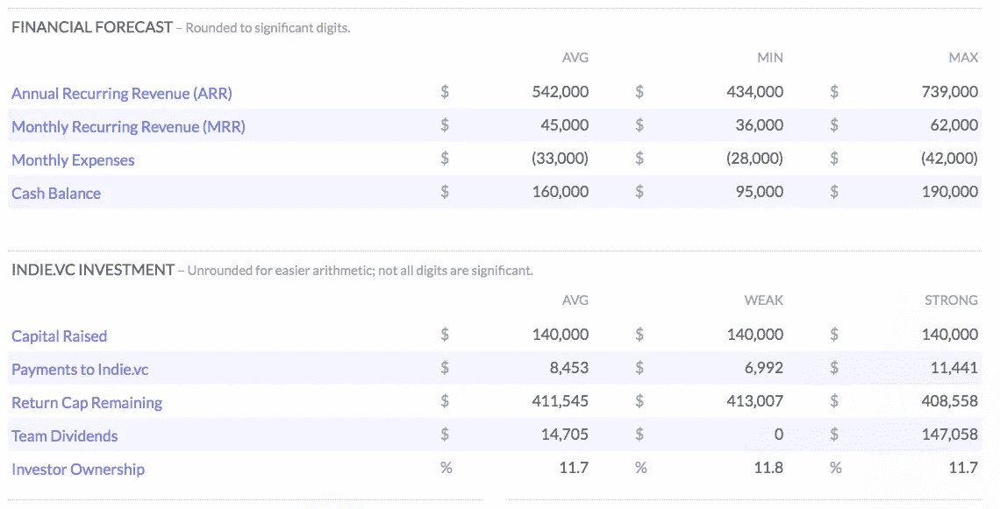

在一般情况下，Indie 收到了 8，453 美元，而团队收到了 14，705 美元。Indie 条款中的赎回条款将他们的所有权从最初的 12%缩减到了 11.7%。

**那些赎回款项呢？**它们定期发生，每月一次，在每笔交易规定的一段时间后发生，通常在投资后 20-24 个月，如下所示:

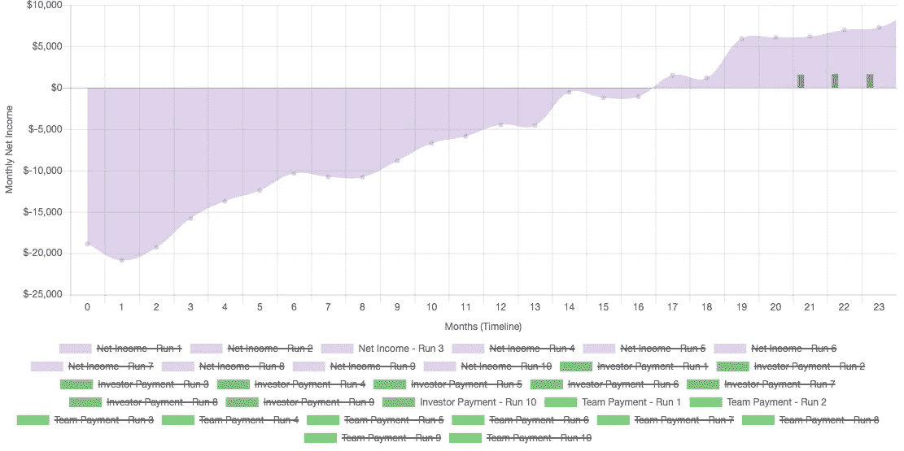

因为我们着眼于 24 个月的时间框架，付款只是开始窥视预测。这些将继续，直到独立的 3 倍回报上限，在这一点上，他们将保留非常小的剩余股份 1.2%。

## 决策时间

在申请这些基金的数千名创始人中，很少有人(如果有的话)有机会在多个报价中进行选择，但了解这些报价之间的权衡可以帮助你决定什么对你最重要。

就公平性而言——双方都在同一区域，但方向不同。在他们的回报上限达到后，Indie 将拥有 1.2%，Earnest 4.6%。与此同时，在没有回报上限的情况下，TinySeed 的持股比例保持在 12%。

在现金方面，事情与直觉相反，并没有完全逆转:TinySeed 在最初两年确实是最便宜的选择，作为投资者获得的美元最少，而你为你的团队获得的比 Earnest 或 Indie 更多。但与此同时，剩余股权排名第二的 Earnest 在所有场景中获得了最多的现金——3.4 万美元，而 Indie 只有 8 万美元。

当然，考虑到相同的原始投资和回报上限，Indie 和 Earnest 的上限将为 42 万美元，而 TinySeed 不会。TinySeed 从其 12%的股份中获得的累计收入将继续增长，而 Earnest 和 Indie 的持股将受到限制。如果阵列*是*的下一个大本营，这种差异将以每年数百万美元来衡量。这是一个重大的权衡。

但是，Earnest 和 Indie 要求的短期额外支出会阻碍你成为下一个大本营吗？Indie.vc 通过将还款时间推迟 18-24 个月来解决这一问题。Earnest 没有。

那么你的决定是什么？有了有效的法定货币和导师圈，这三只基金都是可行的工具，可以让 Array 去你梦想去的地方，但差异是真实的:Indie.vc 允许在延迟还款的同时最大化你的所有权，TinySeed 要求零现金还款，代价是最长期的股权和现金(在盈利成功的情况下)，而 Earnest 提供了一种混合，以早年最高的现金支出为代价减少他们的所有权。

对于不介意额外预付现金的最激进的创始人，Earnest 提供了一种所有权减少机制；对于那些这样做的人来说，TinySeed 和 Indie.vc 是强有力的选择，因为他们的现金支出在早期更少，薪酬触发因素更高或根本不存在。对于微不足道的创始人来说，在种子期后、退出前阶段，这将以现金为代价。与此同时，如果你计划筹集一轮资金，Indie.vc 的赎回计划提供了最低的长期股权成本。

你已经做了决定。

*感谢阅读。* [*Summit*](https://usesummit.com) *，这个用来运行这种分析的工具，现在对创业者免费开放。*

## 这篇文章发表在 [The Startup](https://medium.com/swlh) 上，这是 Medium 最大的创业刊物，拥有+421，678 名读者。

## 在此订阅接收[我们的头条新闻](https://growthsupply.com/the-startup-newsletter/)。

