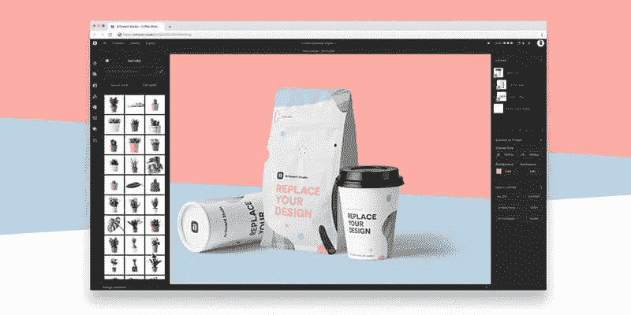

# Photoshop 的替代品

> 原文：<https://medium.com/swlh/alternatives-to-photoshop-de49d944a493>

自从摄影发明以来，我们一直想编辑我们的照片，以展示现实的最佳版本#livingmybestlife。无论是出于平面设计的目的，在风景中添加一个假的塑料飞碟，还是为了拍摄尼斯湖水怪的罕见镜头，照片操纵已经存在很长时间了。编辑照片曾经是一项困难、耗时且技术性很强的任务。它需要颜料、喷枪、放大镜和稳定的手，以及大量的练习和大量的设备。在 2019 年，只需几次点击(或滑动)就可以以以前不可想象的方式改变和操纵任何图像。

最近“photoshopping”名声不佳。模型、风景、产品和历史照片的改变增加了“错误信息的传播”#fakenews。正如埃德加·爱伦·坡曾经说过的，“不要相信你听到的，也不要相信你看到的一半。”他还在将近 20 岁的时候娶了这个 13 岁的表妹，所以随你便吧。

在过去的日子里，业余爱好者和专业人士都不得不支付超过 700 美元，才能得到他们手中的花哨的照片编辑软件(或找到其他方式“获得”)。眨眼、眨眼、轻推、轻推)。Adobe Photoshop 现在每月只需 10 美元，很便宜。也就是说，如果你的预算没有那么多，还有很多免费的选择。

# 很多选择

以下五个工具是 Adobe Photoshop 的绝佳替代品。大多数提供了一个全面的选项列表，让你以多种不同的方式改变你的图像。虽然像任何好的照片处理程序，准备好一点学习曲线！

# [草图](https://www.sketchapp.com/)

*   1 台设备每年 99 美元
*   30 天[免费试用](https://www.sketchapp.com/get/)

Sketch 是多年来最被炒作的专业设计软件，是一个非常真实的挑战者。Sketch 是一款超轻量级的应用程序，在过去的两年里，通过改进用户工作流程和简化界面，它的市场份额一直在快速增长。许多设计师现在都使用 Sketch 来代替 Photoshop 和 Illustrator，这对 Adobe 来说可能相当麻烦。随着工具的丰富，矢量编辑和设计社区中牵引力的增加，监控草图将会变得很有趣。郑重声明，我们还没有做好尝试的准备:)。

Sketch’s super easy to use interface.

# [GIMP](https://www.gimp.org/)

*   自由的

虽然听起来有点淘气，但 GIMP 实际上是现有的最佳替代照片处理选项之一。这个免费的开源程序最初是为 Linux 创建的，但现在可以在大多数操作系统上愉快地运行。事实上，任何可以在 Adobe Photoshop 中完成的东西都可以在 GIMP 中复制，然而，这个界面并不适合胆小的人，需要参考大量的帮助文档。然而，它是免费的，所以至少当你花一个小时想出如何做一个正方形时，你可以把省下来的 10 美元花在咖啡/酒上。

# [照片发布专业版](https://www.photopos.com/PPP3_BS/Default.aspx)

*   自由的

就像 GIMP 一样，Photo POS Pro 可以下载到您的平板电脑、笔记本电脑或 PC 上。不像 GIMP，它有一个友好的，易于使用的界面，开放给休闲摄影师以及严肃的平面设计人员使用。Photo Pos Pro 主要用于修改照片，它提供了基本照片编辑软件所能提供的一切。

# [Pixlr 编辑](https://pixlr.com/)

*   自由的
*   高级:Pixlr 专业版

Pixlr 是另一个有用的选择，可以作为移动应用程序使用，也可以在浏览器中使用。它提供了简单的改变工具，如梯度，红眼修正和分层，所有这些都在一个友好的界面中。Pixlr 有付费和免费版本，如果用户愿意，可以升级到更全面的体验。更重要的是，如果你熟悉 Photoshop，你会发现许多用户界面的相似之处，使过渡更容易一些。

Pixlr website.

# [光眼](https://www.photopea.com/)

*   自由的
*   每月 9 美元起的高级订阅服务

这款基于浏览器的工具非常适合需要在旅途中编辑照片的摄影师或无法使用 Photoshop 的旅行者。它拥有 Photoshop 照片编辑技巧的核心功能，并使用类似的工作流程，使其成为特定 Photoshop 任务的完美替代品。

# [墨景](https://inkscape.org/)

*   自由的

与 GIMP 非常相似，Inkscape 是一个可以下载的跨平台程序。与列表中的其他工具相比，Inkscape 更适合平面设计师，而不仅仅是摄影师。它允许在一个熟悉、舒适的布局中进行文本、对象操作。

# [画板工作室](https://artboard.studio/)

*   永远免费
*   每个项目支付:每月 19 美元
*   设计师计划:每月 49 美元

如果你用 Photoshop 制作产品模型，Artboard Studio 可能会盗用你的用法。Artboard 是一个用于创建产品模型的在线图形设计应用程序。作为一款轻松的软件，Artboard 让制作推广横幅广告一直到社交媒体图片变得轻而易举。

# 快捷方便的工具

也许你已经有了 Adobe Photoshop 或类似的程序，但是，它们可能很费时间，而且掌握它们需要很长的学习时间(GIMP 我正看着你)。当你只想快速完成一项工作时，你可以使用一些简单易用的在线工具。

# [Remove.bg](https://www.remove.bg/)

*   高达 400 万像素的免费图像
*   个人专业:每月 9 美元，25 张高清图片
*   初级专业版:150 张高清图片每月 39 美元
*   专业版:900 张高清图片每月 219 美元
*   商务专业版:4500 张高清图像每月 749 美元

这款基于浏览器的工具完全按照 tin 上显示的那样，移除背景。不要在蒙版和颜色选择上浪费时间，只需上传一张图片并删除即可。值得一提的是，结果很大程度上取决于你上传的图片质量。

# 【TinyPNG.com 号

*   每月前 500 张图片免费
*   接下来 9，500 次图像压缩，每张图像 0.009 美元
*   经过 10，000 次图像压缩后，每张图像 0.002 美元

继续不言自明的标题主题(这是一些很好的 SEO ), TinyPNG 是一种快速有效的方法，只需点击一个按钮就可以减小文件大小。它适用于 [JPG 的](https://tinyjpg.com/)和巴布亚新几内亚的，并且已经成为我们的“首选”工具之一。

# [VSCO](https://vsco.co/)

*   自由的
*   每年 19.99 美元的 VSCO 会员资格

VSCO 是由摄影师为摄影师设计的应用程序，提供免费和付费版本，允许用户增强和编辑他们的照片。这是使用最广泛的照片编辑应用程序之一，有大量的预设滤镜来模仿旧的电影/相机类型，并创建专业的效果。除了能够使用一个大型的预设视觉库，用户还可以成为 VSCO 社区的一员，参加比赛并应对每周的挑战。VSCO 是我们在旅途中最喜欢的照片工具。

# [放置](https://placeit.net/)

*   每月 29 美元无限下载

不管你试图创造什么；一个网站的快速模型，一张海报，一个应用程序，一个标志，甚至一件 t 恤，这个强大的在线工具已经覆盖了你。这是一个易于使用的基于浏览器的生成器集合，不需要下载，非常容易使用。对于那些想看看他们的猫在马克杯上是什么样子的人来说，Placeit 已经覆盖了你。

# [Facetune2](https://www.facetuneapp.com/)

*   自由的
*   提供应用内购买

对于那些使用苹果设备的人来说，Facetune2 可能不需要介绍。这是一款流行的自拍编辑工具，提供了大量的滤镜、背景替换、修图和脸部整形。虽然付费版本确实存在，而且提供了更多的功能，但免费版本更适合你的日常自恋# nofilter #哎呦

# 你知道吗？

“photoshop”这个动词自 1992 年就出现在词典中，比 Adobe Photoshop 1990 年推出第一版晚了两年。多年来，尽管 Adobe 提出抗议，但“photoshop”已经成为任何与照片或图像处理相关的通用商标。2015 年，Adobe 大发雷霆，开始规定用户应该如何引用他们的作品，希望他们不再说“这是我 PS 的”，而是改为“我在这个项目中使用了 Adobe Photoshop。”是啊，但是不行。

不幸的是，对于 Adobe 来说，他们已经加入了那些已经将其产品通用化的公司的行列，并且将简单地接受用户坐在他们的连体衣中等待他们的锅做饭，同时在 photoshop 中搜索 hoovers 的照片。

本文原载于[起点数码网站](https://startdigital.com.au/alternatives-to-photoshop/)。,

## 这篇文章发表在[《创业](https://medium.com/swlh)》上，这是 Medium 最大的创业刊物，有+423，678 人关注。

## 订阅接收[我们的头条新闻](https://growthsupply.com/the-startup-newsletter/)。

