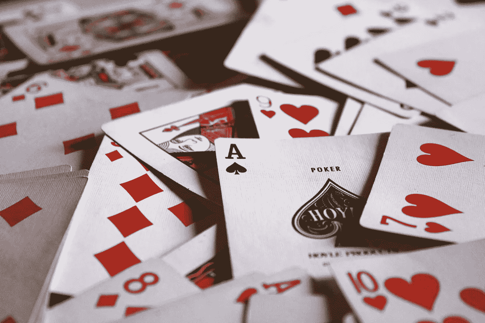

# 总是买丢弃的那堆

> 原文：<https://medium.com/swlh/always-buy-the-discard-pile-92676528f35b>

Photo by: [Jack Hamilton](https://unsplash.com/@jacc?utm_medium=referral&amp;utm_campaign=photographer-credit&amp;utm_content=creditBadge)

当我父母 11 岁离婚时，星期二晚上就成了爸爸的夜晚。这通常意味着一顿豪华的晚餐，交替着未煮熟和煮过头的意大利面，还有从商店买来的冷沙司和煮熟的热狗。在尽情享受了学校的日常谈话后，我们精疲力尽的父亲在公司工作了 10-12 个小时后唯一能做的事情就是和我和妹妹打牌。