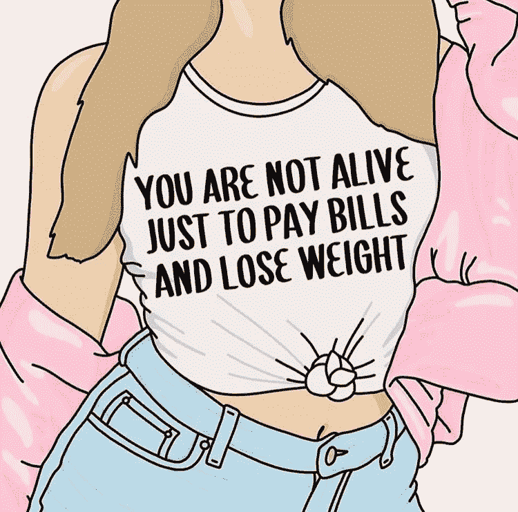

# 我是伪君子吗？

> 原文：<https://medium.com/swlh/am-i-a-hypocrite-32b157895d04>

## 我对身体积极性和自爱的观点与我自己无法实践这一观点之间的矛盾。

随着年龄的增长，我的绰号是我娇小身材的副产品。我妈妈称我为“瘦敏妮”，但当我的身高超过她时，就不再叫我“敏妮”了。在橙色成为新的黑色之前，我被称为 Flaca。中学里的一个男孩称我为“安妮”，是厌食症患者的简称。

直到我大约 12 岁的时候，我才开始与身体形象问题作斗争。这些不安全感出现的标准年龄。我的朋友们开始长胸部，我的胸部保持平坦。我的臀部变宽了，我的屁股鼓了出来(没有抱怨)，我的腰仍然很窄，只是在饭后增加了一点点圆。痤疮在我的脸颊上发芽，我长长的卷发被剪掉，缩成卷曲的卷发。

尴尬的青少年蛋糕上的糖衣:我同时戴着眼镜和牙套。

超级可爱。

所以，我加入了许多人一直在与自己抗争的战争。我选择的武器是茶树油、粉底和直发器。

但至少我很瘦！

这么龌龊浅薄的思维方式，对吧？我希望那时有人能告诉我这些都不重要，重要的是你的内在，情人眼里出西施。你知道，那些天生丽质的人会说的话。

现在，作为一个成年人，我在 Instagram 和 Pinterest 上关注了几个身体积极的页面。我告诉自己，我的不安全感让化妆品行业的白人老头变得富有。我在手机上放了一幅艺术家[萨布丽娜·布吕格曼](https://instagram.com/sasa_elebea?igshid=29gkssebxq7)的插图，提醒自己生活中不仅仅只有身体的样子。

这些都是我坚信的，逻辑上也知道是真的，但似乎不能套用在自己身上的东西。

我站在磅秤上，为自己在过去的一年里增加了 21 磅感到羞愧。

我和朋友出去吃饭，为分享一道开胃菜而感到内疚。

我自嘲说，我有一条用该死的发带系着的裤子。

所有这一切最糟糕的部分是负面自我对话的持续泛滥，但我感到的认知失调紧随其后。我为自己是一名女权主义者而自豪，倡导女性权益，并主张我们不应该为了占据空间而让世界变得美丽。我以这种方式对待其他女人，并相信这对她们是真的，但对我不是。

为什么我要这样对自己？为什么*我们*要这样对待自己？这是我如何看待世界和女性，以及我如何看待自己的冲突。经典困境*言出必行，*我也不知道怎么做。

告诉自己我的身体很美感觉像是在撒谎，但当我对身边的其他女人说的时候却是一个显而易见的真理。

我对一个从我的不安全感和自我怀疑中获利的行业感到悲哀，但我确实有一份我用过的不同护发产品的清单，以及我是否喜欢它们。

我希望我能成为我翻阅的积极向上的页面上看到的那种女人。那种无忧无虑的女人，不会为了证明自己的价值而去寻求别人的认可。抛开这些不谈，我希望我能拥有乔纳森·范尼斯的自信和能量，他是阳光和自爱的灯塔。

另一方面，尽管我很喜欢看到别人实践和促进健康的身体形象，但有时也会令人不快。宣扬自爱和接纳是伟大的，我们应该这样做，但它可能会被视为过于一般化，不真诚。这就是为什么我不总是认为寻求认可是一件坏事。我相信它可以成为自爱之旅中非常有帮助的工具，但它不应该是唯一的。我喜欢向我周围的人指出特定的美丽特征，就像我喜欢得到回报一样。

我的两个姐姐都有一双闪亮的蓝眼睛和长长的睫毛。

我最好的朋友有着最漂亮的嘴唇曲线，我的另一个朋友能把卷发弄得像是她发明的一样。

我可能不喜欢我在臀部增加的额外体重，但是我爱我的大腿，当人们把我比作美人鱼时，我会非常兴奋。事实上，有些东西是我喜欢的，而我的某些部分也是别人喜欢的，这表明我有可能去爱其他的一切。

是的，现在，我努力去发现自己的美，去感受自己的皮肤，去爱自己的身体。但是我的身体很健康，我试着用我的标志性电影*内在美*来提升我周围的人。我想为别人做我自己做不到的事，也许有一天我也会相信。