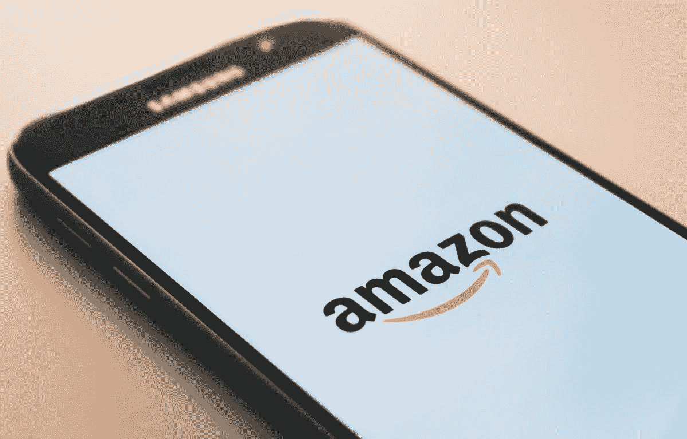

# 亚马逊在欧洲的困境:监管者的观点是它的“双重角色”

> 原文：<https://medium.com/swlh/amazons-plight-in-europe-regulators-views-v%C3%ADs-a-v%C3%ADs-its-dual-role-2a9683158587>

Photo by [Christian Wiediger](https://unsplash.com/@christianw?utm_source=unsplash&utm_medium=referral&utm_content=creditCopyText) on [Unsplash](https://unsplash.com/search/photos/amazon?utm_source=unsplash&utm_medium=referral&utm_content=creditCopyText)

如果你最近浏览了亚马逊的电子产品，你很可能偶然发现了一个叫做亚马逊基础的品牌。亚马逊基础是一个专门经营电子产品和家庭用品的亚马逊品牌。这包括电缆、墨盒、便携式扬声器、电池、空调、碎纸机、烤面包机、搅拌机、水壶等物品。