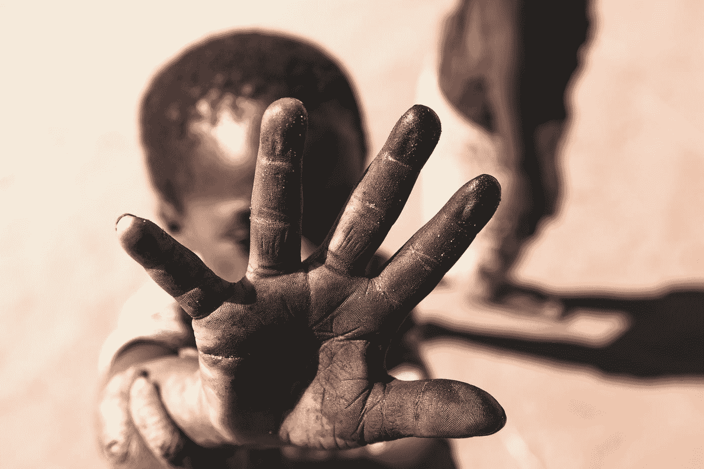

# 美国种族主义

> 原文：<https://medium.com/swlh/american-racism-4be617e5e70b>

# ***焦油宝贝***

Photo by [Atlas Green](https://unsplash.com/@atlas_green?utm_source=medium&utm_medium=referral) on [Unsplash](https://unsplash.com?utm_source=medium&utm_medium=referral)

直到去年，我父亲才在社交圈子里提到了一起教堂爆炸案，Ga。他年轻，黑人，易受影响。当谈到他忍受的歧视和仇恨时，他讨厌讨论他童年的经历。几乎没有人看完一部描述非裔美国人残酷过去的电影；当他这样做的时候，他的嘴唇紧闭，眉头紧锁。就像我说的，他几乎从不谈论那个…