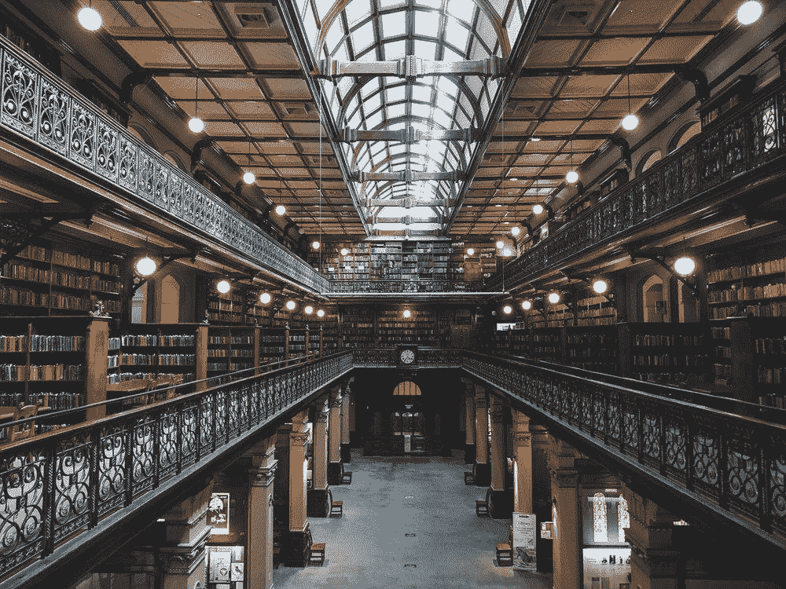

# 美国最优秀的记者揭示了他们追求伟大故事的方法

> 原文：<https://medium.com/swlh/americas-finest-journalists-reveal-their-methods-for-writing-great-stories-eb6d6e9dd1b3>

## 一瞥记者产生想法的方法，他们的研究程序和采访方法。

本文基于罗伯特·s·博因顿的《新新新闻》一书，他采访了 19 位事实文学的从业者