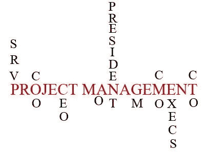
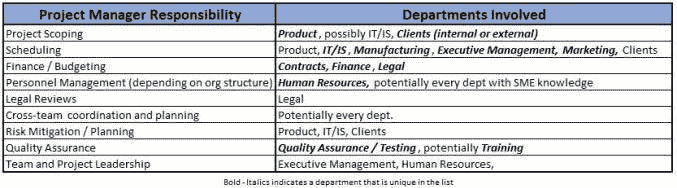

# 优秀项目经理的敏捷答案:提升他们！

> 原文：<https://medium.com/swlh/an-agile-answer-for-great-project-managers-promotion-them-2c3573315549>

## 从新的角度看项目经理的角色

*   优秀的项目经理拥有一套技能，这是公司里其他人不具备的
*   组织应该将这些人视为未来的执行经理
*   实现从项目经理到高管的路径的一种方法是将项目经理轨道视为高管小联盟，就像职业棒球大联盟的单 A、双 A 和麻烦 A 联盟一样。

在我过去的博客文章“项目经理应该害怕敏捷吗”中，我讨论了这样一个事实，在一些敏捷转变中，项目经理正在转变为 Scrum 大师。虽然这对于公司项目管理人员的某个百分比来说是好的，但这并不是项目经理对组织的价值的最佳利用。

如果一个组织要花时间进行成功的敏捷转型，他们必须考虑组织中的许多角色并做出决策。这是我的论点，项目经理和执行管理层都应该阅读；组织需要在他们的员工中发现优秀的项目经理，并开始将他们提升到组织中的不同职位。

什么是从优秀到卓越的项目经理？首先，当我评估任何一个项目经理时，我会关注他/她的项目的扩展性。可扩展性包括项目的长度、项目的预算、参与项目的团队/部门以及项目团队成员的数量。

在很大程度上，我说的是管理大规模、多学科项目、持续一年以上、预算数百万的项目经理。这些项目通常涉及多个部门或团队——许多利益相关者、大量的项目团队资源、更大的预算和更大的复杂性。

需要注意的一点是，在我看来，项目的成功或失败并不能很好地反映项目经理的知识和价值。这主要是因为有太多的组织因素在一个大型项目中发挥作用，其成败不能仅仅归因于项目经理。此外，成功/失败的标准也有一定程度的主观性。对项目经理来说可能是成功的，对组织来说可能不是成功的，反之亦然。

也就是说，一个项目经理在成功交付的同时管理项目起伏的能力是对他们能力的肯定。项目的成功对一个组织来说是至关重要的，项目经理应该得到一些赞扬/责备。当评估一个项目时，我尽我所能记住，项目经理不做工作，团队生产产品。成败直接落在整个团队的肩上。

在评估项目经理的晋升时，应该考虑的第二个限定条件是他们是否通过认证。通常，项目越大，项目经理获得 PMP 或 Prince2 认证的可能性就越大。这并不是不尊重许多努力工作、知识渊博但未获得认证的项目经理。我认识认证项目经理和非认证项目经理，并与之共事过，这两个群体都有他们真正优秀的项目经理。与此同时，我坚信认证提供了知识的基础，尤其是当一个人晋升到其他职位时，它可以证明是有价值的。

这并不意味着一个组织不应该推广一个没有通过认证的优秀项目经理。正如不是所有的高管都有 MBA，也不是所有的 PM 都需要认证。不管有没有认证，他们需要的是在大规模多学科项目上的丰富经验。

这种经历为这些人提供了各种知识。这种对组织和工作的了解往往被寻求晋升的组织所忽视。这种经验并不总是可以衡量的，但是对组织来说却是非常有价值的。这些项目经理往往能够成功应对复杂和危险的工作环境，并理解企业运营的动力。

# 小联盟

我觉得许多公司不知道如何利用项目经理，当公司过渡到敏捷时，这一点更加突出。每个组织都需要回答的问题是，他们应该在哪里寻找新的执行经理？对于那些还没有考虑这个问题的人，我将为他们解答。

我认为，项目经理的角色应该被看作是执行管理层(副总裁及以上)的小联盟。正如美国职业棒球大联盟利用他们的小联盟来评估、培训球员并为他们提供经验一样，公司也应该这样做。

一些公司已经有了一种小联盟的形式:员工轮换计划和实习。有多少公司将员工在多个部门工作作为经理培训的一部分。有些是为员工准备的，有些是实习生项目，让实习生接触不同的部门和角色。

丰田汽车北美公司有两种类型的计划。他们开发了一种健康有效的实习方式，实习生每 6 个月进行 4 次不同的轮换。轮换涉及不同的部门，目的是实习生将学习一些整体的丰田业务。这些实习生成为未来员工的储备，然后随着他们经验的增加成为经理。

丰田还允许员工有机会去海外工作。这些职位遍布世界各地，在这些职位上，员工将对丰田公司的运营有更多的了解。除了海外机会，丰田还大量利用来自现场工作人员(地区、私人经销商、经销商等)的渠道。)作为管理材料的来源。当员工申请下一个公开的晋升机会时，经验和知识都是非常有利的。

# 项目管理:在职 MBA

预防性维护工作本身是一个循环任务的精简版本。如果项目足够大，包括多个部门和资源，那么项目经理就有很大的机会了解这些部门是如何工作的。想想你在 LinkedIn 或 Flipbook 上看到多少次文章或帖子告诉你读这 4 或 6 本书就像读 MBA 一样好。现在，我们都知道这是严重的夸张，但事实仍然是，有其他方式获得一些商业知识。

一个有经验的项目经理拥有同样的知识基础，公司可以从这个基础上建立中层和执行经理。事实上，如果项目经理已经在公司工作了一段时间，他们对公司如何开展业务的内部知识可能比多一个 MBA 学位对公司更有价值。

让我们看看项目经理在大型项目中与不同的团队/部门合作:

这种观点也不包括诸如公司和产品战略之类的知识，尽管项目经理是知情的，有时是其形成的一部分。

将这种互动和知识的数量与普通中层经理和有时是执行经理进行比较。总的来说，一个普通的中层经理了解他们的垂直部门以及经常与该垂直部门互动的团队/部门。他们对公司、产品和整个市场的看法仅限于他们的筒仓。正是他们有限的互动阻碍了他们在组织中更有效地工作。

这位经理不具备项目经理在大型项目中的广泛影响力。项目经理必须与上面确定的部门合作，这意味着他们的经验通常是跨垂直行业的。项目的跨学科性质在一定程度上消除了孤岛。

# 领导力:项目经理风格

卓越的项目经理所体现的另一种品质是领导力，这种品质不像我们希望在中层经理身上看到的那样普遍。无论 LinkedIn 上发布了多少领导力迷因或文章，领导力都是需要鼓励和实践的。不幸的是，我目睹了许多不了解基本领导原则的管理者。

当我们看伟大的项目经理的特征时，项目经理成为领导者的需要成为焦点。首相不仅仅是一个愿意第一个发言、声音最大的人，还是一个仆人领导角色中最后一个发言的人。根据你的组织结构和你是否有项目管理办公室的事实，项目经理常常是你的执行管理层的项目发言人。

我记得与我的 CEO 和首席运营官的许多会议上，我的项目是绿色的，他们只有一两个状态问题。在我的脑海中更清晰的是我的项目是红色的那段日子，我们花了 20 分钟深入到项目中，回答为什么、何时、何地以及有时是谁该负责的问题。首席执行官或首席运营官令人沮丧的眼神和咄咄逼人的提问可以成就也可以毁掉一个伟大的项目经理。大多数中层管理人员永远不会经历那场风暴，但这可能是许多组织中的 PM 每周的经历。

无论您是向项目管理办公室的高管汇报，还是直接向高管管理团队汇报，项目管理人员都会从这些互动中获得一定程度的知识和洞察力。优秀的项目经理会从这些互动中了解几件事:

*   要问的重要问题是什么？
*   本周、本月或本季度执行管理的重点是什么？
*   处理客户、产品和市场问题的策略

我确信我可以通过添加更多的理由或例子来扩展这一点，即项目经理的知识对于一个组织的价值。我可以很容易地再写一页，说明为什么一个组织应该评估他们的项目经理作为潜在的执行经理。

事实上，优秀的项目经理将内部和外部知识与经验相结合，可以让你的组织变得更好。我鼓励执行经理不要只看头衔，要为这些机会找到最佳人选。把你的项目管理办公室当成执行管理的小联盟。

找出最好的。指导他们。提升他们。

*原载于 2019 年 5 月 25 日*[*【https://businessinquisitor.com】*](https://businessinquisitor.com/2019/05/25/an-agile-answer-for-great-project-managers-promotion-them/)*。*