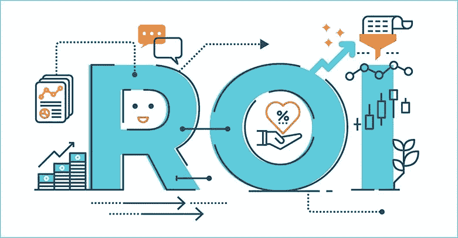
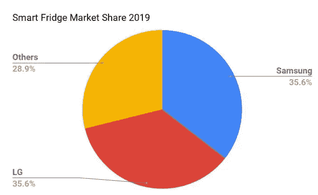
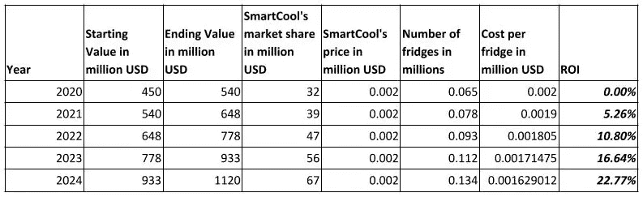
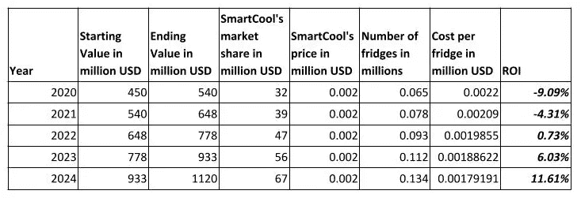

# 模拟新产品投资回报率的另一种方法

> 原文：<https://medium.com/swlh/an-alternate-approach-to-model-roi-of-a-new-product-d5fbf4b00c4b>

## 介绍

如果你是一家初创公司的创始人或早期阶段的产品经理，你可能必须考虑的最重要的事情之一是你计划开发的新产品的投资回报率。

> 预期投资回报率=(用户覆盖范围*新增或增量使用*业务价值)-开发成本

在这个公式中，有两大要素在起作用——内部要素和外部要素。

> 内部开发成本
> 
> 外部-(用户数量*业务价值)

对于一个新产品，开发成本将包括参与产品开发的每个人的工资、运营成本等等。作为一个 PM，要得到这些数字是极其困难和费时的。此外，你还没有开始开发，所以你不会知道你实际上要花多少钱。那么我们如何计算开发成本呢？

由开发成本驱动的产品的另一个方面是你的定价。

> 你的产品价格=开发成本+利润

不要看开发成本驱动的定价，让我们看开发成本是定价的一个函数。这样做的好处是

1.  *这种方法更加以客户为中心*
2.  *定价由市场和客户意愿决定。你不能仅仅因为你的开发预算激增就提高价格。*

**我们可以假设我们的产品会和竞争对手定价相同。**

## 在这个练习中，我们以开发新的智能冰箱 SmartCool 为例。你如何确定新智能冰箱的投资回报率？

我们将尝试计算 SmartCool 从现在起(2024 年)5 年后的投资回报率**并估计我们可以投资多少来开发 SmartCool YOY。**

智能冰箱的全球市场为***4 . 5 亿美元*** (来自互联网)

我们竞争对手的智能冰箱平均价格为 2000 美元。

售出冰箱数量+2019 年潜在销售量= 4.5 亿/2000 =***225000***

目前，三星和 LG 是智能冰箱领域的市场领导者

我们将尝试从 Playstore 下载应用程序，获取三星和 LG 销售的智能冰箱数量。

**三星**

三星智能冰箱应用程序的下载次数= 100，000 次(来自 playstore)

假设每次购买下载 2.5 次(包括虚拟下载)。三星迄今售出的智能冰箱数量= 4 万台。假设 EOY 将在 6 个月内多销售 4 万台冰箱，三星在 2019 年销售的冰箱总数= ***8 万台。***

**LG**

LG 智能 IOT 应用程序的下载次数(用于控制所有 LG 智能设备= 100 万次

假设 10%的下载量(100，000 次)是智能冰箱，我们可以估计 LG 在 2019 年也将售出 ***80，000 台*** 智能冰箱。

【2019 年智能冰箱市场份额

既然我们是新产品，我们可以保守地估计我们的目标将是市场的其余部分，即 ***28.9%*** 。假设我们占据了 28.9%的市场份额，即 ***6%*** 。

假设 SmartCool 在 2020 年推出它的冰箱。

鉴于 ***CAGR 智能冰箱市场份额为 17.6%*** 。

复合年增长率%=(终值/起始 value)^1/n-1

CAGR % =(2020 年的价值/2019 年的价值)-1

***2020 年市值= 5.4 亿美元***

SmartCool 的市场份额为 6% =***3240 万美元***

SmartCool 的冰箱定价为 2000 美元，与其竞争对手相似。售出的冰箱数量= ***16，000 台***

ROI = SmartCool 的预期市场份额—开发+维护成本

我们可以假设第 1 年(2020 年)的投资回报率为 0。

每台冰箱的开发+维护成本= 2000 美元

假设我们每年将开发成本降低 ***5%*** 并且冰箱的价格保持不变，即 2000 美元。

假设我们将市场份额维持在 ***6%*** 直到 2024 年(这实际上是保守的)

**如果我们继续开发，投资回报率+每台冰箱的维护成本= 2000 美元**

**如果每台冰箱的开发和维护成本高出 10%，投资回报率= 2200 美元**

这种方法将帮助你保守地估计你的市场是什么样子，你如何为你的产品定价，以及你的投资回报是什么样子。

请在下面的评论中告诉我你的想法。感谢您的反馈。