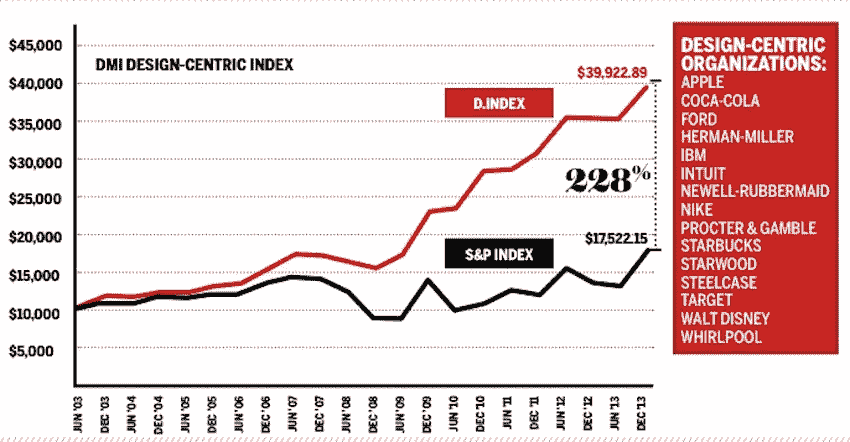

# 关于产品、设计和投资回报率的轶事

> 原文：<https://medium.com/swlh/an-anecdote-on-product-design-and-roi-ef3c8c5a551b>

从前，有一个产品经理。

他负责这家初创公司的产品战略，这是一家在线食品配送服务公司。他们获得了新的资金，并呈指数级增长。但印度的整个行业也是如此。它包括一些大玩家，以及许多新兴的大型超本地创业公司。

在竞争日益激烈的环境中，他需要推出与用户密切相关的功能和附加值。他召集了自己的核心产品团队，以及营销和销售团队。经过多次头脑风暴和熬夜，他们仍然没有想出这个主意。产品团队给出了许多优化应用程序和有效管理交付后端的解决方案。营销团队提出了新的客户保持策略和降低客户获取成本的方法。销售团队深入探讨了为什么一些支付方式比其他方式更受青睐，以及如何让用户的交易过程更加顺畅。

这些都是好主意，但不一定是他想要的。他开始思考他能给他的用户提供的不可抗拒的东西？这一次，他召集了他的设计和 UI/UX 团队，以及产品、营销和销售团队。现在他们又集思广益了。

> *这一次，不是从内向外。但是从外面看。房间里的每个人都成了用户，而不是产品的开发者。*

他们想出了许多有价值的策略和特征。为了减少偏见，他进行了许多用户测试，并对讨论的一些功能进行了微调。

在练习的最后，产品经理有了一组市场上从未有过的特性，解决了他们最大用户份额中的一个非常有效且持久的问题。它提供了用户从未想过会得到的便利。最重要的是，产品经理没有浪费时间为正确的用户制造错误的东西。将用户放在产品开发的起点，彻底的用户测试使得在竞争环境中有更大的成功机会。这使他能够有效地扩展和管理后端，而不用担心失败。开发、产品、设计、用户体验和营销团队之间的密切合作确保了更新尽可能完美，给用户带来几乎没有错误的体验。他的 CAC 开始下降，客户频率增加，最终，公司开始看到市场份额的增加。当然，还有收入。

这是一个真实的故事。

> *专注于用户的品牌和公司会自动投资 UX。当你在构建别人将要“使用”的东西时，你需要知道如何、为什么、何时、何地以及它的所有方面。*

这方面的一个很好的例子是亚马逊，它深入了解用户在旅程每个阶段的体验。以设计为导向的公司比那些没有采用设计或设计不正确的公司发展得更快。

事实上，5 年前，DMI(设计管理学院)发现设计驱动的公司比标准普尔指数高出 228% 。这肯定不是偶然的。我猜他们的投资回报率也很高！

THE ‘DMI DESIGN VALUE INDEX’

你能猜出故事中提到的消费者应用吗？有吗？请在评论中告诉我你对 ROI 和设计的看法。

*你可以关注我们的* [*推特*](https://twitter.com/monsoonfishy)*/*[*insta gram*](https://www.instagram.com/monsoonfish/)*/*[*脸书*](https://www.facebook.com/monsoonfish)*/*[*LinkedIn*](https://www.linkedin.com/company/13404751/)

*本文最初发表于*[*LinkedIn*](https://www.linkedin.com/pulse/roi-you-ask-siddharth-kabra/)*上，作者是 Monsoonfish 首席执行官西达尔特·卡巴拉。*

## 这篇文章发表在 [The Startup](https://medium.com/swlh) 上，这是 Medium 最大的创业刊物，拥有+422，678 名读者。

## 在这里订阅接收[我们的头条新闻](https://growthsupply.com/the-startup-newsletter/)。

