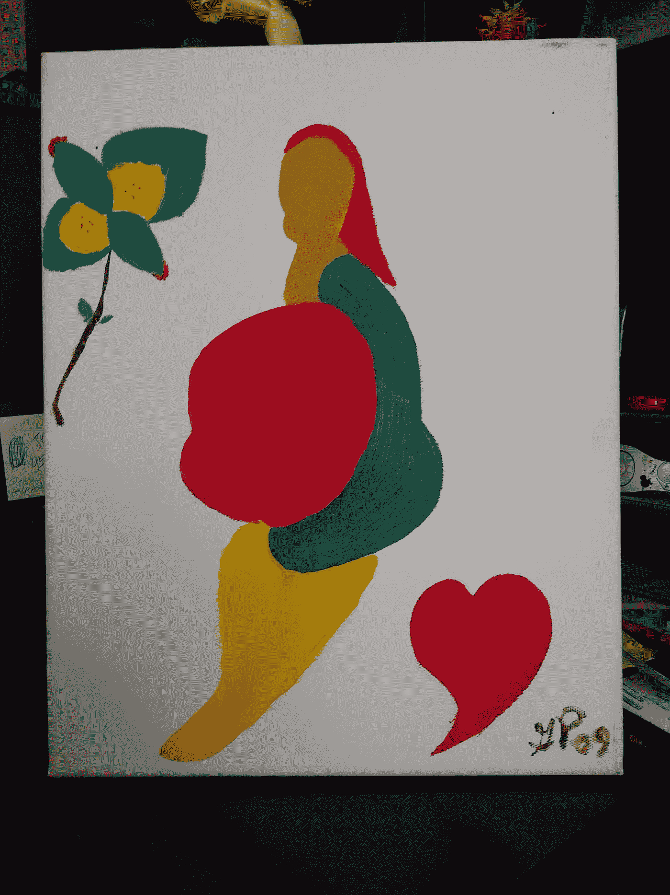

# 艺术家——如何获得灵感

> 原文：<https://medium.com/swlh/an-artist-how-to-grow-inspired-97838131bba2>

Pregnant Woman by Gregory Prince

从艰难的开始到不断的生产。

## 掠过的潮汐

> 没有时间和地点。找不到我的路。每个人建议的方法都试过了。
> 仍然缺乏意义，没有开始，失去信心。看到池塘里有一个水坑。
> 滴在中间圈出。一圈圈同心的小波浪吸引了我。然后阴影逃离了我，让我不再怀疑。
> 里面的光已经出来了。
> 时间……