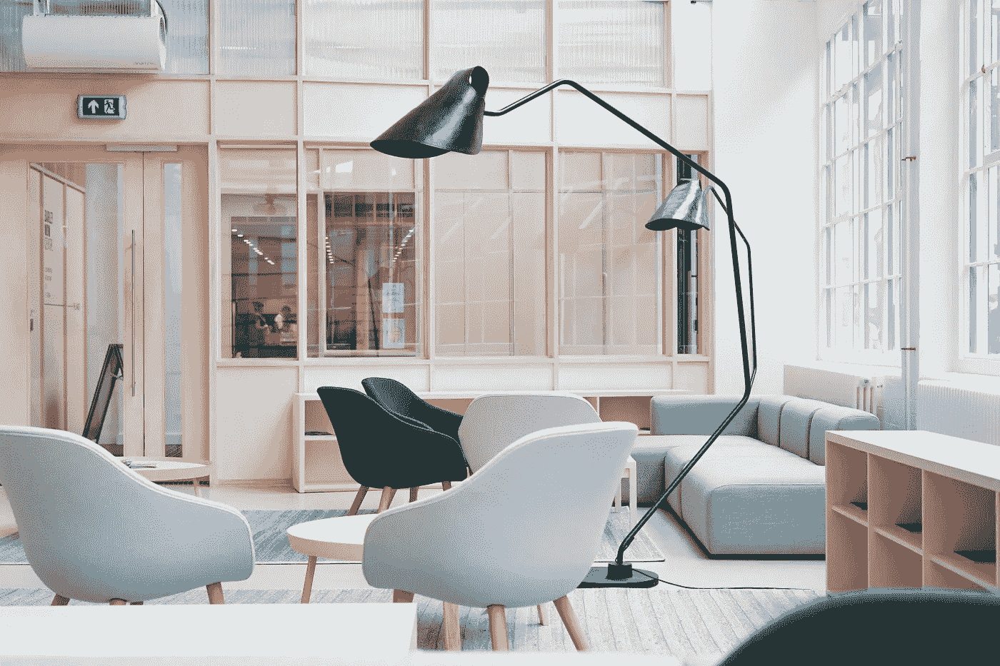

# 我对开放式办公室平面图的各种焦虑

> 原文：<https://medium.com/swlh/an-assortment-of-myanxieties-about-open-office-floor-plans-3f0032e7a492>

谁干的。

我现在在家工作。自由职业者，没有老板，没有公共厕所。我生活在一个寂静的茧中，只是偶尔被街边的喇叭声短暂打断。隐私是美味的。事实上，我经常在想，如果让我回到一栋非住宅建筑，我需要付出什么代价，朋友，你负担不起。不，从现在开始我是一个独唱艺术家…