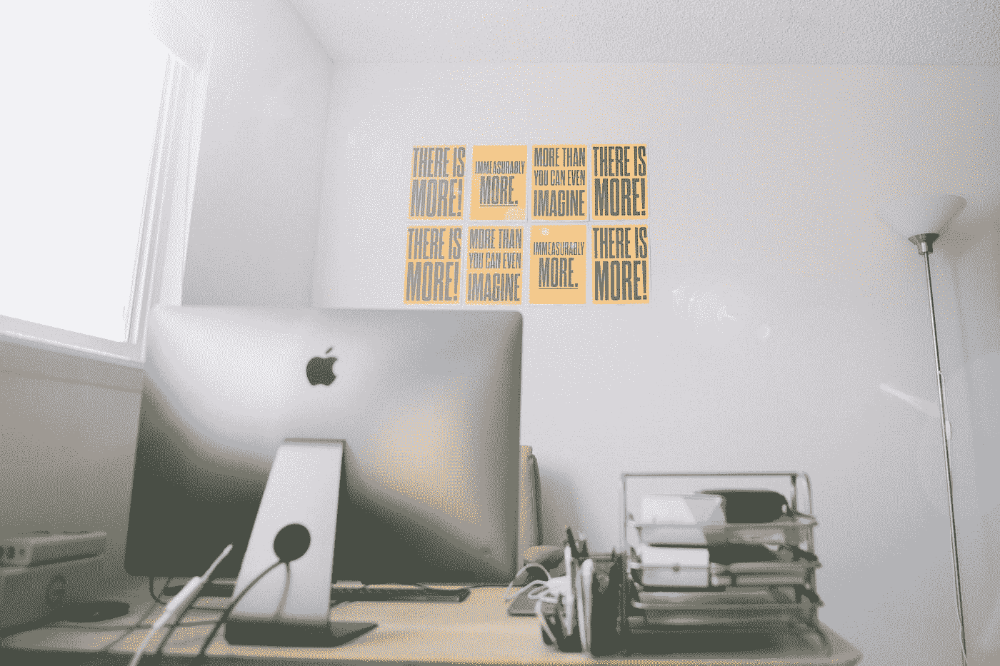

# 空桌子做不了工作

> 原文：<https://medium.com/swlh/an-empty-desk-cant-do-the-work-6d086c735e2a>

## 重视你的员工，即使她已经辞职

Photo by [Neal E. Johnson](https://unsplash.com/@neal_johnson?utm_source=medium&utm_medium=referral) on [Unsplash](https://unsplash.com?utm_source=medium&utm_medium=referral)

今天早上，我向一位客户的准专业员工说了一声悲伤的再见，我认识他并与之共事了近 20 年。她是一个工作热情的人——能干、专业、高效。

她的离开是因为和她的老板，我的客户，发生了争执。他们的职业关系更类似于…