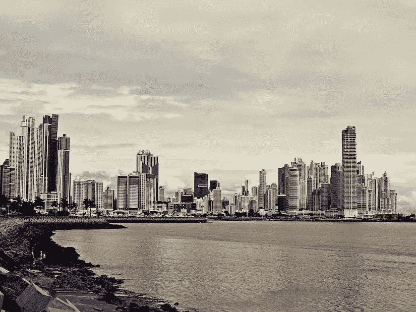

# 巴拿马商业和技术领域企业家指南

> 原文：<https://medium.com/swlh/an-entrepreneurs-guide-to-panama-s-business-and-tech-scene-2490976f572c>

[Source](https://pixabay.com/photos/panama-city-modern-city-skyscrapers-2163483/)

作为 400 万人的家园，巴拿马通常是其臭名昭著的运河的代名词。这不是一件坏事。巴拿马国内生产总值的大部分仍来自运河通行费收入。

企业家涌向巴拿马是因为那里的天气和相对低廉的生活成本。虽然像泰国这样的国家可能提供更便宜的日常费用，但巴拿马允许这些…