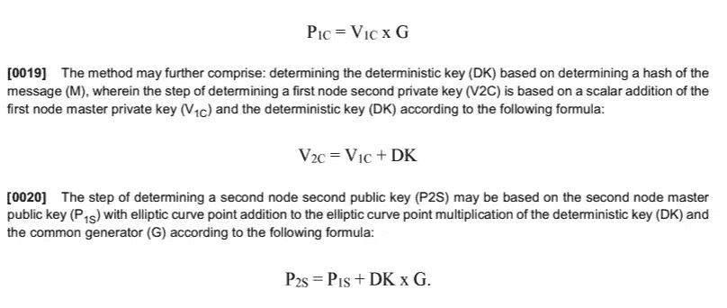
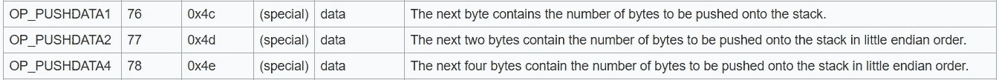

# 不可变的文件和数据存储

> 原文：<https://medium.com/swlh/an-immutable-file-and-data-store-36f67fc044d7>

我将开始每周张贴比特币的使用(BSV)。BSV 允许使用比特币的全部潜力，以及使用它可以创建的许多可能的系统和应用。所有的解决方案都基于我们在 nChain 获得的专利；因此，它们只能在比特币 SV 链上使用。

Alice is in for a ride…

本周，我将介绍一个可以用来创建安全文件存储的系统。

我们的用户 Alice 有一个 ECDSA 公钥:

*   Pa(0)是她的公钥(可以向一个 [PKI CA](https://en.wikipedia.org/wiki/Public_key_infrastructure) 注册)，不作为比特币地址使用。她没有公开将“身份密钥”与她的比特币地址联系起来。相反，她可以使用 PCT 申请号 [PCT/IB2017/050856](https://patentimages.storage.googleapis.com/e9/d4/1a/644d344019a178/EP3268914B1.pdf) 中的技术来创建的确定性子密钥，该子密钥链接到所使用的比特币地址。此后我们称之为**方法 42** 。在整个过程中还有其他专利，但这对于邮报来说已经足够了。
*   Da(0)是 Alice 用来与 Pa(0)签署消息的*秘密密钥*。
*   Pa(1)是基于上述方法的确定性密钥，并且与比特币地址相关联。只要用户愿意，这种地址可以用来安全可靠地保存文件、合同、发票甚至图像。
*   F(1)是第一个文件。它具有使用普通散列函数(例如但不限于 SHA256)的散列。

为了说明如何在这种技术的基础上提供进一步的创新，这里有一个例子，说明该技术如何用于保护数字钱包(作为一个应用程序)中的文件(任何类型，但我们将使用图像文件作为例子)。公钥/私钥对通常用于数字钱包。

在下面的例子中，我们有一个用户想要访问一个文件，该文件可以使用一个单独的密钥进行加密。如果用户负责存储他们的加密密钥(和文件本身)，当加密密钥、用户本身或他们的硬件变得不可用时，可能会出现问题，因为一个这样的场景使得加密的文件不可访问。然而，反过来，将加密密钥存储在应用程序提供商处需要对提供商及其安全机制有一定程度的信任。如果应用程序提供商的系统遭到黑客攻击，加密密钥就会被未授权方获取。然后，文件(如私人图像)可能会被盗或受损。因此，需要以这样一种方式存储加密密钥，使得它不能被未授权方获得，但是在必要时也可以被复制。

在我们的系统中，每个文件使用一个单独的密钥。一般来说，单个密钥用于许多文件；在基于 AES 对称加密的标准应用中，用户将使用一个密钥来保护 1，000 个文件。在我们提出的系统中，为每个文件计算一个单独的密钥，然而，用户不必担心丢失文件或他的任何密钥。

[PCT/IB2017/050856](https://patentimages.storage.googleapis.com/e9/d4/1a/644d344019a178/EP3268914B1.pdf) 的一个显著优点是，这种技术的使用允许基于每个节点的单个私有主密钥生成对应于多个安全私有密钥的多个公共秘密。现在，如果我们将节点作为应用程序“盒子”,这样我们就有了一个要存储的文件，我们可以用它来为每个文件创建一个新的密钥，然后允许该文件安全、私密地永久存储在比特币区块链上。

我们通过在应用程序功能之间预先商定的过程的基础上确定一系列连续的确定性密钥来实现这样的目标。尽管在每一方只需要安全地存储一个私钥，但是多个私钥因此保持安全。这样做不仅减轻了相当大的安全负担，还使用户能够生成从 base 或 master 派生的密钥层次结构。如果用户愿意，他可以生成“子键”，其中层次结构中的键具有逻辑关联。例如，操作者可以生成代表和保护与特定组织或个人相关联的相关账户或实体的密钥。因此，可以安全地生成确定性密钥，并且以反映使用它们的环境或上下文的方式生成确定性密钥。

更重要的是，当密钥和相关联的比特币地址用于计算比特币区块链中的文件地址时，文件所有权仍然是假名。Alice 可以使用与 Pa(0)没有任何关系的比特币钱包和密钥资助文件向确定性地址的发送。

我们将这样一个键和相关的地址称为 Pf(0) funding address。Alice 可以在 Pf(0)中拥有与她的身份没有任何关系的比特币，并且仍然安全地、秘密地发送给 Pa(1)。

本质上，该技术提供了改进的安全通信和文件存储，甚至是安全(甚至是带水印的)文件的创建和网络上一对节点或各方之间的交换。用户知道他们可以在比特币区块链上保存一个文件，比如一张图片，几十年后还可以使用。这项技术，以及我将在后面的文章中讨论的其他技术，允许用户安全地保存他们曾经拥有的所有文件和数据，而不用担心丢失或损害。

# 该方法:

Alice 从她的 ECDSA 主密钥开始(它本身可以是一个子密钥，但是我不会将一个复杂的主题过分复杂化)。

*   爱丽丝有一份文件。在我们的解决方案中，应用程序的各个部分充当网络上的一对节点，并在应用程序或设备(即各方)内进行交换。该应用程序可以为每个文件计算一个密钥，并允许用户用自己的私钥和公钥分别对每个文件进行加密，并交换各自的公钥，同时对私钥保密。
*   应用程序在其功能组件之间交换消息。
*   应用程序可以“同意”基于该消息的确定性密钥。密钥是“确定性的”,因为在多次执行密钥生成算法时会产生相同的密钥。
*   Alice 有她的主密钥 Pa(0)，以及来自公钥 Pf(0)的一次性比特币支付地址。对于 Alice 来说，在她为安全文件提供资金之后，地址和密钥是否被保留都无关紧要；事实上，如果她用它来支付一次费用(和加载一个文件),然后扔掉它，那是最好的。这就是比特币白皮书中使用的隐私方法。
*   只有爱丽丝知道 Pa(0)，因为它从来没有在公共区块链上使用。
*   使用**方法 42** 中的过程，Alice 在她用来支付矿工托管她的安全文件的密钥和主密钥之间创建了一个秘密密钥 s(af.0)。然后，它被用作通信密钥，其过程在专利中有详细描述；这是为了确保通信安全，然后被遗忘。
*   文件加密密钥 s.f(1)意味着相同的过程，并且在下面详细描述。
*   Alice 现在计算一个地址，她以后可以很容易地确定该地址，并且可以在应用程序中使用确定性过程来计算该地址:

*s(file . 1)= H[Da(0)| H(file)| INDEX]*

*Pf(1) = s(file.1) X G — >这就是椭圆曲线运算。*

*   索引值可以通过多种方式确定，为了保持某种程度的简单性，本文没有涉及。
*   *索引*可以简单到:

*索引=哈希(* ***索引****)；其中****index****是文件号，甚至是简单的非加密哈希，甚至是简单的文件校验和。*

*   Pa(0)在整个过程中保持私有。事实上，Pa(0)甚至可以是基于阈值的密钥，例如在 [WO2017145010A1](https://patentimages.storage.googleapis.com/38/81/de/27b37646a28b52/WO2017145010A1.pdf) 中。

Method 42 — [https://patentimages.storage.googleapis.com/e9/d4/1a/644d344019a178/EP3268914B1.pdf](https://patentimages.storage.googleapis.com/e9/d4/1a/644d344019a178/EP3268914B1.pdf)

该过程现在允许 Alice 从与 Pa(1)相关联的比特币地址发送文件，其中 Pa(1)是通过如下方法计算的:

*   Pa(1)= Pf(1)+Pa(0)=[s(file . 1)+Da(0)]X G

Alice 现在可以使用包含她希望保存到区块链的文件的事务来发送文件。小文件可以使用 OP_Return 或 OP_PushData 发送，这取决于它是需要保留还是可以删除:

*   OP _ push DATA 1/**{ DATA }**/OP _ DROP

OP_PushData4 allowed 4.3 GB to be pushed to the stack

使用 ECDSA 对文件进行签名，从而进行身份验证。在加密中(AES 和更多可以用作对称加密算法)，她知道这是她的文件，即使她不再有 Pf(0)的私钥，因为她可以使用公共信息和 Pa(0)计算用于解密文件的秘密。

交易中的文件使用**方法-42** 过程加密。

*   Pf(0) = Df(0) X G
*   Pa(0) = Da(0) X G
*   s . f(1)= Da(0)X Df(0)X G = Df(0)X Pa(0)= Da(0)X Pf(0)

由于 Alice 知道 Pa(1)并且可以看到 Pf(0)被用于向 Pa(1)发送文件，所以她可以看到公钥 Pf(0)。因此，当她知道 Da(0)时，她可以计算 s.f(1)。

因此，Alice 可以计算使用的密钥和文件位置。该文件使用对称密钥 s.f(1)加密。因此没有外部方能够确定文件的散列，因为他们不能查看该文件。

Alice 现在可以使用一个简单的基于哈希表的系统来映射许多文件。有了少量的信息，Alice 将能够从任何位置和任何系统安全地访问她的文件。我将在本月晚些时候解释这方面的内容。

Unix 链接文件，并使用一个简单的目录来创建文件夹。爱丽丝也能做到。只有一个关键索引，她现在可以开始在任何地方访问她的文件。

更重要的是，只有爱丽丝知道文件的存在。即使 Pa(1)是使用确定性系统从 Pa(0)导出的，区块链上 Pa(1)的存在仍然无法使外部方将事务 Pa(1)中的文件存储链接到 Alice，甚至无法仅确定与 Pa(0)的关系。

因此，Alice 可以完全访问她所有的文件。不是现在，而是只要她想。她可以保存童年的文件，50 年后再回来找。保存图像的系统可以将每个图像保存一次(且仅一次)，因为匹配散列的能力意味着 Alice 将总是知道她是否已经保存了文件的副本。她将能够创建整个驱动器存储，可供她和她一个人使用，并保持基于假名链接的完全隐私。

Alice 还可以创建防火墙和分区。使用**方法-42** 过程，爱丽丝现在可以单独加密每个文件，因此她可以共享每个文件(全部或部分),甚至出售文件的访问权。更重要的是，与所有文件都用一个密钥加密的驱动器加密系统不同，Alice 对所有文件都有一个单独的密钥。如果单个密钥被共享和泄露，它不会危及其他文件的安全和隐私。

因为只有 Alice 知道 Pa(1)和文件中的值，所以她拥有一个完全匿名的、高度可用的分布式文件共享。它是私有的、加密的、可追踪的。她甚至可以使用一个类似 GIT 的系统来映射文件随时间的变化。由于 Alice 可以拥有每个文件的单个副本，并且只有一个副本(可以在任何地方访问)，所以她使用的存储空间比您预期的要少得多。

我们可以使用 HMAC 的方案和其他方案使程序更安全，在这些方案中，爱丽丝有更多的安全性和隐私，但这样做超出了今天帖子的范围。

## XOR 和 OTP

我们甚至可以远离 AES 和慢速加密。最终的加密系统是一次性密码(或一次性密码本)。它可以与 XOR 和 Zeta 函数一起使用，创建一个快速安全的一次性加密系统。

我不会在今天的帖子中详细介绍这种机制，但它与我们今年即将推出的其他专利有关。

## 两党制

我们现在加上鲍勃。

该技术还实现了各方之间的安全通信，而不需要存储公共秘密，因为公共秘密可以根据需要由各方基于共享消息单独确定。重要的是，消息不需要以与私钥相同的安全级别存储，并且在某些情况下可以公开获得。

我们的用户 Bob 有一个 ECDSA 公钥:

*   Pb(0)是他的公钥(可以用一个 [PKI CA](https://en.wikipedia.org/wiki/Public_key_infrastructure) 注册)不作为比特币地址。他不会公开将他的“身份”密钥与他的比特币地址联系起来。相反，他可以使用 PCT 申请号 [PCT/IB2017/050856](https://patentimages.storage.googleapis.com/e9/d4/1a/644d344019a178/EP3268914B1.pdf) 中的技术来创建的确定性子密钥，该子密钥链接到所使用的比特币地址。
*   Db(0)是鲍勃用来和 Pb(0)签署消息的*密钥*。
*   Pb(1)是基于上述方法的确定性密钥，并且与比特币地址相关联。只要用户愿意，这种地址可以用来安全可靠地保存文件、合同、发票甚至图像。

每个节点确定:

*   它自己的私钥的更新版本，基于它现有的私钥和确定性密钥，以及
*   另一个节点的公钥的更新版本，基于另一个节点的现有公钥和确定性密钥

可以通过对现有私钥和确定性密钥应用简单的数学处理来实现更新的确定。

*   然后，这对节点中的每一个基于其自己的更新的私钥和另一个节点的更新的公钥来确定公共(即共享)秘密。由于确定性密钥基于共享消息，因此为两个节点所共有，相同的公共秘密可以由两个节点确定，但是通过不同的更新的私有和公共密钥的组合来确定。然后，公共秘密可以用作节点之间安全通信的基础。

基本上，我们可以使用上面列出的流程的修改版本，并将数据合并到 Alice 和 Bob 之间的事务中。

在这样的排列中，Alice 和 Bob 每个人都知道秘密，并且每个人都可以访问文件并证明它来自另一方。同时，即使该文件是公开可用的，它也不能被解密。

Alice 和 Bob 甚至可以允许一个事务有一个预先签名的基于 nLocktime 的过期时间，这样任何一方都可以选择发送 UTXO expire 事务(不存储在链上)，允许文件过期并被删除。同样，还有很多要解释的，但仅今天的方面就足以催生几个新公司(抱歉，Dropbox、OneDrive 和 Google Drive……)

## 最后

[PCT/IB2017/050856](https://patentimages.storage.googleapis.com/e9/d4/1a/644d344019a178/EP3268914B1.pdf) 的应用显然数量众多且种类繁多，甚至不限于在比特币或区块链环境中使用。本质上，这种创新可以为任何需要保护敏感数据、通信或受控资源的情况提供显著的安全优势。因此，随着数字世界随着数据云存储的增加、数字通信方法的更新以及物联网设备的预期爆炸而增长，其潜在的使用案例数不胜数。

欢迎来到 Metanet。这个系统比你能想象的任何兔子洞都要深…

现在，我开始解释这一切。

# 参考资料:

1.  **确定一个共同的秘密，用于信息和分层的确定性密钥的安全交换。**h[ttps://patent images . storage . Google APIs . com/e9/D4/1a/644d 344019 a 178/EP 3268914 b 1 . pdf](https://patentimages.storage.googleapis.com/e9/d4/1a/644d344019a178/EP3268914B1.pdf)
2.  结合钱包管理系统为基于区块链的系统提供安全的多方防丢失存储和密钥传输[https://patent images . storage . Google APIs . com/38/81/de/27b 37646 a 28 b 52/wo 2017145010 a 1 . pdf](https://patentimages.storage.googleapis.com/38/81/de/27b37646a28b52/WO2017145010A1.pdf)

## 这篇文章发表在 [The Startup](https://medium.com/swlh) 上，这是 Medium 最大的创业刊物，拥有+411，714 名读者。

## 在这里订阅接收[我们的头条新闻](http://growthsupply.com/the-startup-newsletter/)。

