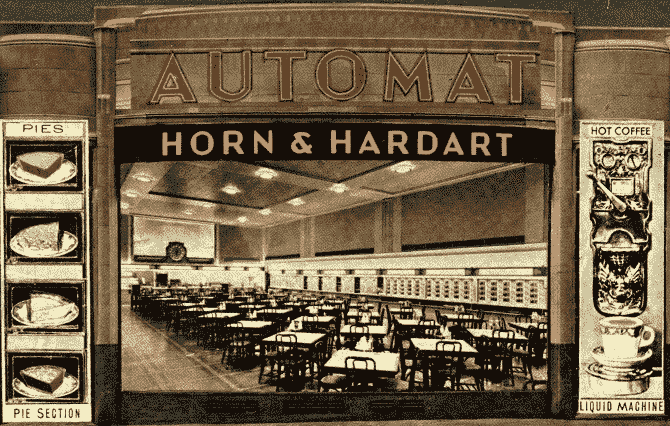

# 一份即时检测报告和一个樱桃派

> 原文：<https://medium.com/swlh/an-instant-test-report-and-a-cherry-pie-a384e11e0a76>

# 尽管几十年的梦想和修补，机器可以测试我们的软件仍然是科幻小说。

我不太确定我的新老板是什么意思，但我几乎可以肯定我不同意他说的话。很油嘴滑舌。这很简单。它忽略了近一个世纪的质量工程和能力成熟度的最新进展。

Jerry McDonald 是副总裁，负责的事情多到一张名片都写不完，在一次重组后，他成了我的老板，让我只能盯着曾经有过一个软件测试经理的地方。我提到杰里的真名，是因为 1)这给了他的建议一定的讽刺意味，2)他应该得到公众的认可，因为他在我职业生涯开始时告诉了我一些事情，事实证明，我太相信自己的智慧，以至于无法从除了艰难学校之外的任何老师那里学到东西。一大批正在成长的软件开发经理仍然没有学会它。

建议呢？"你不能像麦当劳一样管理软件测试."

*Long before McDonald’s served its first systematically assembled hamburger, automats offered a tantalizing peek into the fully-automated future that was just around the corner. Miami U. Libraries — Digital Collections [Public domain]*

如果我对麦当劳(连锁餐厅，而不是杰里的店)有任何批评，你不会在这里找到。他们有非常好的理由去做他们所做的事情。他们熟练地运用统计过程控制等核心“大 Q”质量技术，精确地定义了快餐生产，并花了几十年时间挤出每一滴变异。没有变化意味着在可预测的时间表上没有浪费的可预测的产品。顾客喜欢它。其他公司试图模仿它。有人将该模型移植到软件产品开发中只是时间问题。

正当我进入场地的时候，时间到了。在我遇到 Jerry 的几年前，我去参加我新的“软件质量保证工程师”的工作，在我的桌子上发现了两件东西，它们定义了公司对我的期望。第一本是 Watts Humphrey 的*管理软件过程*。第二个是一个大盒子，里面装着一个名为“SQA 机器人”的软件自动化套件的安装介质和说明书(后来被 IBM 收购，更名为“Rational Robot”，然后被理性地抛弃)。这本书是能力成熟度模型的前身，它清楚地表明了我的工作是将软件测试减少到一个可重复的过程，然后这个过程可以被定义和优化。SQA 机器人站在一旁，等着我以可执行代码的形式给它测试——为什么不呢？如果测试可以简化为一个可重复的过程，那么机器人应该能够重复它。我们的商店是麦当劳，SQA 机器人是汉堡带。

这是 20 世纪 90 年代末。互联网刚刚进入主流。就在几年前，要得到一本特定的技术书籍，需要花一整天的时间去随机的实体店，或者花几个月的时间等待馆际互借齿轮转动。现在，我们可以点击鼠标，提供信用卡，几乎一夜之间就能收到我们想要的邮件。甚至有传言说，有些人可以在网上订购当天送达的比萨饼。一切似乎都有可能——甚至是为我们测试软件的机器人。

在其闪亮的引擎盖下，SQA 机器人脾气暴躁，但这只是吸引了我的牛仔本性，并激励我像一匹桀骜不驯的野马一样打破它。在我对它有所控制并每晚练习我们的软件产品之后，我发现我可以通过用 C++编写自己的库并把它们安装上去来教它新的技巧。正如我们的一个开发人员在一个稍微不同的上下文中打趣的那样，我有源代码，因此可以做任何事情。我为自己感到骄傲。

由于我们的测试大多是自动化或半自动的，我们拥有了 Watts Humprey 所要求的可重复过程。我可以准确地告诉你测试需要多长时间，所以发布时间表中唯一的变化就是我们会发现多少 bug，需要修复多少 bug。我期待着扩展、改进和不断优化。谁知道呢？也许我们甚至可以申请 CMM 级认证。

如果这个故事是虚构的，我会在这里告诉你我花了前两段时间设置的失败。现实并不那么整洁。随着网络泡沫濒临破裂，该公司经历了多次更名和重组。出于我一直不明白的原因，软件测试部门唯一的受害者是我们的经理。除了他建议我走错了路之外，我的新老板副总裁基本上没有打扰我，直到我的留用协议到期，我骑着马走向夕阳，仍然为我的自动化成功感到自豪，并对我的业务流程智慧深信不疑。

我被剥夺了我所需要的和应得的失败，我允许自己跟随行业趋势，现在是一名一线软件开发人员。泡沫破裂，牛群被淘汰。在较小的商店工作(大多没有专业测试人员)，我们每个人都学会了扮演多重角色。更适合我们实际工作的编程语言和工具使得编码错误更难引入，更容易检测。我们中的大部分人开始将单元测试视为核心学科，并将其融入到设计、编码和集成中。这些趋势提高了产品质量，减少了对专业软件测试人员的需求。如果我们的代码已经受到语言的保护，并且被单元测试所覆盖，为什么我们要雇佣更多的人来做已经完成的测试工作呢？

静静地思考这个问题，杰里·麦克唐纳智慧的轮廓逐渐显现。让这种想法持续下去，你很快就会发现它无处不在。就在上周，一项在线病史调查问我是否有任何已知的过敏症，并允许我从肝炎等疾病列表中选择答案。我没有理由怀疑这个软件产品的开发者只使用最安全的语言和工具，或者他们有 100%的单元测试覆盖率。恰恰相反，我很难想象这样的保护措施，尽管它们很好，怎么会发现这个明显的缺陷。

你不能像麦当劳一样测试软件，因为不像汉堡带，变化是软件产品开发固有的。构建软件的全部意义在于做一些不同的事情。如果你想要一个已经存在的副本，你可以很容易地精确地创建一个。当然，当我们有意做出改变时，检测无意的副作用是有价值的。这种检测(“回归测试”)是任何软件测试程序的一个重要组成部分，也是系统化或自动化的一个很好的候选，但是我们不要把最简单和定义最好的部分与复杂和混乱的整体混淆起来。

在与 Russ Roberts 的 [2018 EconTalk 采访中，麻省理工学院机器人名人罗德尼·布鲁克斯指出，不熟悉机器学习问题空间的人经常高估技术，因为我们将*的表现*误认为*的能力*。例如，我们可能观察到图像识别机器正确地识别照片中的猫，然后得出结论，该机器有“猫”的概念，可以做像诊断毛球或预测 Fluffy 是否能够划独木舟这样的事情。根据布鲁克斯的说法，这种“通用智能”机器可能有一天会出现，但很可能是几十年或几个世纪之后。最近在性能方面的进步，很大程度上是由计算能力的增长所驱动的，只是加剧了我们将计算能力误认为能力的自然倾向。这个错误导致我们高估了现在的技术，然后低估了更上一层楼的难度。](http://www.econtalk.org/rodney-brooks-on-artificial-intelligence/)

今天，我们可以建造机器来执行专门的任务，比如当算法对某些输入范围产生意外结果时，快速通知我们。结合精心设计的软件开发流程，使机器能够在正确的时间将这些信息交付给正确的人，我们可以避免陈旧信息带来的数量级损失，从而大幅缩短产品交付周期。这是一个巨大的好处，但我们不要把表现误认为能力。我们只是利用现实技术解决了一个小问题。我们还没有造出一台知道如何测试软件的机器。

一台合格的测试机器能做哪些现实技术做不到的事情？让我们只关注软件测试的一个方面。今天大多数自动化的主要功能是告诉我们一个结果是否是*意料之外的*。我们对机器进行编程，以检查意外的结果，因为比较很容易执行，但这只是我们真正想知道的一个廉价的代理:这个结果是否威胁到产品的价值？这个更有意义的问题远远超出了当今技术的理解范围。可能是需求传达有误。也许这是一个完美的沟通，但结果却是一个糟糕的想法，可能会冒犯关键利益相关者或使公司陷入法律纠纷。

我怀疑这是他们的意图，但是*管理软件过程*和 Rational Robot 让我在我的脑海中听到 Jerry 相反的声音，并得出结论，当明智地部署时，可重复的检查是有价值的，但是执行例程并不能接近完整的软件测试制度。现在我是一个戴着“测试经理”帽子的人，我已经通过用专业的软件测试人员来称赞我们的实质性自动化程序来应用这些经验。从机器为他们执行的例行检查中解脱出来，我们的测试人员释放了他们人类思维的力量。他们表现得像调查记者和科学家。当他们与产品互动时，他们会问一些重要的问题并设计实验来寻找答案。他们在明确的需求下挖掘，以了解谁想要什么以及为什么，并成为从人类需求到可执行代码的复杂而混乱的路径上的专家。他们通过其含糊不清，矛盾，沟通不畅，办公室政治排序，这样他们就可以预测谁将被什么窃听，以及多少。在沃隆星球的这一边，没有一台机器能传递这种信息——这种信息能告诉我们关于产品风险的最多信息。

如果你是许多软件开发经理中的一员，他们已经停止雇佣“手工测试员”或者鼓励你现有的员工去选择自动化，我希望你能重新考虑一下。虽然我同意我们的未来将会更快、更机械化，并且完全赞同我们行业沿着自动化管道连续交付的趋势，但是我们不要把我们现实的技术误认为是测试机器。目前还没有一台称职的试验机。我们仍然需要人类测试人员，因为我们最重要的错误源于代码上游复杂的人类混乱。它们不能被简化为我们可以期望现实机器检测到的简单的不匹配。今天，只有人类会发现我们最重要的错误。作为一个开发和发布软件产品的组织，我们唯一能控制的变量就是*哪些*人类会发现我们的 bug，在什么情况下会发现。

包含人类测试人员并不意味着放弃连续交付的梦想，或者限制我们的管道来匹配人类的步伐。人类测试人员是在装配线末端拿着剪贴板的检查员的旧范式是过去的遗迹。让我们埋葬它，取而代之的是找到创造性的方法，在产品开发的每个阶段利用人类测试人员的技能和专业知识。让我们把测试一路向左转向发现和构思。然后，让我们将它一直向右转移到我们的客户实际体验的实时生产系统中。我们不再用软盘运送我们的软件了。我们不再需要几个月的时间来对缺陷做出反应，所以让我们冒一些风险，依靠我们的专业测试人员来帮助我们选择便宜的修复而不是昂贵的预防。这就是非关键系统的连续交付的样子。让我们拥抱它。

杰瑞是对的。我们不能像麦当劳一样测试我们的软件，只是因为模型代表了一种不切实际的极端，试图将强烈的人类努力减少为可重复的过程。同样，我们也不应该跳到相反的极端，完全拒绝系统化和机械化。像测试一样，管理不能简化为具有确定性分支和明确定义的决策阈值的流程图。所有现实的选择对我们来说都是可行的，无论是机器、专业测试人员、赏金猎人、实习生、顾客还是街上的尸体。与麦当劳特许经营不同，我们的商店没有成功的蓝图。那有什么好玩的？

20 世纪 80 年代初，迈克·杜斯基斯(Mike Duskis)还是个孩子的时候，就发现入侵视频游戏比玩游戏更有趣。然后，他进入了软件开发行业，从儿童娱乐到安全关键的医疗设备。他目前是美国科罗拉多州丹佛市 [CyberGRX](https://cybergrx.com/) 的测试经理。