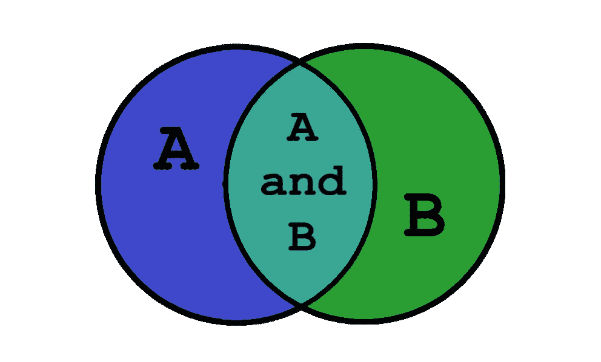

# Python 集合介绍—第三部分

> 原文：<https://medium.com/swlh/an-introduction-to-python-sets-part-iii-dbb3e5df2ffc>

## Python 中标准集合运算的完整指南

A Venn Diagram (Source : realpython.com [[link](https://realpython.com/python-sets/)])

> "集合是允许自己被认为是一个整体的集合."—乔治·康托尔

# 我们离开的地方

在[第一部分](/python-pandemonium/https-medium-com-python-pandemonium-an-introduction-to-python-sets-part-i-120974a713be)中，我们讨论了**如何在 Python** 中定义 set 对象。我们看到一组中的元素…