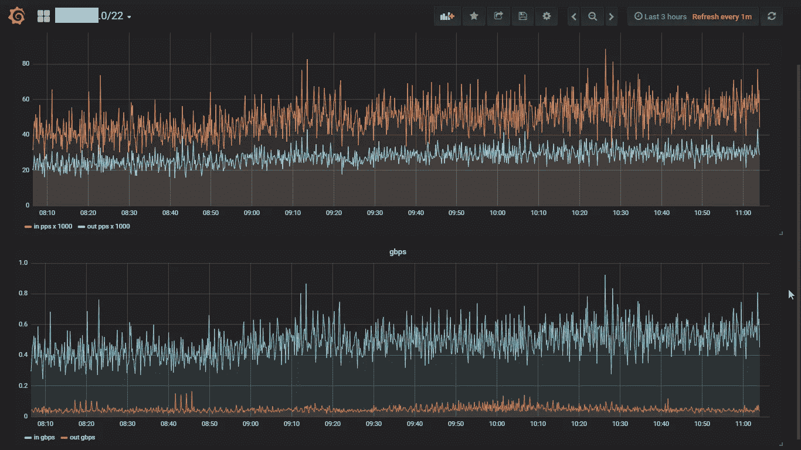

# 时间序列分析导论

> 原文：<https://medium.com/swlh/an-introduction-to-time-series-analysis-ef1a9200717a>

Using Time Series Analysis to detect DDoS Attacks

嘿伙计们！所以最近我决定深入研究机器学习。作为一名网络安全爱好者，我的目标是从网络安全的角度来研究它。我不停地问自己这个问题，“机器学习如何被用来保护我们免受网络攻击？”。

然而，在我回答这个问题之前，对我来说，更深入地了解机器学习本身是很重要的…