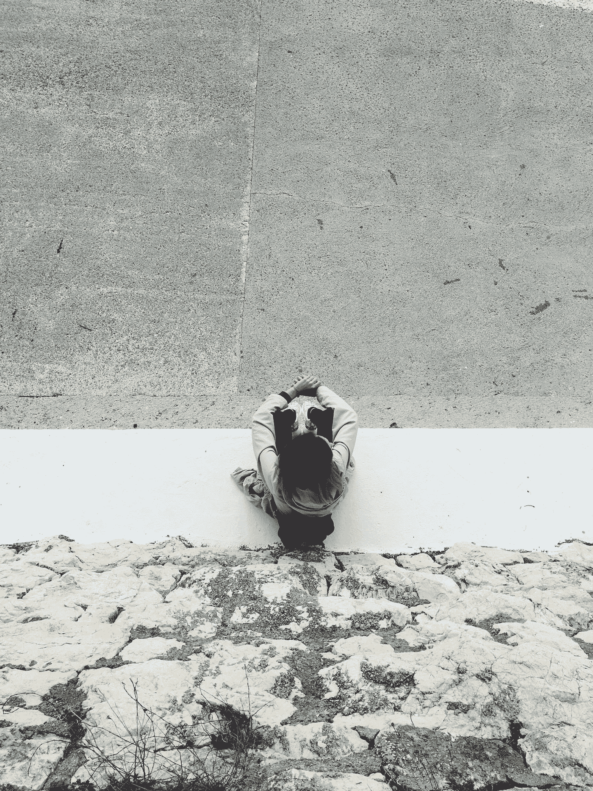

# 作为自由作家，内向者寻找客户指南

> 原文：<https://medium.com/swlh/an-introverts-guide-to-finding-clients-as-a-freelance-writer-e97095d86a8c>

## 需要客户却讨厌人？

当我告诉人们我是一个内向的人时，他们通常会感到惊讶。需要的时候，我可以非常善于交际。然而，我做的外向活动越多，我觉得我的情绪就越低落。我讨厌孤独，但是当我想一个人呆着却不能的时候，我就开始崩溃了。

Photo by [Igor Cancarevic](https://unsplash.com/@igorcancarevic?utm_source=medium&utm_medium=referral) on [Unsplash](https://unsplash.com?utm_source=medium&utm_medium=referral)