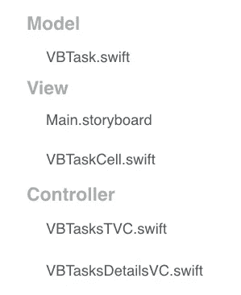
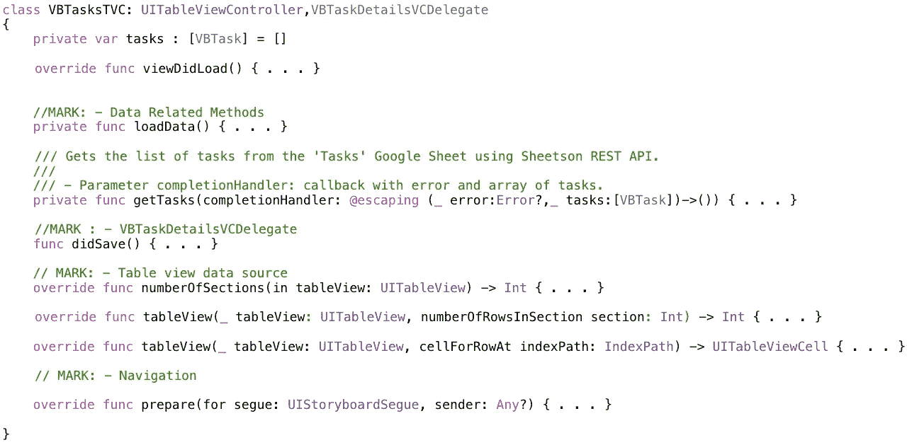
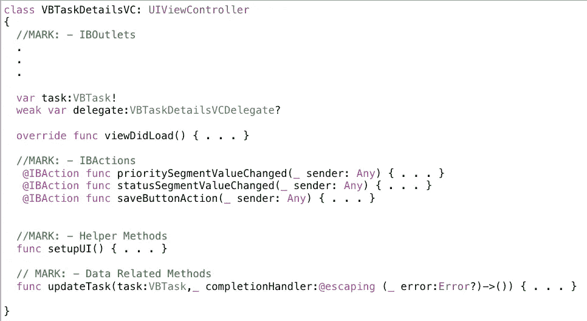
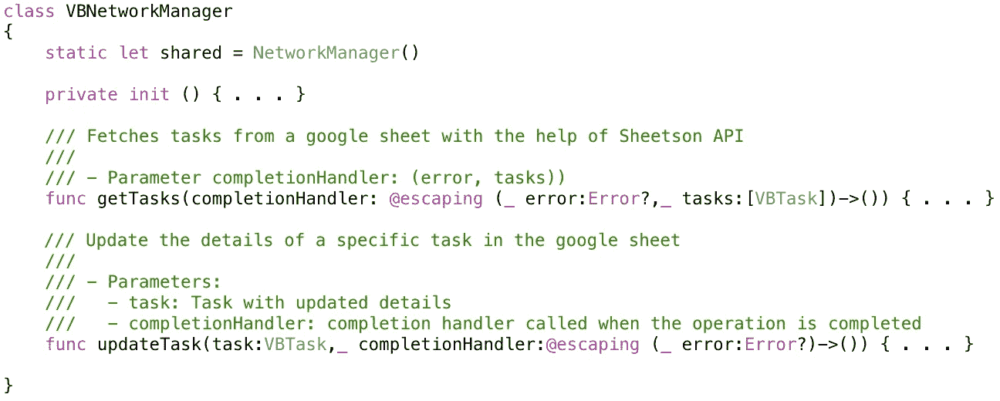
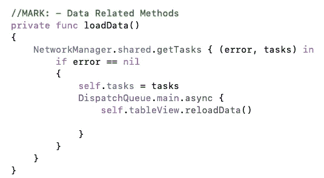
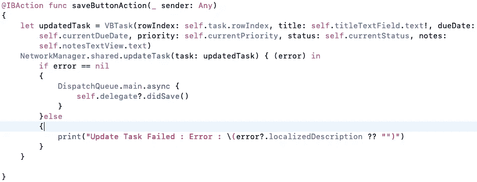

# 一个 iOS 项目从 MVC 到 MVP 的旅程:第 1 部分

> 原文：<https://medium.com/swlh/an-ios-projects-journey-from-mvc-to-mvp-and-beyond-part-1-d7f41615798c>

Photo by [Daniel Cartin](https://unsplash.com/@danielcv_93?utm_source=medium&utm_medium=referral) on [Unsplash](https://unsplash.com?utm_source=medium&utm_medium=referral)

自从你开始遵循 MVC(模型-视图-控制器)架构的 iOS 项目已经有几个月了，它的规模和复杂性都在增长。当你意识到你的代码很难测试和维护时，你现在觉得有必要重新组织你的代码。您有大量的视图控制器，您的大部分代码没有遵循“单一责任”和“关注点分离”的原则，并且在合并您的更改时，很难在不担心冲突的情况下与其他队友分工。是时候做一些清理和重构代码了。

# 思考角色和责任

每个大公司都是从几个人开始的，每个人都有多种角色和职责。在公司的早期阶段，这是完全有意义的。随着公司的发展，越来越多的人加入进来接管一些角色和职责，现在每个人都扮演着非常特定的角色，承担着非常特定的职责。以同样的方式思考你的项目，从简单的 MVC 架构开始，随着项目的增长，逐渐转移到更可行的架构。

在移动应用中要执行的一些职责是，

1.  用户界面
2.  数据实体
3.  业务逻辑
4.  数据持久性
5.  建立工作关系网
6.  导航/路线

在 MVC 架构中，您有三个角色(通常称为层)，模型、视图和控制器。模型角色负责数据实体，视图角色负责用户界面，而控制器通常负责业务逻辑、数据持久性、网络和导航。这导致大多数项目的视图控制器有数千行代码。

理想情况下，我们希望视图控制器做的唯一事情就是控制视图。因此，我们需要将视图控制器的一些职责转移给其他角色，

1.  **Presenter** —负责业务逻辑并为视图控制器准备数据。
2.  **数据管理器** —负责数据持久化，包含与获取、保存和更新数据相关的逻辑。
3.  **网络管理器** —负责联网，包含所有 REST API 调用。

# 例子

让我们以一个简单的任务管理器应用程序为例。该应用程序显示了从谷歌工作表中提取的任务列表，选择一个任务会显示任务的详细信息，还允许保存对任务详细信息的更改。

该应用程序目前遵循 MVC 架构，项目文件以下列方式组织，

Organization of files in the Xcode project

我们有一个名为“VBTask”的结构，它表示一个任务实体。我们有一个故事板，包含每个屏幕的 UI 设计和屏幕之间的导航。最后，我们有一个显示任务列表的表视图控制器(VBTasksTVC)和一个显示单个任务细节的视图控制器(VBTaskDetailsVC)。

让我们仔细看看' VBTasksTVC.swift '和' VBTaskDetailsVC.swift '，

Outline of VBTasksTVC.swift

Outline of VBTaskDetailsVC.swift

让我们创建一个网络管理器类，它从视图控制器那里接管网络的责任。名为“VBNetworkManager”的新单例类(该类的单个实例在整个应用程序中共享)现在将包含“ *getTasks()* ”(来自 VBTasksTVC)和“ *updateTasks()* ”(来自 VBTaskDetailsVC)方法的实现。单例模式带来了它们的问题，我们将在后面的部分进一步重构这个类，脱离单例设计模式。在这个阶段，单体设计模式是一个很好的选择。

我们现在可以在 VBTasksTVC 中使用 VBNetworkManager 的“getTasks()”方法。

VBTasksTVC’s loadData() method

并且，VBTaskDetailsVC 可以使用 VBNetworkManager 的“updateTask()”方法。

VBTaskDetailsVC’s saveButtonAction() method

我们现在已经成功地将视图控制器从网络的责任中解放出来。在[的下一部分](https://link.medium.com/JWk1KMkbUY)，我们将看看演示者如何通过接管准备数据的责任来解放我们的视图控制器。