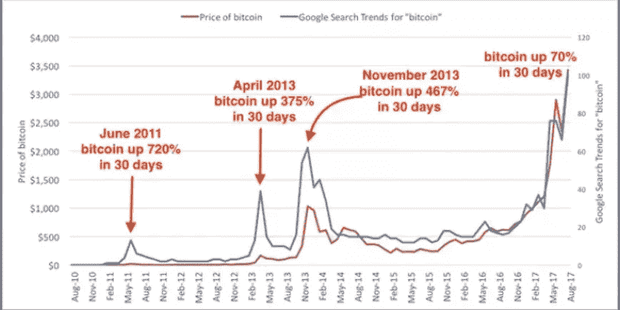

# 致所有加密货币投资者的公开信

> 原文：<https://medium.com/swlh/an-open-letter-to-all-cryptocurrency-investors-5b8db5fab325>

## 新的一年的开始提出了新的策略

Photo by [Álvaro Serrano](https://unsplash.com/photos/hjwKMkehBco?utm_source=unsplash&utm_medium=referral&utm_content=creditCopyText) on [Unsplash](https://unsplash.com/search/photos/letter?utm_source=unsplash&utm_medium=referral&utm_content=creditCopyText)

2019 年 1 月 15 日

加密货币投资者的伙伴。

在 2016 年结束时，我们看到了 2017 年将是一个吉祥之年的轮廓。加密货币领域中有远见和精神毅力的人通过购买比特币、以太坊、Ripple 等的大量股票为自己定位。请记住，这些人并不是在 2017 年一夜暴富的。自比特币诞生并最终实现以来，它们中的大多数都在密码领域萎靡不振。

事实上，其中一些人已经在这个领域呆了近十年，但没有我们在 2017 年看到的大部分突破。这些人潜在的品质是远见和耐心，我们可以自己实现。你看，股价的零星波动(见下图)并没有阻止他们对大量采用加密技术的愿景。他们看到，只要他们投资的项目保持他们的效用、紧迫性和关注点，他们就一定会获利。但是这些收获不会不战而降。

我从这些经验丰富的投资者、无数的书籍和我自己的生活经验中学到的是，没有什么有价值的东西是不战而获的。想想看，如果你很容易就获得了某样东西，你很少会赋予它任何重要的价值。这就是为什么太快屈服于追求的女人经常被当作炮友，而贞洁的女人受到尊重。

人类的一个基本心理是重视那些需要付出巨大努力才能达到的不相称的高度。有时候，斗争只是意味着后退一步，反思前一年所做的决定。非常坦率地说，2018 年不是产生重大决定的一年，因为那时所有的立场都已经确定。

让我借此机会再次向你们重申这一集体愿景。我们一起踏上了这段旅程。你和我已经踏上了这场革命之旅，希望看到财富和权力重新分配给人民。这种挑衅性的努力逃脱不了传统的审查和随后的权力束缚。我们看到谷歌和脸书在 2017 年底禁止所有加密广告。此外，政府最终采取行动，制定各种立法来减轻(首次发行硬币)ICO 的。

Bitcoin price movement is in red & Google search trends for bitcoin is in blue

所有这些来自集中式系统的因素造成了一个瓶颈，导致了 2018 年加密增长和利润的窒息。我们看到各种加密市值在 2018 年贬值超过 95%。目前，我们正在为我们的生计而战，但我怀疑理性和凶猛的创新将在未来几年占上风。

正如上面的图表所示，这种隐性抑郁症不是我们以前没有见过的。我们一次又一次地看到这种情况。这没什么可怕的。我们只是不得不接受这样一个事实:我们最初的快速收益概念现在已经被放到了长期位置上。这是我们可以从 2017 年的秘密奸商那里学到的一件事。我们可以从他们的忍耐中学习，当沮丧的风暴似乎势不可挡的时候。

在这令人耳目一新的新年里，我向你保证，我们会谨慎行事。让我们保持让我们走到一起的愿景——让我们着眼于隧道尽头的光明(尽管隧道可能很长)——让我们鼓起我们神经中的每一根纤维，紧紧抓住我们身体中的每一点耐心。我们获取巨额利润的目标没有改变。

前面的路可能会很艰难，但你可以用你的生命打赌，如果我们冷静我们的神经足够长的时间，我们将发现巨大的机会来利用以获得那些利润**。正如你可能已经猜到的那样，这次旅行绝对不适合心脏虚弱的人。在这新的一年里，让我们竖起一面牛气冲天的旗帜:*命运不仅眷顾勤劳的人，也眷顾勇敢的人。***

真诚地

霍德勒的同事

附言*【我深感荣幸的是，你们信任我，让我来领导你们完成这一使命。我向上帝祈祷我不会让你失望。* ]

**如果您喜欢这篇文章，请通过👏直到天塌下来。最多可以给 50👏**

## 这篇文章发表在 [The Startup](https://medium.com/swlh) 上，这是 Medium 最大的创业刊物，拥有+411，714 名读者。

## 在此订阅接收[我们的头条新闻](http://growthsupply.com/the-startup-newsletter/)。

