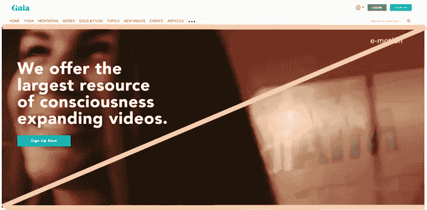
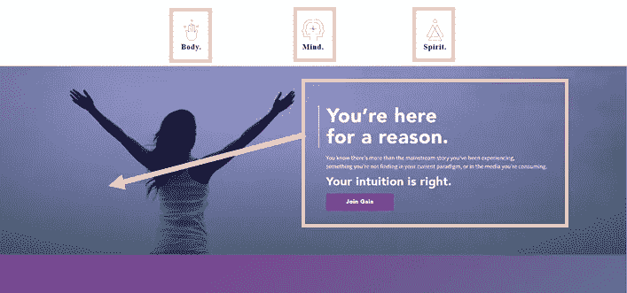
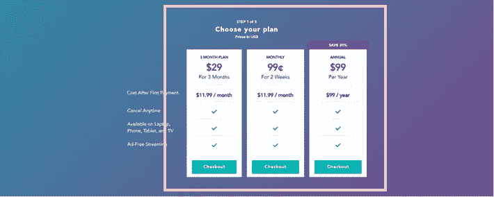
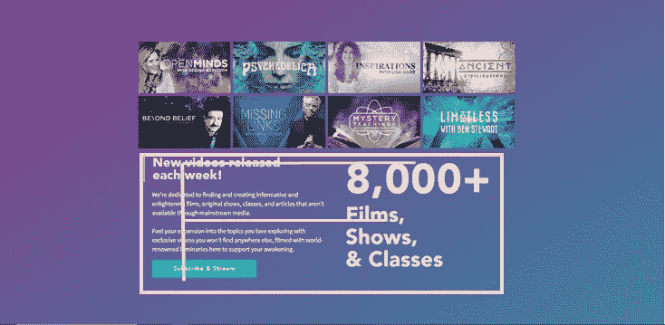
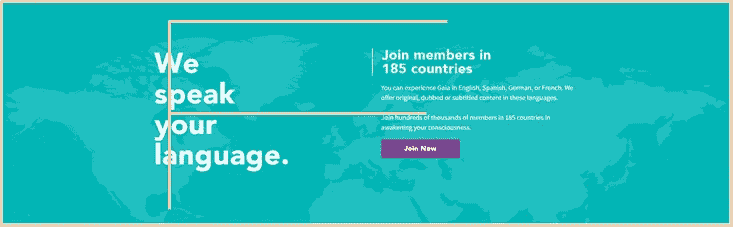
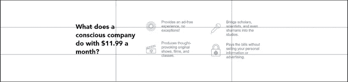
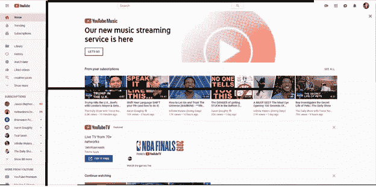
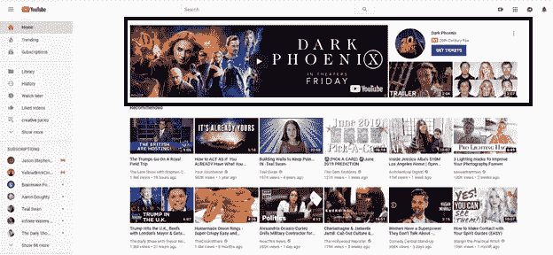
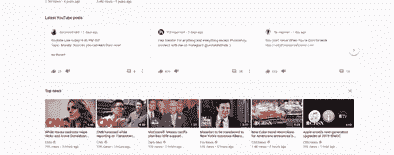
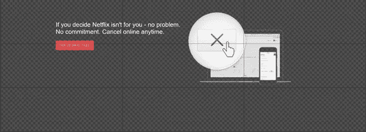

# 流媒体网站的视觉层次研究

> 原文：<https://medium.com/swlh/analyzing-the-use-of-visual-hierarchy-2d9516da189e>

仅仅为了美学上的成就而仅凭想象来创造设计，可能无法传达信息和重要信息。那么，让我们来看看一些知名登陆页面背后的原理，以及它们是如何向用户传递信息的。

# **盖娅**

*我最喜欢的网站之一叫做盖亚，运作起来像网飞或 Hulu，但是是为扩展意识而设计的。让我们看看他们是如何在整个网站中实现视觉层次的。*

Use of Z-pattern in the hero section

主页上的英雄部分使用 z 形图案来吸引人们对行动号召按钮的注意。

Rule of odds & proximity

在接下来的章节中，我们看到他们使用几率法则来引起人们对构成其内容的三个要素的注意:思想、身体和精神。我们也可以看到邻近性的使用，因为他们把图像和给出的信息联系起来。

Use of contrast

向下滚动到他们的付款计划，我们可以看到对比的使用。他们希望他们的用户体验到快速找到这些信息的便利，而这也实现了这个目标。

symmetry

我们注意到这里对称性的使用，这可能是为什么这个信息不突出。当我是这个网站的新用户，我正在彻底地研究这个网站时，我从来没有停下来阅读过这些信息。

The F-pattern

我们可以在这幅图上看到 F 模式的使用。他们的主要目标是让用户知道有大量的内容，你永远不会感到无聊。当我第一次看到这个模块时，我浏览了一遍，然后以 F 模式查看我得到了什么信息。

Again, the F-pattern

我们再次注意到 F 模式的使用，同时它们传达了它们的全球流行。

rule of thirds

这里应用了三分法，将一些信息块直接放在交叉点上。

当我作为一个新手访问他们的网站时，我认为它的设计非常简单，使用了如此多的空白，以至于这些信息似乎并不重要。在很多方面，我将它的展示与网飞或 Hulu 的相比，它们所有的电影标题都在背景中闪烁，我想被它们的内容淹没，就像我经常与网飞或 Hulu 的内容一样。

我对这个网站的看法是，我从来没有真正欣赏过信息的编排方式。我现在对他们的经验设计师有了新的欣赏。

# 油管（国外视频网站）

我花很多时间在 YouTube 上看精神领袖和喜剧新闻。我们来看看他们的视觉层次原则。

the F-pattern

主页包含一个 F 模式来传达大量的内容。他们的目的是以一种我们的大脑能够理解的方式来组织这些内容。

size

他们在主页的英雄部分设置了尺寸，以显示他们最相关的内容。

use of proximity

我们还可以在侧面板中看到接近度的使用。所有喜欢的视频都与“稍后观看”视频和播放列表放在一起。然后，我们在底部看到所有订阅频道，以便于找到它们，而不是使用搜索工具来查找它们。

lack of white space

正如我们在 YouTube 上所看到的，他们的内容中并没有包含太多的空白。但这与用户的目的有关，而不仅仅是一个缺点。我们大多数人在点击观看之前都会浏览尽可能多的主页内容。因此，这确立了他们的使命，即节省用户的时间，而不是分散视频并有更长的滚动时间。

起初，在不知道等级原则的情况下，我以为 YouTube 忙于内容。现在考虑到这些层次原则，我可以看到这样一个繁忙的网站如何仍然可以成为一个易于导航的设计，节省用户大量的时间，因为他们不知道该看什么。

# 网飞

*不用登录网飞账户，让我们看看登陆页面与盖亚的相比如何。*

use of proximity

我们可以看到，在这里，行动号召与背景中的电影和电视节目相关联。

rule of odds

他们使用赔率规则来展示他们的用户认为最方便的东西:没有承诺的轻松，在任何地方远程观看，以及多种价格选择。

我们还可以看到整个页面都使用了空白，使页面不那么繁忙，内容也不那么多。

rule of thirds

再一次，我们看到这种对远程观察自由的强调，使用三分法则。他们提到了远程观看的便利性，而且没有承诺两次，不像价格选项只提到一次。我得到的印象是，他们不希望他们的用户更多地关注价格，而不是价值:在每个设备上的易用性和取消的自由。

*我从网飞学到的最后一点是，他们显然相信自己的产品，这一点在他们的登陆页面上表现得很好。虽然这显示了对其价值的极大信心，但它可能缺乏透明度。*

**我的映像**

*与盖亚不同，网飞不会在登录页面展示他们的价格。他们也没有利用很多其他层次原则，因为内容与行动号召直接相关。不像盖亚，他们不需要描述他们的内容和给一瞥，因为大多数网飞用户知道他们的电影和节目。*

*这项分析是研究视觉层次原则的一种方式，旨在展示它们如何用于创造以用户为中心的体验。*