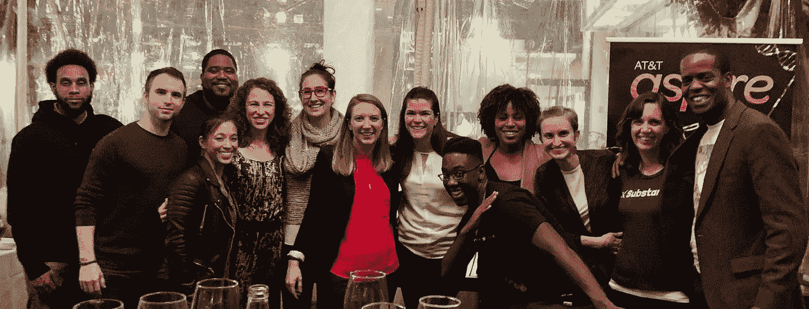

# 加速器剖析#1:课程

> 原文：<https://medium.com/swlh/anatomy-of-an-accelerator-1-curriculum-b121811f55ee>

*这是加速器项目设计元素系列文章的第一篇，* [*我们*](http://www.productivellc.com) *认为这是一个成功的项目。在过去的四年里，通过与客户的合作，我们学到了很多关于加速器(和其他创新计划模式)的知识，分享这些知识很有意义。我们将使用我们在设计和实现 AT & T Aspire 加速器方面的工作作为这些帖子的模型。*

很明显，我们持续的联系使每个人的小众兴趣都能在网上找到受众。猫咪视频、尤克里里的歌曲翻唱，以及[猫咪弹奏尤克里里的视频](https://www.youtube.com/watch?v=rkWy8nRWPGk)——这些东西似乎无处不在，但它们很快获得了追随者和文化。这不仅仅适用于琐碎和/或感人的事情。我们也能够在生产领域找到一个利基，这个利基一直是创新项目设计。

我知道，我知道，我们听起来很棒。

不过，这是真的！我走了一条非常曲折的职业道路，没有什么能像设计创新项目一样满足我所有的兴趣。我写过并画过出版的连环漫画，我为一家新成立的咖啡公司烘焙过咖啡，我还为一家一岁的出版商管理过产品。虽然这些工作都非常有趣，但它们并没有像设计创新项目那样抓住战略上的痒处。如果这些项目能够产生积极的社会影响，就更好了，就像 Aspire Accelerator 的情况一样。

Aspire Accelerator 已经进入第五个年头，27 个不同的组织从该计划中毕业，累计学生人数超过 2200 万。我们喜欢在这个项目上工作，我认为这在很大程度上归功于它的设计。

Aspire 加速器的设计源于一项用户研究工作，这项工作让我们与 32 位 EdTech 初创公司创始人、11 位 EdTech 初创公司导师和 5 位 EdTech 风投进行了交谈。我们学到了很多关于 EdTech 是一个独特的具有挑战性的市场的特殊方式，我们也学到了如何建立顶级 EdTech 加速器计划的基本设计标准。

# 设计标准#1 —课程

Photo by [Elijah Hail](https://unsplash.com/@elijahhail?utm_source=medium&utm_medium=referral) on [Unsplash](https://unsplash.com?utm_source=medium&utm_medium=referral)

现代加速器设计的一个支柱是这些程序运行他们的创业公司的一套独特的会议——他们的课程。该课程背后的驱动思想是，有一个让初创企业成功的公式，如果他们只是遵循课程中的指示，他们也可以成功。

2014 年， [Y Combinator](http://www.ycombinator.com/) 首先发布了他们的课程，然后作为一套[免费视频](http://startupclass.samaltman.com/)发布给任何想要受益的人。四年后，我们发现自己充斥着优秀的(免费的)[内容](/@StartupJourney/400-free-tools-and-resources-for-entrepreneurs-and-startups-4e0c10539a0c)，通过视频、 [meetups、](https://www.meetup.com/Hackers-and-Founders/)、[播客](https://www.earwolf.com/show/startup-school/)，见鬼——现在有了一部[(已取消)情景喜剧](https://abc.go.com/shows/alex-inc)，主角经历了创业的起起落落。尽管这些信息的质量和相关性可能各不相同，但对于任何想创建公司的人来说，这些信息都是现成的、容易获取的。

加速器是为了给创业者必要的工具来加速成功公司的发展。因此，如果任何人都可以在谷歌搜索的后端创建一家公司，那么课程在加速器这样的创新项目中还有一席之地吗？答案是一个很直白的“也许”；)

**在决定如何为您的加速器开发课程时，一切都取决于您想要的结果。**如果你只是想创建可以扩大规模并创造投资回报的可资助初创企业，那么，无论如何，都要创建一个课程，将你的创业团队塑造成你的资助者网络希望看到的类型。这是 Y Combinator 多年来一直在成功做的事情，而且似乎很有效。当然也有一些缺点——他们的招聘结构和项目似乎只对像 Y Combinator 团队那样的创始人有效。值得称赞的是，他们一直在努力解决他们的多元化问题，但他们仍然以压倒性优势选择白人男性创始人。

当然，问题的一部分是大多数组织仍然把他们缺乏多样性看作是一个需要解决的问题，而不是一个发展的机会。当你在运行一个加速器项目，支持其产品有机会接触到各种类型用户的技术组织时，拥有与这些用户背景相匹配的创始人会有所帮助。对于旨在支持对被低估的青年和贫困社区产生巨大影响的组织的美国电话电报公司 Aspire 计划来说，创始人多元化是实现其预期结果最大化的必要条件: ***社会影响。***

Photo by [Santi Vedrí](https://unsplash.com/@santivedri?utm_source=medium&utm_medium=referral) on [Unsplash](https://unsplash.com?utm_source=medium&utm_medium=referral)

所以，让我把它带回到课程上来。如果你正在运营一家加速器，其创始人都来自相似的背景，而且恰好与你的背景相符——我会说，你处于一个很好的位置，可以为这些创始人编写成功的课程。然而，为了实现 Aspire 的社会影响目标，我们所做的一切都必须融入多元化。突然间，一套固定的课程开始变得不那么有意义了。

除了创始人多元化，我们还有一系列广泛的目标市场和商业模式。我们考虑了正在产生我们想要帮助创造的影响的成熟组织的类型(像[汗学院](https://www.khanacademy.org)、 [Think CERCA](https://thinkcerca.com) 、[捐助者选择](https://www.donorschoose.org)、 [Udacity](https://www.udacity.com) 和 [Duolingo](https://www.duolingo.com) 这样的公司)，并考虑了如何支持早期阶段的组织。很快就清楚了，大规模的影响不仅仅局限于一种公司类型或一种参与模式。这些组织既有盈利性的也有非盈利性的，他们向学校、教师或家长推销，他们的管理人员就像他们的商业模式一样多样化。

如果我们要支持所有这些类型的组织和创始人，那么现在一套课程就显得毫无意义。盈利性公司的筹资研讨会与非盈利性公司的非常不同。面向家长的销售策略研讨会与面向学区的销售策略研讨会有很大不同。

> 我们决定完全取消课程，这使世界变得完全不同。

那么，如果没有课程的话，我们该如何利用项目中的组织呢？我将把它留给我们的下一篇文章。可以说，答案是任何事情和一切，根据特定组织的业务模型、市场和成熟度定制。

这种对我们组织的支持，加上我们组织及其创始人的多样性，其价值是显而易见的，并且正在发挥作用。几个证据:

*   **63%的企业家是女性**
*   **44%是有色人种创始人**
*   **我们支持的项目现在已经惠及全国超过 2200 万名学生**
*   在初始投资之后，他们又筹集了 3500 万美元的资金
*   **四年后，所有 27 家合资企业仍在运营**

毫无疑问，客户支持是资源密集型的，很难有效实现，在下一篇文章中，我将通过谈论我们的下一个设计标准——**领导力来告诉你我们是如何做到的。**加速是一门微妙的科学，每个组织的加速之路都是独特的。

**当然，高质量的课程*很有可能会*加速你的组织，但是(结合多样性)一个 100%定制的“非课程”方法将*确保*它发生。**

如果这些帖子有帮助，请告诉我们！如果您不同意，我们也很想听听您的意见！无论如何， [*我们很想收到你的来信*](https://productivellc.com/contact-us/) *！我们的业务致力于降低任何人加速积极社会变革的障碍。我们咨询各种客户关于创建加速程序来做到这一点！如果你对加速度很好奇，* [*让我们试着满足这种好奇心*](https://productivellc.com/contact-us/) *。*

## 这篇文章发表在 [The Startup](https://medium.com/swlh) 上，这是 Medium 最大的创业刊物，拥有+406，714 名读者。

## 在这里订阅接收[我们的头条新闻](http://growthsupply.com/the-startup-newsletter/)。

