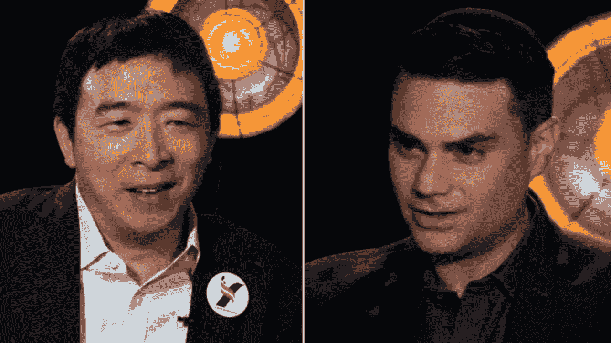

# 杨安泽和本·夏皮罗讨论评论:对普遍基本收入的分析

> 原文：<https://medium.com/swlh/andrew-yang-ben-shapiro-discussion-review-an-analysis-of-universal-basic-income-30bb1d93cb96>

Andrew Yang (Left) and Shapiro (Right)

上周，2020 年大选的民主党候选人杨安泽在保守派播客“本·夏皮罗秀”上坐下来讨论了他的一些想法，该播客由保守派作家、议长和政治评论员本·夏皮罗主持。

杨安泽作为一名企业家、慈善家和“*为美国而创业”、*“a…