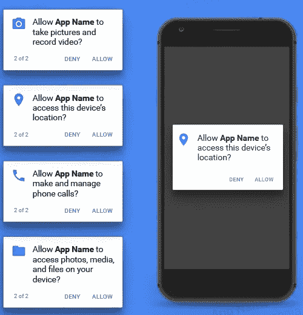

# Android 权限系统漏洞和可能的解决方法

> 原文：<https://medium.com/swlh/android-permissions-system-vulnerabilities-and-possible-workarounds-8098519aefa9>

Android Permission Dialogs by [Seth Cottle](https://www.sketchappsources.com/free-source/2328-android-permissions-dialog-templates-sketch-freebie-resource.html)

你们中的许多人肯定读过非常令人关注的[新闻](https://www.theverge.com/2019/7/8/20686514/android-covert-channel-permissions-data-collection-imei-ssid-location)或[一项研究](https://www.ftc.gov/system/files/documents/public_events/1415032/privacycon2019_serge_egelman.pdf)在 PrivacyCon 2019(跳转到 2:16:28) 上展示了**超过 1300 个 Android 应用**如何在 ***拒绝*** 权限后获取私人数据，其中包括拥有**数亿用户**的热门应用。这些应用程序正在利用 android 权限模型，收集地理位置、持久用户或…