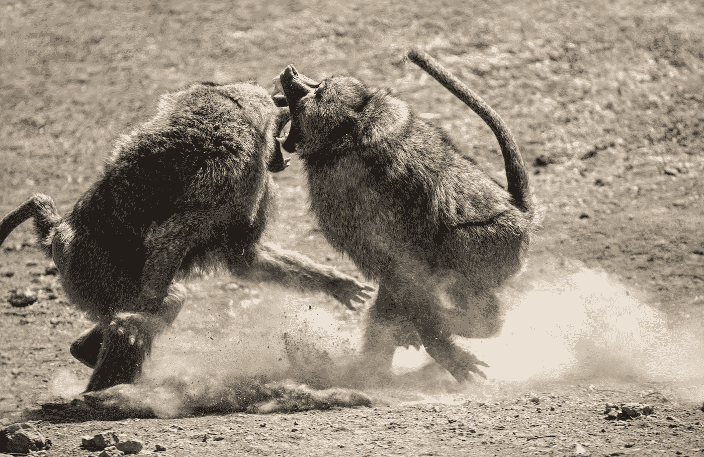

# 愤怒:识别愤怒发作的冲击:

> 原文：<https://medium.com/swlh/anger-identify-the-onslaught-of-an-anger-episode-643c9b6c4135>

Photo by [David Clode](https://unsplash.com/@davidclode?utm_source=medium&utm_medium=referral) on [Unsplash](https://unsplash.com?utm_source=medium&utm_medium=referral)

## …不用愤怒的情绪来控制你。

你经历过愤怒吗？在你意识到这一点之前，你对你的搭档、你前面的司机或者在季后赛中吹了一个严重犯规的裁判大喊大叫？如果你对这些问题中的任何一个说不，你可以跳过这篇文章的其余部分。你得到了…