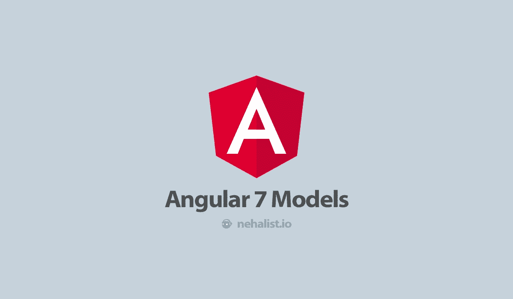
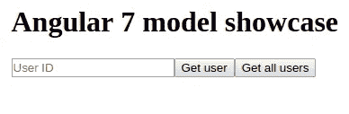
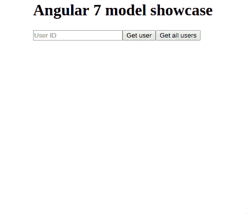

# Angular 7 款

> 原文：<https://medium.com/swlh/angular-7-models-cd0cd80f5e33>



由于我的[上一篇关于 Angular 模型的指南](https://nehalist.io/working-with-models-in-angular/)是在 2017 年 9 月写的，现在肯定是更新 Angular 最新版本的时候了。关于实现的一些事情已经改变了，特别是在如何创建我们的类(现在通过 Angular CLI 完成)、`HttpClient`如何工作(已经变得通用)以及如何将我们的响应映射到我们的模型(通过管道)方面。

此外，本指南将尝试涵盖上一指南中出现的一些问题。

对于 TL；这个帖子的 DR 版本见 [GitHub 资源库](https://github.com/nehalist/angular7-models)。

# 计算机网络服务器

对于本指南，我们将创建一个*非常*小的 [expressjs](https://express.js.com) 服务器来服务我们的数据。这个服务器(用普通 JavaScript 实现)将返回简单的 JSON，然后映射到 Angular 中的模型。

```
// server.js

// Our users which will be queried by their index
const users = [
  {
    firstName: "Jesse",
    lastName: "Pinkman",
    position: "Manufacturer",
    cars: [
      {
        brand: "BMW",
        model: "M3",
        kW: 338,
      },
    ],
  },
  {
    firstName: "Walter",
    lastName: "White",
    position: "CEO",
    cars: [
      {
        brand: "BMW",
        model: "335i",
        kW: 225,
      },
      {
        brand: "Lamborghini",
        model: "Aventador",
        kW: 566,
      }
    ],
  },
];

// Allow cross-origin requests
app.use(function(req, res, next) {
  res.header("Access-Control-Allow-Origin", "*");
  res.header("Access-Control-Allow-Headers", "Origin, X-Requested-With, Content-Type, Accept");
  next();
});

app.get("/users", (req, res) => {
  return res.json(users);
});

app.get("/user/:id", (req, res) => {
  // To prevent the ID "0" we'll simply subtract by one. This way we can query for id = 2 which will serve us 1, etc.
  const idx = req.params.id - 1;

  if (!users[idx]) {
    return res.status(404).json({ error: "User not found" });
  }

  return res.json(users[idx]);
});

app.listen(3000, () => {
  console.log("Server running on port 3000");
});
```

服务器以`node server.js`启动，将提供 API 来根据两个不同用户的 ID 查询他们。例如`http://localhost:3000/2`会输出:

```
{
  "firstName": "Walter",
  "lastName": "White",
  "position": "CEO",
  "cars": [
    {
      "brand": "BMW",
      "model": "335i",
      "kW": 225
    },
    {
      "brand": "Lamborghini",
      "model": "Aventador",
      "kW": 566
    }
  ]
}
```

前往`http://localhost:3000/users`将返回所有用户的列表。

我们这里有两个对象，它们将被映射到适当的模型对象；用户本身及其汽车 **s** ( *复数！*)。

# 角度应用

让我们从最底层开始，使用 Angular CLI 创建新的 Angular 应用程序:

```
ng g angular7-models 
cd angular7-models
```

我们需要一个对我们的用户和两个模型负责的服务，一个代表用户，一个代表汽车。

```
ng g service services/user 
ng g class models/user.model 
ng g class models/car.model
```

这(以及已经存在的应用程序组件)是我们在本指南中需要的所有东西的基础。

# 模型和反序列化

当从我们的 API 查询时，我们所有的模型都需要被反序列化。这只是指定了来自 API 的数据映射到模型类的方式。

正如在[之前的指南](https://nehalist.io/working-with-models-in-angular/#deserialization)中一样，我们将简单地实现一个`Deserializable`接口，该接口将由我们的模型在之后实现:

```
// src/app/models/deserializable.model.ts

export interface Deserializable {
  deserialize(input: any): this;
}
```

这个接口将由我们的模型实现；`deserialize`将负责将我们的数据映射到我们的对象。

# 汽车模型

因为我们的汽车模型没有任何关系(这使得*更容易*模型实现),让我们从这个模型开始。

```
// src/app/models/car.model.ts

import {Deserializable} from './deserializable.model';

export class Car implements Deserializable {
  public brand: 'BMW' | 'Audi' | 'Lamborghini' | 'Mercedes';
  public model: string;
  public kW: number;

  deserialize(input: any): this {
    return Object.assign(this, input);
  }

  getHp() {
    return this.kW * 1.36;
  }
}
```

在这种情况下，`Object.assign`是一个简单的助手，*将*我们的输入分配给我们的对象——由于我们不需要任何分配逻辑(比如从我们的 API 转换或修改数据),这就足够了。

此外，出于演示的目的，这个模型有一个实用程序方法，将我们汽车的千瓦数转换为马力——我们将在稍后的 UI 中使用这个实用程序。

# 用户模型

我们的用户模型将与我们的汽车模型相关联；一个用户可以拥有*多辆*汽车。这要求我们在用户模型中进行反序列化，以额外处理汽车的反序列化；

```
// src/app/models/user.model.ts

import {Deserializable} from './deserializable.model';
import {Car} from './car.model';

export class User implements Deserializable {
  public id: number;
  public firstName: string;
  public lastName: string;
  public position: string;
  public cars: Car[];

  deserialize(input: any): this {
    // Assign input to our object BEFORE deserialize our cars to prevent already deserialized cars from being overwritten.
    Object.assign(this, input);

    // Iterate over all cars for our user and map them to a proper `Car` model
    this.cars = input.cars.map(car => new Car().deserialize(car));

    return this;
  }

  getFullName() {
    return this.firstName + ' ' + this.lastName;
  }
}
```

这个反序列化方法的工作方式*与我们的 car 略有不同；在*将我们的输入分配给用户模型之后，我们需要反序列化我们的汽车*，以防止输入覆盖我们的汽车属性。*

因为我们知道`input.cars`是一个数组，所以我们使用了`[Array.prototype.map()](https://developer.mozilla.org/en-US/docs/Web/JavaScript/Reference/Global_Objects/Array/map)`。这将遍历我们的所有元素(在我们的例子中:我们的汽车)，反序列化它们并返回一个包含反序列化模型的数组。

> ***注*** *:如果你想知道是否可以用* `[*Array.prototype.forEach()*](https://developer.mozilla.org/en-US/docs/Web/JavaScript/Reference/Global_Objects/Array/forEach)` *:* 不行！*`*forEach*`*和* `*map*` *的最大区别在于* `*map*` 返回一个新数组*而* `*forEach*` *只是将提供的回调应用于我们所有的数组项——但不返回一个新数组。**

*我们再次实现了一个实用方法来直接获取用户的全名。*

*这就是我们的模型。让我们通过我们的服务来查询它们吧！*

# *用户服务程序*

*自从我的上一篇指南以来，一个主要的变化是`HttpClient`的工作方式。它已经变得通用了，这意味着我们可以告诉它，我们期望什么类型的反应。*

```
*// src/app/services/user.service.ts

import {Injectable} from '@angular/core';
import {HttpClient} from '@angular/common/http';
import {Observable} from 'rxjs';
import {User} from '../models/user.model';
import {map} from 'rxjs/operators';

@Injectable({
  providedIn: 'root'
})
export class UserService {

  constructor(private httpService: HttpClient) {
  }

  public getUser(id: number): Observable<User> {
    return this.httpService.get<User>(`http://localhost:3000/user/${id}`).pipe(
      map(data => new User().deserialize(data)),
      catchError(() => throwError('User not found'))
    );
  }

  public getAllUsers(): Observable<User[]> {
    return this.httpService.get<User[]>(`http://localhost:3000/users`).pipe(
      map(data => data.map(data => new User().deserialize(data)))
    );
  }
}*
```

*这里有两个方法:一个用于查询特定用户，另一个用于查询所有用户。*

*两种方法都通过 from RxJS 将它们的响应映射到我们的模型。我们的`getUser`方法额外实现了一些错误处理，这在试图查询一个不存在的用户时很有用。*

*这就是我们的服务。我们现在可以通过我们的服务使用我们的模型！*

# *应用程序组件*

*我们的应用程序组件将有两个非常简单的特性:查询一个特定的用户(使用`getUser`服务方法)和查询所有用户(使用`getAllUsers`服务方法)。为了简单起见，我们将把两个功能的逻辑放在一个组件中。*

*让我们从模板开始:*

```
*<!-- src/app/app.component.html -->

<div style="width: 400px; margin: auto;">
  <h2>Angular 7 model showcase</h2>
  <input type="number" [(ngModel)]="userId" placeholder="User ID">
  <button type="button" (click)="getUser()">Get user</button>

  <button type="button" (click)="getAllUsers()">Get all users</button>

  <div *ngIf="user">
    User is called {{user.getFullName()}}. He has the following cars:
    <ul>
      <li *ngFor="let car of user.cars">
        {{car.brand}} {{car.model}} with {{car.getHp()}} hp.
      </li>
    </ul>
  </div>

  <div *ngIf="users">
    <hr>

    <ul>
      <li *ngFor="let user of users;">
        {{user.getFullName()}} is {{user.position}} and has {{user.cars.length}} cars
      </li>
    </ul>
  </div>
</div>*
```

*这将把我们带到这个*非常漂亮的*用户界面:*

**

*在它完全工作之前，我们需要实现附加在按钮上的点击事件；*

```
*import {Component} from '@angular/core';
import {UserService} from './services/user.service';
import {User} from './models/user.model';

@Component({
  selector: 'app-root',
  templateUrl: './app.component.html',
  styleUrls: ['./app.component.css']
})
export class AppComponent {
  public userId: number;

  public user: User;

  public users: User[];

  constructor(private userService: UserService) {
  }

  public getUser() {
    this.userService.getUser(this.userId).subscribe(user => this.user = user);
  }

  public getAllUsers() {
    this.userService.getAllUsers().subscribe(users => this.users = users);
  }
}*
```

*瞧，我们完成了:*

**

**惊讶于我们* `*getHp*` *方法的这种近乎疯狂的 kW 到 HP 的转换，因为我已经忘记四舍五入了！**

*我们模板中的所有用户交互现在都是我们的`User`对象的一个实例(每个用户的汽车都是`Car`的一个实例)——这意味着我们可以使用所有的助手工具并与真正的对象一起工作。*

# *结论*

*处理真实的对象而不是原始的 JSON 会让你的生活变得容易得多(参见我之前的关于这种方法的优点的指南)。*

*和往常一样，你可以在 GitHub 上找到该指南的完整源代码。*

*如果你喜欢这篇文章，请留下👏，关注我上 [*推特*](https://twitter.com/nehalist) *并订阅* [*我的快讯*](https://nehalist.io/newsletter/) *。原载于 2019 年 4 月 18 日*[*https://nehalist . io*](https://nehalist.io/angular-7-models/)*。**