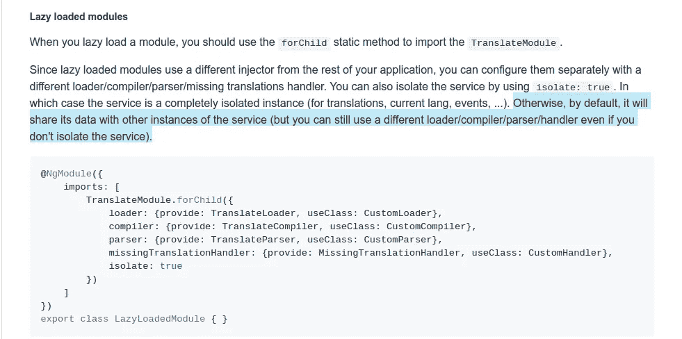

# angular NGX-转换惰性加载模块

> 原文：<https://medium.com/swlh/angular-7-ngx-translate-lazy-loaded-modules-36d586b82ba4>

Angular + NGX translate

*我们很多人使用*[*ngx-translate*](http://www.ngx-translate.com/)*来管理 angular app 中的翻译。*

*你有没有遇到过这样的情况:在**翻译管道**和**翻译** **服务**的情况下，你有懒惰加载的模块而 *ngx-translate* 无法翻译 app。*

*很可能你已经在 StackOverflow，Google 等网站上搜索过答案了。*

*在 *ngx-translate* 文档中，我们看到我们可以执行*translate module . for child({ })，*如果我们不隔离这个翻译，它应该使用默认文件。*

**

*但是，如果你去看这个 [***问题***](https://github.com/ngx-translate/core/issues/425) 你会发现它并不像预期的那样工作。这里还有一点很重要，那就是这个 bug 是很久以前提交的，在 2017 年 2 月 11 日。所以当我现在写的时候，差不多是一年前了。*

*我们可以用 isolate: true 为每个模块加载单独的文件，但是如果您想要共享在 *forRoot({})中使用的主文件呢？**

*然后我建议创建你自己的翻译管道(async - my case)和你自己的翻译服务。*

## *平移管道*

*管道的简单示例代码:*

**用法:**

*只需将它添加到您的共享模块中，并在您的 HTML 中将其命名为*

> **
{ { your translation key | ebTranslateLazy | async } }
。**

***翻译服务***

*如果您设置了`@Injectable({
providedIn: 'root',
})`，您可以将 Pipe 作为服务使用*

*但是如果你想创建一个单独的服务没问题，代码基本上是一样的。*

*注意中提供的*是符号，优选从角度 6°开始。对于较低版本，请在模块的 providers 数组中声明它。这同样适用于我们的服务。**

**用法:**

*只需在组件的构造函数中注入服务或管道，在需要的地方使用服务*

**this . translatelazyservice . stream(值)。subscribe(item =>{ do something(item)})；。**

*希望你喜欢。*

***作者:** [**米罗斯拉夫**](https://medium.com/u/3cf54a8924de?source=post_page-----36d586b82ba4--------------------------------)*