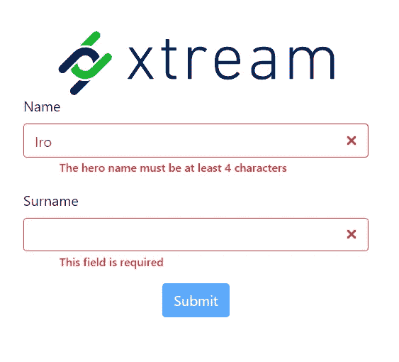

# 角度验证错误变得简单

> 原文：<https://medium.com/swlh/angular-validation-errors-made-easy-3bc1a837c6e7>

角度**反应形式**很棒。动态性、验证和绑定使我——以及我所在社区的一部分——更喜欢它们而不是模板驱动的。然而，不管是被动的还是模板驱动的，
表单应该让应用程序从用户那里收集数据，并向他们提供关于数据验证的反馈。

我们认为这两种策略都存在向用户显示错误消息的方式不佳的问题。在本文中，我将讲述我们如何在 [**xtream**](https://xtreamers.io) **中尝试解决这个问题。**

## 验证错误详细程度

我们如何显示输入的验证错误？正如《圣经》(也叫 Angular documentation)所建议的，我们必须这样写

[https://angular.io/guide/form-validation#built-in-validators](https://angular.io/guide/form-validation#built-in-validators)

您可以通过在组件中添加一个 getter 来简化该模板:

验证变成了:

[https://angular.io/guide/form-validation#built-in-validators](https://angular.io/guide/form-validation#built-in-validators)

这是一个只包含一个具有四种不同验证类型的字段的表单，我们已经完成了 20 行代码。模板驱动的情况与此也相差不远:您必须编写一组`if`语句，至少一个字段需要一个验证，并显示特定的消息。

在开发 [sofan](https://sofan.it) 的过程中，在八月下旬的第一个登录页面要求姓名、姓氏、电子邮件、出生日期、城市和电话号码以及一些共识之后，我们开始寻找一种**更有效的**和**动态**方式来显示表单中的验证错误消息。

## 要求

在 Utopia 中，我们只需在创建`FormControls`时设置验证器，基于错误类型的**语言特定的**消息将出现在输入下方。消息应该根据字段和形式而**不同，并且可能是参数化的，因此如果我们将验证器从`Validators.min(4)`更改为`Validators.min(5)`，消息也会相应地更改。此外，对于像`required`这样的一般性错误，我们不想到处复制和粘贴“这个字段是必需的”。相反，如果特定于表单的验证类型不存在，我们希望有一个通用验证类型的后备。**

这样做我们可以专注于组件内部的验证逻辑，只关心语言文件中的消息，避免那些可怕的`ngIf`子句污染模板。

经过一些谷歌搜索和头脑风暴，我们创建了一个涵盖所有需求的小库。

# @ xtream/ngx-验证-错误

最终的解决方案是一组组件，允许我们编写看起来**干净**和**简短**的表单模板:

Final usage of @xtream/ngx-validation-errors

让我们看看`ValidationContextComponent`、`FormFieldContainerComponent`和`InputErrorsComponent`是如何完成我们需要的。

## InputErrorsComponent

该组件接受一组错误消息和参数，并使用[**@ ngx-translate**](https://github.com/ngx-translate/core)显示它们。消息只是翻译键，如“新英雄”。NAME.ERRORS.MINLENGTH”和参数是一个丰富错误信息的 JavaScript 对象，比如`{minlength: 8, actuallength: 6}`，所以我们可以使用`{{messageKey | translate:params}}`。我们将很快看到这个组件是如何添加到 DOM 中的。输入错误在输入下方显示为红色文本；使用`validationContext`的`innerValidationError`属性，你可以移动输入中的错误，例如，一个黑暗的背景。

Errors showed inside input with **innerValidationError** set to true

## ValidationContexComponent

该组件的职责是查询所有内部的`FormFieldContainers`，并在其中设置作为输入传递的验证上下文。上例中是“*新 _ 英雄*”。这允许使用特定于每个表单错误消息。

## FormFieldContainerComponent

该组件将输入包装在一个容器中，这样我们就可以动态地添加或删除它下面的错误组件。这是模板。

Container component to wrap input and add errors

使用内容投影，我们在输入的底部添加了传递错误消息和参数的`InputErrorsComponent`。

然后`FormFieldContainerComponent`开始变魔术:

组件使用 **@ContentChild** 选择其内容中的`FormControlName` 。如果表单控件是无效的、脏的和被触摸过的，它使用模板创建当前错误的列表

`${validationContext}.${fieldName}.ERRORS.${errorType}`

从而转换**中的字段名和错误类型。使用 errors 对象中的关键字以及**消息参数**来识别**错误类型**(您可以在这里直接查看内置验证器[，但是它也可以使用自定义验证器)。](https://github.com/angular/angular/blob/master/packages/forms/src/validators.ts)**

如果生成的关键字不存在于翻译中，则消息退回到可配置的默认验证上下文(如“GENERAL”)，删除字段名:“NEW_HERO”。NAME.ERRORS.MINLENGTH“变成”通用。所以你可以保留一些基本的错误。

最后，如果组件能够读取表单控件链接到的本地 html 元素，它还会切换类`is-invalid`，例如，您可以使用该类用红色边框标记输入。

## 图书馆使用

我们知道错误显示的方式和基础验证上下文的观点。在将验证组件提取到一个可重用的库中时，我们开发了用于配置的`forRoot`静态方法。

首先，使用以下命令安装它:

`npm i @xtream/ngx-validation-errors`

在您的`app.module.ts`中添加:

Simple library import

现在你可以在你的模板中使用 **validationContext** 和 **formFieldContainer** 。

自定义一般上下文和错误组件使用

Customised library import

`errorsComponent`必须遵守下面的接口，以便可以用默认接口替换。

记得将其添加到 **entryComponents** 列表中，否则不能使用组件工厂动态实例化。

你可以在 [**github repo**](https://github.com/xtreamsrl/ngx-validation-errors) 中找到带库和演示的整个 Angular workspace。该库的第一个 alpha 版本可以在 npm 注册表中以名称[**@ xtream/ngx-validation-errors**](https://www.npmjs.com/package/@xtream/ngx-validation-errors)**获得。**

这是一项正在进行的工作，所以如果你发现错误或你认为某些
丢失了，请打开一个问题或提交一份公关。

感谢您阅读这篇文章！

*在这里分享任何评论和提出任何问题或通过我的* [*LinkedIn 个人资料*](https://www.linkedin.com/in/luca-micieli) *取得联系。*