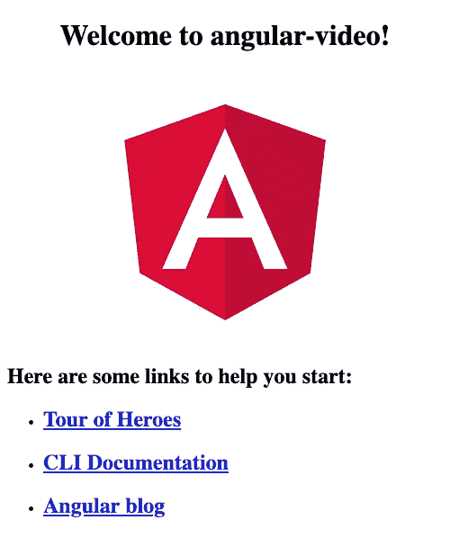
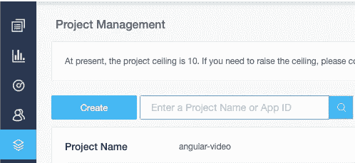
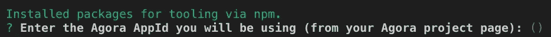
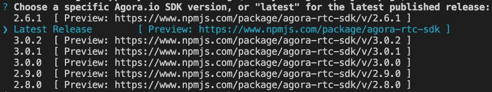
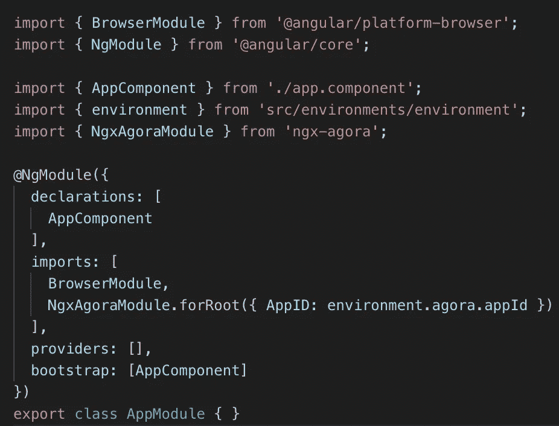
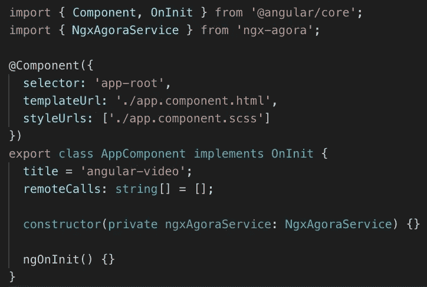
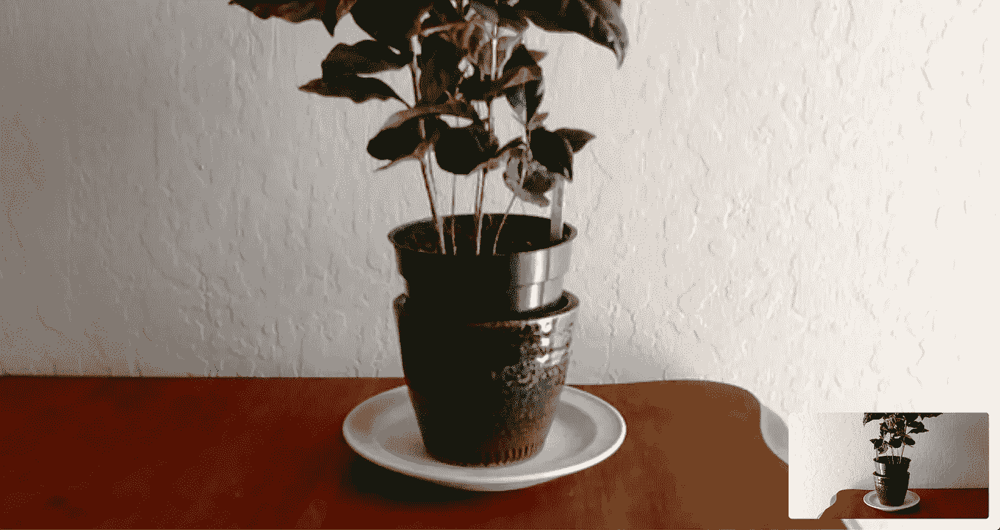

# 使用 Agora.io 进行角度视频会议

> 原文：<https://medium.com/swlh/angular-video-conferencing-with-agora-io-45905235eebb>

## 使用 ngx-agora 图书馆，不到 10 分钟就可以启动并运行。

[*ngx-agora*](https://github.com/drew-thompson/ngx-agora)*——*agora . io 的开源 Angular 库。

[*agora . io docs*](https://docs.agora.io/en/Video/API%20Reference/web/index.html)*—*具有易用 API 的跨平台 WebRTC

## 创建一个角度应用程序

让我们首先使用 Angular CLI 创建一个新的 Angular 应用程序，然后将 Agora SDK 集成到其中。

> 如果你没有使用过 Angular CLI，它是一个强大的工具，可以生成任何有角度的东西。您可以使用命令`npm i -g @angular/cli`使用 [npm](https://www.npmjs.com/) 进行全局安装。

我们将通过运行命令`ng new angular-video`来调用我们的新应用 *angular-video* 。运行令人惊叹的终端提示，以您喜欢的方式设置项目——在这个例子中，我将对 routing 说*不*,并将默认的项目样式表格式设置为 *scss* (因为谁还想要普通的 css 呢，对吗？).

这应该会生成运行典型 Angular 演示所需的所有文件，在新项目文件夹中运行`ng serve -o`应该会打开每个人最喜欢的应用程序。

Default Angular App

现在我们有了一个空白项目，让我们后退一步，准备好我们的 Agora.io 帐户进行测试！我们当前的目标是创建一个项目，并复制其唯一的**应用程序 ID** ，用于我们的应用程序。

## 创建 Agora.io 项目

前往[他们的注册页面](https://sso.agora.io/en/signup)并创建一个免费账户——注意，他们目前需要通过短信进行账户验证，所以拿出你的手机。一旦您完成这一步并进入他们的控制面板用户界面，下面是您需要完成的步骤:

1.  创建一个新项目(我称我的项目为`angular-video`)
2.  导航到*项目管理*选项卡，找到您的新项目

UI is subject to change

3.将项目的**应用 ID** (未显示)复制到你的剪贴板，你很快就会需要它。好了，现在你有了一个独特的项目 ID，让我们回到我们的角度项目和终端。

## 整合 ngx-agora 图书馆

让我们输入命令`ng add ngx-agora`，它将运行库的角度示意图，并帮助将其集成到您的项目中。

Let’s make this easy

出现提示时，粘贴并提交上一步中的**应用 ID**——这将在自动集成过程中使用。

Let’s go with the latest version!

在发布时，版本`3.0.2`是最新的 Agora SDK 版本，但是如果它适合您的使用情况，您可以随意选择不同的版本。我将在这里选择*最新发布的*。

此时，schematics 应该已经更新了您的项目，使用您提供的 **APP ID** 来设置一个环境变量，并将`NgxAgoraModule`的导入添加到您的`app.module`中。

Now we’re ready for development!

## 开始使用 Agora.io 的 API

现在我们已经准备好开始使用 Agora.io 的 SDK 并开始视频聊天了！转到您的`app.component.ts`，将`NgxAgoraService`注入到您的组件构造函数中。让我们也实现`OnInit`并创建一个公共列表来跟踪远程用户 id。

DIY DI — now we can use the Agora API

下一步是创建`client`对象，该对象提供将您的计算机连接到 Agora 服务器并最终连接到其他人的计算机的功能。

在此阶段，您可以提供将要连接的电话会议的类型。Agora 目前支持两种类型:

1.  `rtc` —免费视频通话，每个参与者都可以自由交谈
2.  `live` —广播格式，参与者各有一套`host`或`audience`角色

在这种情况下，我们将关注于`rtc`，因此使用`NgxAgoraService`提供的`createClient`方法来设置一个本地`AgoraClient`对象，我们将使用该对象与 Agora.io SDK 进行交互。接下来，为客户机分配必要的事件处理程序，以响应 WebRTC 生命周期中的重要事件。

> 在`client`创建后立即分配这些处理程序是很重要的，否则事件可能会在您监听它们之前就被触发*。*

Initialized the client and its event handlers

> 创建后，`NgxAgoraService`自动初始化`client`，使用库的`app.module.ts`导入中提供的`AppId`，客户端，但是`createClient`方法提供了用你自己的方法覆盖这个`init`调用的能力。

## 设置模板

我们需要创建一个本地 A/V 流发送给远程用户，如果我们想在屏幕上显示该流，我们需要将其连接到我们的 HTML 模板。

We’ll add some light styling just to be fancy 💖

Agora.io 的 SDK 寻找一个带有指定`id`的`HTMLElement`来播放流，所以让我们在模板中放置一个`
`，将它的`id`绑定到组件中的一个变量`localCallId`。

虽然您通常只有一个本地 A/V 流，但您可以与多个远程流进行交互，您可以对每个流执行相同的过程，以在客户端显示它。

现在我们已经准备好了模板，让我们开始创建我们的本地流并将其发布到服务器通道。

## 创建并连接您的本地流

回到`app.component.ts`，通过调用`NgxAgoraService`的`createStream`函数创建一个 A/V 流。这是你告诉 Agora.io 的 SDK 你想创建什么样的流，它是否有`audio`、`video`、`screen`，你想给它取什么名字。如[文档](https://docs.agora.io/en/Video/API%20Reference/web/interfaces/agorartc.streamspec.html)中所述，确保不要将`video`和`screen`同时包含为`true`。

Create a local stream and play it in the browser.

创建流后，将其分配给私有的`localStream`变量，您将需要分配事件处理程序(就像我们对`client`所做的那样)并初始化它——这是 Agora.io SDK 要求设备访问权限的地方。

SDK 在流的`init`函数中提供了回调，以及可以被监听的独立事件，您可以在这些事件中对拒绝媒体访问的用户做出响应。一旦本地流成功初始化，我们通过 [play 函数](https://docs.agora.io/en/Video/API%20Reference/web/interfaces/agorartc.stream.html#play)指示 SDK 将我们流的输出连接到我们绑定到`localCallId`的`div`。此时，您应该能够在运行的应用程序中看到相机的输出。

## 加入通话并发布您的流

此时，我们有:

1.  本地 A/V 流，连接到我们的本地视频`
`
2.  一个带有事件监听器的`client`对象，准备对核心事件做出反应

是时候*加入*聊天室*发布*我们的信息流了。在我们将本地 A/V 流发布给一个调用之前，我们需要等待它初始化。保证我们准备好发布的最简单的方法是在对`localStream.init`的成功回调中调用我们对`join`和`publish`方法的调用。

让我们`join`一个任意的聊天室，`foo-bar`，当第一个用户加入时，它会在我们的 Agora.io 项目下自动初始化。

> Agora.io 对`*join*`方法有一些指导方针[,所以请注意，每个`*streamID*`都是一致的`*string*`或`*number*`,适用于您通话中的所有成员。](https://docs.agora.io/en/Video/API%20Reference/web/interfaces/agorartc.streamspec.html)

Initialize your local stream, join a call, then publish to it.

## 与自己开始通话

此时，我们准备在两个标签页中打开`localhost:4200`，一个在匿名模式下，并查看结果。我们应该期待本地视频出现在右下角，更小，而远程视频在它后面是一整页的背景。

It’s you! Looking healthy! 😄

您可以看到本地和远程映像是如何相互镜像的，这在您与自己的通话中是意料之中的。

> 在这样的测试中(有两个本地标签)，有时 Agora.io SDK 不会镜像视频流。如果发生这种情况，刷新页面，事情应该正常工作。

您可以在 Github 上的[资源库中查看该演示的完整源代码。](https://github.com/drew-thompson/angular-video)