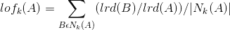

# 推文中的异常检测:基于聚类和邻近度的方法

> 原文：<https://medium.com/swlh/anomaly-detection-in-tweets-clustering-proximity-based-approach-58f8c22eed1e>

如何使用聚类算法和邻近分析(LOF baed)来发现 twitter 文本推文中的离群值/异常值。两种方法的比较


Photo by [Annie Spratt](https://unsplash.com/@anniespratt?utm_source=medium&utm_medium=referral) on [Unsplash](https://unsplash.com?utm_source=medium&utm_medium=referral)

异常/孤立点检测是最大似然领域的一个热门话题。它属于“无监督学习”过程。与“监督学习”不同，这里我们没有任何关于数据模式的先验知识。“异常或异常值”是指与我们整个数据集中的其他数据点不太相似的数据点。在本文中，我将讨论两种从“推特”数据中发现异常推文的方法以及它们的比较。

我将使用 Python，Sci-kit learn，来自“pypi.org”的“pyod”库，Gensim，NLTK 来解决这个问题。

**获取数据和问题描述**

对于这个问题，我将使用 UCI 机器学习知识库中的数据 Twitter 中的[健康新闻数据集](https://archive.ics.uci.edu/ml/datasets/Health+News+in+Twitter) **”。**该数据集包含来自 CNN、纽约时报、CBC 等各种新闻频道的不同样本推文。毫无疑问，这些是文本数据，而推文不过是一两行带有新闻源链接的文本。下面的 python 代码可以读取下载的数据(对于我的论文，我只使用了' nytimeshealth.txt '。还有来自其他新闻来源的“txt”文件)来自上述来源:

```
def _read_all_health_tweets():all_tweets = {}
 file = open(‘../../data/Health-Tweets/nytimeshealth.txt’, ‘r’)
 lines = file.readlines()
 for index, line in enumerate(lines):
 parts = line.split(sep=’|’, maxsplit=2)
 tweet = “”.join(parts[2:len(parts)])
 all_tweets[index] = tweetfile.close()
 return all_tweets
```

如果上面的 python“dict”被转换为 pandas“data frame”并与“IPython-Jupiter Notebook”一起显示，那么前 9 个条目将如下所示:


该文件中共有 6245 条推文。很明显，并非所有的推文都与“健康新闻”相关，其中相当一部分可能属于任意领域。现在，我们的问题是:‘我们能识别出那些与医疗保健没多大关系的推文吗？’。或者我们能做的最好的事情，用最大似然术语来说就是“概括问题陈述”，也就是说，“我们能识别出前 n 个异常的推文吗？”其中“n”可以是用户提供的参数。这里的挑战是数据是完全“未分类/未标记的”(即，每条推文都没有“异常/非异常”的标签，我们无法用这些数据训练标准的 ML 模型)，从而使其在本质上“无监督”。现在我将提出两种方法来解决它，一种是“基于聚类”，另一种是“基于邻近”。但在此之前，文本 tweet 数据必须进行预处理，以便为任何类型的 ML 算法提供信息。我将在下一节讨论这个问题。

**预处理&向量空间模型(Doc2Vec)生成**

预处理的第一步是将每个文本 tweet 转换成数组标记&删除不想要的字符、停用词等。

第二步是将对应于每个文本 tweet 的每个标记数组转换成数字向量。这一步被称为‘向量空间模型’生成。有标准的向量空间模型可用，如“Tf-Idf”、“Word2Vec”、“Doc2Vec”等。该向量作为文档的特征向量工作，并确定有多少个特征。我使用“Doc2Vec”作为这个问题的模型，因为每个评论都可以被视为一个单独的文档，并且“Doc2Vec”在理解文本的上下文含义方面非常有效(与 Tf-Idf 相比，Tf-Idf 只是一个纯粹的基于频率的模型)。

以下 Python 代码片段用作为文档创建 Doc2Vec 的管道步骤:

```
from sklearn.pipeline import Pipelinefrom gensim.models.doc2vec import TaggedDocument, Doc2Vec
from sklearn.base import BaseEstimator
from gensim.parsing.preprocessing import preprocess_string
from sklearn import utils
from tqdm import tqdmclass Doc2VecTransformer(BaseEstimator):def __init__(self, vector_size=100, learning_rate=0.02, epochs=20):
 self.learning_rate = learning_rate
 self.epochs = epochs
 self._model = None
 self.vector_size = vector_size
 self.workers = multiprocessing.cpu_count() — 1def fit(self, x, y=None):
 tagged_x = [TaggedDocument(preprocess_string(item), [index]) for index, item in enumerate(x)]
 model = Doc2Vec(documents=tagged_x, vector_size=self.vector_size, workers=self.workers)for epoch in range(self.epochs):
 model.train(utils.shuffle([x for x in tqdm(tagged_x)]), total_examples=len(tagged_x), epochs=1)
 model.alpha -= self.learning_rate
 model.min_alpha = model.alphaself._model = model
 return selfdef transform(self, x):
 arr = np.array([self._model.infer_vector(preprocess_string(item))
 for index, item in enumerate(x)])
 return arrfrom sklearn.pipeline import Pipelinetweets_dict = _read_all_health_tweets()
tweets = tweets_dict.values()
pl = Pipeline(steps=[('doc2vec', Doc2VecTransformer())])
vectors_df = pl.fit(tweets).transform(tweets)
vectors_df
```

“vectors_df”将打印如下:


从上面可以清楚地看到‘doc 2 vec’正在生成一个 2D 阵列。每行对应于每条文本推文。2D 阵列的列是“Doc2Vec”的实际特征向量。这里，列数是 100，由“vector_size”参数设置，这导致了特征数。该参数可以调整或由外部提供。因此，通过这种方法，每条文本推文都被转换成一组数字特征。这些特征是虚拟的，很难在物理上形象化。

文档的“Doc2Vec”是通过对照随机采样的单词的邻近单词训练神经网络而生成的，反之亦然。这里，只有学习到的隐藏层的权重才是关注的问题，并被取为“Doc2Vec”值。事实上有两种技术:分布式内存(DM)和分布式单词包(DBOW)。有关更多详情，您可以查看以下资源:

*   [稀有科技的 Doc2Vec 教程](https://rare-technologies.com/doc2vec-tutorial/)
*   [分布式陈述语句&文档](https://cs.stanford.edu/~quocle/paragraph_vector.pdf)

**维度分析和主成分**

上面的“Doc2Vec”转换为每条文本推文提供了 100 个特征向量。但是像聚类和离群因素这样的分析技术，太多的特征可能会破坏实际的目的。建议将“Doc2Vec”向量大小保持在 100 到 300 之间。因此，最好在“Doc2Vec”上做一个更高维的分量投影，看看哪些是重要的分量，哪些不是。“PCA”非常适合这一点。我分析了 10 个主要成分，发现只有前 2 个能够解释足够的差异。

现在，可能会出现一个问题，“为什么我没有将‘doc 2 vec’中的‘vector _ size’保持为 2 或 3，而不是 100。本来可以避免不必要的复杂的常设仲裁院。”回答是“没有”。如果我保持“vector_size”为 3，那么在“Doc2Vec”中许多隐藏的特征将被抑制。也可能出现过早收敛问题。这就是为什么最好让‘doc 2 vec’生成所有确定大小的向量，然后应用 PCA。

```
def analyze_tweets_pca(n_pca_components):
    tweets_dict = _read_all_health_tweets()
    tweets = tweets_dict.values()
    doc2vectors = Pipeline(steps=[('doc2vec', Doc2VecTransformer())]).fit(tweets).transform(tweets)
    pca = PCA(n_components=n_pca_components)
    pca_vectors = pca.fit_transform(doc2vectors)
    print('All Principal Components ..')
    print(pca_vectors)
    for index, var in enumerate(pca.explained_variance_ratio_):
        print("Explained Variance ratio by Principal Component ",
 (index+1), " : ", var)analyze_tweets_pca(n_pca_components=10)
```

它产生以下输出:


因此，在接下来的章节中，我将只采用前 2 个主成分(几乎 99.7%的方差由前 2 个主成分解释)进行聚类和局部异常因子估计。这样，维数减少了，并且还可以提高聚类和邻近分析的准确性。

**基于聚类的(k-means)方法**

聚类是“无监督学习”中最流行的技术之一。我使用了标准的“k 均值”算法。对于使用点的“轮廓分数”的“k 均值”概念的异常值检测是非常重要的。

*Silhoutte 评分:*由类间和类内距离的比值给出，如下:


Fig 4

在哪里，

b(i) =数据点“I”到任何其他聚类(其中“I”不是成员)中所有点的最小平均距离

a(i) =数据点“I”之间的平均距离。和同一聚类中的所有其他数据点

在上面的所有定义中，距离是作为 PCA 向量之间的余弦相似性的倒数来计算的，因为它对大小不太敏感&对于文本分析来说，它优于“欧几里德”或广义“闵可夫斯基”距离

所有数据点的“轮廓得分”平均值是特定聚类设置的总体“轮廓得分”。它的值范围从-1 到 1。正值越大，表示集群设置越好。现在，从各个数据点的“轮廓分数”中，可以得出如下三个结论:

*值接近-1 :* 数据点被错误地放入一个理想情况下不应该属于的簇中。基本上它是一个“内场”。

*接近 0 的值:*数据点不应该属于任何聚类，应该分离出来。这是一个“离群值”或“异常值”。

*接近 1 的值:*数据点被完美地放置在正确的聚类中。

从上述第二点可以清楚地看出，从聚类设置中找出异常值无非是找出“轮廓得分”值最接近于零的数据点。按升序排列所有绝对“轮廓得分”值将给出可能的前 n 个异常值。可以看出，这些点通常位于聚类的边界区域之间。因为，从概念上讲，那些不属于任何集群。

要做到这一点，首先应该使用“k-means”算法的最佳“k”值进行聚类。最佳“k”是整个聚类设置“轮廓分数”变得最大或接近+1 的那个。这可以通过尝试一组“k”值范围来确定。我用两个方差最大的“主成分”做了“k 均值”。

```
def determine_anomaly_tweets_k_means(top_n):
    tweets_dict = _read_all_health_tweets()
    tweets = tweets_dict.values()
    pl = Pipeline(steps=[('doc2vec', Doc2VecTransformer()),
                         ('pca', PCA(n_components=2)),
                         ('kmeans', OptimalKMeansTextsClusterTransformer(min_k=2, max_k=5))])
    pl.fit(tweets)
    pca_vectors, cluster_labels = pl.transform(tweets)
    silhouette_values = silhouette_samples(X=pca_vectors, labels=cluster_labels, metric='cosine')
    tweet_index_silhouette_scores = []
    absolute_silhouette_scores_tweet_index = []

    for index, sh_score in enumerate(silhouette_values):
        absolute_silhouette_scores_tweet_index.append((abs(sh_score), index))
        tweet_index_silhouette_scores.append((index, sh_score))

    sorted_scores = sorted(absolute_silhouette_scores_tweet_index, key=sort_key)

    top_n_silhouette_scores = []
    pca_vectors_anomalies = []
    print("Top ", top_n, " anomalies")
    for i in range(top_n):
        abs_sh_score, index = sorted_scores[i]
        index_1, sh_score = tweet_index_silhouette_scores[index]
        top_n_silhouette_scores.append((index, sh_score))
        print(tweets_dict[index])
        print('PCA vector', pca_vectors[index])
        pca_vectors_anomalies.append(pca_vectors[index])
        print('Silhouette Score: ', sh_score)
        print("..................")

    plot_tweets_k_means_clusters_with_anomalies(pca_vectors=pca_vectors, pca_vectors_anomalies=pca_vectors_anomalies,
                                                cluster_labels=cluster_labels)
    plot_scatter_silhouette_scores(top_n_silhouette_scores=top_n_silhouette_scores,
                                   tweets_dict=tweets_dict,
                                   silhouette_score_per_tweet=tweet_index_silhouette_scores)determine_anomaly_tweets_k_means(top_n=5)
```

它产生以下输出和图形:


Fig 1


Fig 2

从上面的图 1 可以看出，离群值(蓝色的“三角形”点)位于集群的边界区域。图 2 是‘轮廓散点图’，异常值显示为‘红色’点，证明异常值的‘轮廓分数’接近于零。

**基于局部离群因子(接近度)的方法**

在详细讨论之前，需要给出一些指标的定义，如下所示:

*   Nk(A):数据点 A 的 k 个最近邻居的集合
*   k-距离(A):第 k 个与其邻居最近的距离
*   可达距离(A，B):数据点 A & B 之间可达距离由该公式给出。


*   局部可达密度(A)或 lrd(A):数据点 A 与其邻居的平均可达距离的倒数，由以下公式给出:


*   局部异常值因子(A)或 lof(A):邻居的平均局部可达密度除以数据点 A 自己的局部可达密度，它由以下公式给出:



在上述定义中，所有“距离”都是由余弦相似性的倒数给出的，类似于“k-means”方法。

通过 lrd(A ),可以从 A 获得到达邻居或任何数据点聚类的平均行进距离。lrd(A)的值越低，其可达性将降低，即，它指示数据点距离其他数据点很远。

通过 lof(A ),可以比较点 A 与其相邻点的“lrd”。如果邻居的“lrd”较高，则该特定数据点远离密集区域，因此,“异常值”及其“异常值分数”由“lof”值给出。通常 lof > 1 意味着“可能的异常值”。

在计算了所有数据点的“LOF”值后，按照降序对这些值进行排序将得到前 n 个可能的异常值，其中“n”作为输入参数。我对预处理过的“Twitter”数据应用了同样的方法，用两个主成分给出了最高的方差，得到了最高的离群值。

```
from matplotlib import pyplot as plt
from pyod.models.lof import LOFclass LOFDetectionTransformer(BaseEstimator):

    def __init__(self):
        self._model = None

    def fit(self, x, y=None):
        self._model = LOF(metric='cosine')
        self._model.fit(x)
        return self

    def transform(self, x):
        return self._model.decision_scores_def determine_anomaly_tweets_lof(top_n):
    tweets_dict = _read_all_health_tweets()
    tweets = tweets_dict.values()
    pl = Pipeline(steps=[('doc2vec', Doc2VecTransformer()),
                         ('pca', PCA(n_components=2)),
                         ('lof', LOFDetectionTransformer())])
    pl.fit(tweets)
    scores = pl.transform(tweets)
    tweet_index_decision_scores = []
    decision_scores_tweet_index = []

    for index, score in enumerate(scores):
        decision_scores_tweet_index.append((score, index))
        tweet_index_decision_scores.append((index, score))

    sorted_scores = sorted(decision_scores_tweet_index, key=sort_key, reverse=True)

    top_n_tweet_index_decision_scores = []
    print("Top ", top_n, " anomalies")
    for i in range(top_n):
        score, index = sorted_scores[i]
        top_n_tweet_index_decision_scores.append((index, score))
        print(tweets_dict[index])
        print('Decision Score: ', score)
        print("..................")

    plot_scatter_lof(tweets_dict=tweets_dict, tweet_index_decision_scores=tweet_index_decision_scores,
                     top_n_tweet_index_decision_scores=top_n_tweet_index_decision_scores)determine_anomaly_tweets_lof(top_n=5)
```

调用上面的函数可以显示具有较高“决策得分”的前五个异常文本 tweets(参数为“top_n ”),并生成以下输出和图表


Fig 3

这里的“决策分数”只不过是数据点的“lof”值。上面散点图中的所有异常值都显示为“红色圆圈”点。LOF 算法取决于下面给出的两个重要参数

*n 个邻居:*计算“k-距离”和“lrd”时要考虑的数据点周围的邻居数量。通常它保持为 20，但是通常它的值来自领域知识

*污染:*异常值与总人口数量的比率。通常它保持为 0.1，但是和上面一样，它的值也来自领域知识。“污染”在确定群体的“阈值 lof”中起着非常重要的作用。“阈值 lof”可用于决定一个新数据点是否是异常值(在我们的例子中，一个新的文本 tweet 不存在于训练集中)

**两种方法的比较**

“k-均值聚类”和“LOF”方法都有一些优点和缺点。在这两种情况下，可以在多次运行中看到输出的随机性。这主要是由于“Doc2Vec”的产生和那里的洗牌活动。

*k 均值聚类方法的优势:*

I)不需要数据的先验知识或领域知识。参数“k”可以动态确定。适用于没有数据知识的用例。

*k 均值聚类方法的缺点:*

I)运行时间更多。找出最佳“k”本身是一项相当耗时的活动

ii)如果簇的形状不是球形，则不能很好地工作。事实上，在这种情况下，“剪影分数”本身将开始给出错误的结果

iii)在看不见数据的情况下，很难确定异常值。

*“LOF”方法的优势:*

I)在任意形状的数据的情况下工作得非常好。它非常类似于“DBSCAN ”,并基于相同的“局部邻近”概念工作

ii)运行时间更少。

iii)对于看不见的数据，它也工作得很好。它可以在训练集中不存在的新数据上标记出“异常值/非异常值”。

*“LOF”方法的缺点:*

I)参数需要领域知识:“污染”和“n 个邻居”。

因此，很明显，这两种方法实际上是相辅相成的。在做出任何选择特定方法的决定之前，必须有人彻底理解业务用例。

解决方案的代码库可以在[这里](https://github.com/avisheknag17/public_ml_models/blob/master/health_tweets_anomaly_analysis.py)找到。

我的 Linkedin 页面:[https://www.linkedin.com/in/avishek-nag-957a0015/](https://www.linkedin.com/in/avishek-nag-957a0015/)

最近，我写了一本关于 ML([https://twitter.com/bpbonline/status/1256146448346988546](https://twitter.com/bpbonline/status/1256146448346988546))的书

**参考文献:**

1.  本地异常因素—[http://www.dbs.ifi.lmu.de/Publikationen/Papers/LOF.pdf](http://www.dbs.ifi.lmu.de/Publikationen/Papers/LOF.pdf)
2.  k-means 算法—[https://www.datascience.com/blog/k-means-clustering](https://www.datascience.com/blog/k-means-clustering)
3.  主成分分析—[https://towards data science . com/a-一站式主成分分析-5582fb7e0a9c](https://towardsdatascience.com/a-one-stop-shop-for-principal-component-analysis-5582fb7e0a9c)

[](https://medium.com/swlh)

## 这篇文章发表在[《创业](https://medium.com/swlh)》上，这是 Medium 最大的创业刊物，有+444678 人关注。

## 在这里订阅接收[我们的头条新闻](https://growthsupply.com/the-startup-newsletter/)。

[](https://medium.com/swlh)