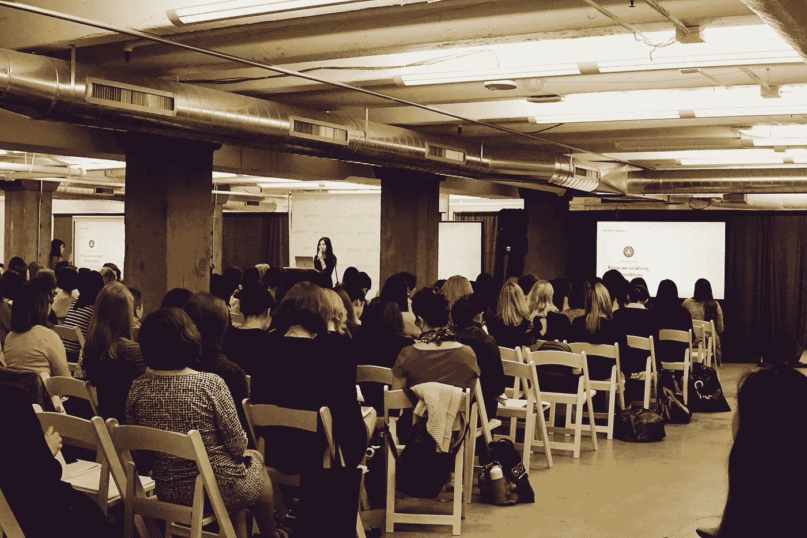

# 任何人都可以成为领导者:影响日常工作设计的 4 个简单行动

> 原文：<https://medium.com/swlh/anyone-can-be-a-leader-4-simple-actions-to-influence-design-in-your-everyday-work-eb0457507a6a>

## 作为 WiUX Conference 2019 的专题演讲人和谷歌的初级设计师，我的收获

几周前，我在第五届 WiUX(UX 女性)年度设计大会上发言，该大会旨在赋予各种经历的女性权力并将其联系起来，帮助她们在用户体验和相关领域做出努力。今年的主题是跨越国界的 UX，这让我有机会超越传统习俗，思考作为一名 UX 专业人士意味着什么。

工作中出现的一些事情是我们通常看待领导力的方式。当我们想到领导力时，我们可能会想到高层是如何做出决策的，而作为个人贡献者，我们只是简单地贯彻这些决策。即使在谷歌，我们努力鼓励各个层次的每个人做出决定和参与，我们也很难摆脱盲目跟随和遵循常规的做法。毕竟，这是我们可能习惯做的事情，无论它是我们成长的文化或环境的一部分。

在工作的头几个月，回想我上大学前所追求的艺术目标，我意识到我一直是一个“领导者”，追求领导比我想象的要简单。**领导力不是上天赐予你的，而是你自己做出的决定。**

通过遵循这 4 条建议并把它们融入到你的日常工作中，你会开始意识到领导力是建立在我们所采取的行动和由此养成的习惯之上的。

1.  **找出弱点并设定目标解决它们→从为什么开始**

你可能有很多想做的事情，但是有些事情你认为比别人更重要。一旦你发现那些东西是什么，为什么你想追求/正在追求它们，那就是你的驱动目的。有一个目标或一个精神宣言会让你的工作更有意义，并影响你所做的决定。

对我来说，我想在公共演讲方面做得更好，而导致这个更大目标的行动:长时间练习，选择更多的演示机会，是基于更大的目的，即确保我的设计决策被听到。

当你有一个目标(即建议改变)时，你可以通过做决定来领导，并引导人们理解并在自己的工作中采纳这个目标；给他们的日常生活带来意义。

**2。与您的团队建立关系→授权他人**

每个人都可以帮助和指导其他人实现他们的目标，不管你的水平如何。

开始授权他人，承认他人的成功和积极贡献。Invista 的 Cait Flood 说，当你授权给另一个人时，你投资了自己，承担了有可能改变另一个人生活的风险，同时用他们的故事、文化和目标丰富了自己。

**3。忘记标题→关注解决方案，而不是问题**

在创建解决方案或与团队合作时，等级制度不应该成为障碍。想办法通过你的设计做出最大的改变。这可能是看 OKRs 和帮助你的队友工作，如果有一个设计的机会，在它被分配给你之前。如果协作是错误的，创建一个最佳评论实践的框架。

领导层做出的决策应该(如果不是已经)基于我们的日常决策。

**4。相信你的直觉→质疑现状**

如果你找到了更好的做事方法，不要因为它不符合你的组织标准而忽视它。如果记录和统计数据不能直接应用到你的团队，或者如果你找到了更好的方法来完成工作，它们总是会被打破。

***除了演讲，下面是我从整个会议中学到的:***

**每一级都有领导**

很长一段时间，我习惯于听到只有被授予“高级”及以上头衔的人才有资格就他们的工作发表演讲。每个人都有一些有价值的东西可以贡献，能够在会议上发言让我意识到这一点。我被邀请的原因之一是，作为一名新的毕业生设计师，我的建议非常有价值，尤其是对大多数学生观众来说。

在众多经验丰富的设计专业人士中，成为最年轻的演讲者令人感到羞愧，我觉得我真的能和他们感同身受。领导力不是基于头衔或多年的经验，而是基于通过共同的目标和抱负与同事建立联系。

**易受攻击允许连接**

在我的演讲中，我努力诚实地讲述我的经历，即使有些经历并不像大多数人想象的那样迷人。演讲结束后，人们很自然地走近我，和我交谈。他们分享了自己在该行业工作或毕业后寻找全职机会的经历。

头衔有时会妨碍彼此之间的联系。通过开诚布公地分享我们的个人经历，我们可以打破由我们作品的标题所造成的障碍。让我们少强调我们的头衔，而是以支持为目标。

**故事和经历比数据更能引起共鸣**

故事更容易引起共鸣。这是可以联系其他人，尽管差异和区分硬，遥远的数据。在我演讲后，问我问题的人经常会提到我在演讲中分享的故事，比如克服我对公开演讲的恐惧。

数据并不能传达迫使我们做这些事情背后的全部故事。没有背后的故事也不会令人难忘。这让我想到了我自己的设计工作，我的团队如何做出决策，以及我们如何共同鼓励我们的同行依靠故事，遵循数据，以便做出更明智的决策。

# 结尾注释

UX 是整个过程和简单习惯的核心部分，可以鼓励设计师重新思考他们的工作方式，因为每个人都是他们工作中的“领导者”，而不是认为只有“高级人员”或“高管”才是领导者。我认为年轻设计师，尤其是女性，通常不被鼓励大胆发言，挑战常规。

我想鼓励更多的女性在工作中大胆发言，采取主动，重新思考“等级制度”和“性别陈规定型观念”的思维模式，因为影响可以超越社会结构。为了改变这些观念，我们需要树立更多自信的榜样，并挑战其他女性，打破我们在日常工作中可能感受到的性别刻板印象。

[*查看我在* *UX 研究* *上的 Skillshare 课程，学点新东西！*](http://skl.sh/2nal9ZT)