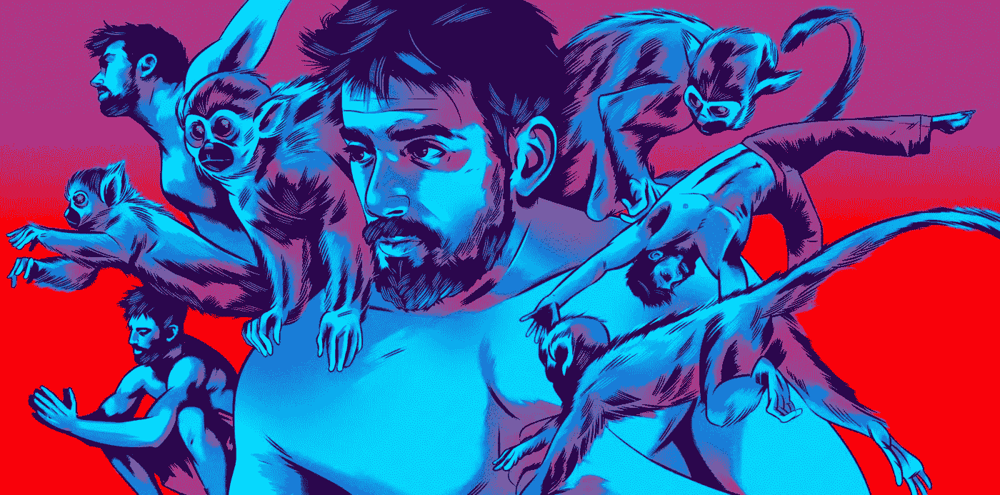

# 任何人都可以创建内容，即使是你。

> 原文：<https://medium.com/swlh/anyone-can-create-content-even-you-b6621d4e6edb>

## 你的内容是一种表达自己和留下遗产的方式。

Image Credit: [The Atlantic](https://www.theatlantic.com/health/archive/2018/08/ido-portal-the-player/566687/)

这里有太多的借口来解释为什么发布内容如此困难。我曾经是这些唱反调的人之一。有些谎言就像你需要一台带照明装置的相机或者天生的写作天赋。