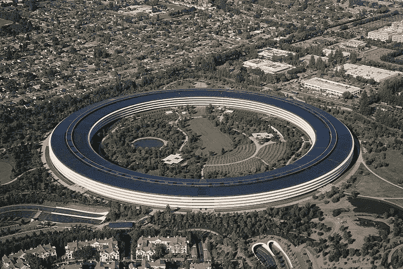

# 苹果总部对泰姬陵

> 原文：<https://medium.com/swlh/apple-headquarters-vs-the-taj-majal-fd1cdfa0604a>

## 哪个更浪漫？

[Apple Headquarters](https://www.google.com/search?q=apple+headquarters&rlz=1C1SQJL_enUS773US773&tbm=isch&source=lnt&tbs=sur:fc&sa=X&ved=0ahUKEwig8-2W2rXjAhXGpJ4KHbcfDh8QpwUIIw&biw=917&bih=507&dpr=1.1#imgrc=c3IPCQNtH8Zh0M:) Wikimedia commons

本周，我带着 17 岁的女儿参观了位于库比蒂诺的苹果总部。巧合的是，去年 7 月我们参观了印度阿格拉的泰姬陵。我们立刻被这种经历的相似性所打动。

泰姬陵的故事是众所周知的——由沙·贾汗于 1631 年建造，以纪念他最喜爱的妻子玛哈尔