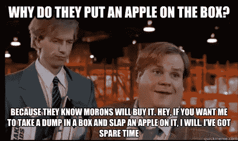

# 苹果新闻:为美分支付美元

> 原文：<https://medium.com/swlh/apple-news-paying-dollars-for-cents-a01481504bed>

## 质地、订阅和产品-市场-业务匹配的重要性

👆Check out *the most frictionless way for you to get informed or inform others* 👆

自 2018 年收购数字报刊亭 Texture 以来，苹果一直对其苹果新闻的战略雄心保持沉默。也就是说，直到上周，当其计划将订阅服务整合到苹果新闻中的消息开始传播。本质上，苹果将策划一个新闻/杂志捆绑包，整合不同出版商的内容，每月收取 10 美元的费用，从中抽取 50%的分成，然后将收入余额按比例分配给其出版合作伙伴。从[边缘](https://www.theverge.com/2019/2/12/18222281/apple-news-subscription-service-50-percent-cut-publishers-media-deal):

> 但苹果显然正与出版商就这笔钱(传言为每个用户每月 10 美元)中有多少将回到内容创作者手中的问题发生争执。据《华尔街日报》报道，苹果目前正在提议的交易中，它将为自己保留一半的收入，而另一半将根据用户阅读每个出版商内容的时间进行分配。这种模式与 Spotify 过去根据总体收听时间计算艺人报酬的方式类似。

苹果高达 50%的收入份额——可能只是一个试探性的气球——已经被公众舆论尽职尽责地挑了出来。它所选择的 KPI，一个“基于用户花在阅读上的时间”的参与度的替代指标，也不存在固有的误导。

因此，虽然苹果新闻订阅服务的细节可能会改变，但我更感兴趣的是它的策略，这种策略很可能会保持下去…

## 卖宠物石头

本·汤姆森在[战略博物馆](https://stratechery.com/2019/the-cost-of-apple-news/)讨论了交换条件:

> 另一方面，出版商真正放弃的是什么？前往苹果新闻应用的读者已经决定不直接访问特定出版商的网站，而且，鉴于数字内容的边际成本为零，为什么不支持苹果新闻，以防某篇文章引起轰动？
> […]
> 正在发生的是聚合:苹果新闻吸引了用户，这意味着出版商将按照苹果的条款进入苹果的平台，这使得苹果新闻对用户更具吸引力，使得出版商更加不愿离开，即使他们并没有从交易中获得太多好处。

如果这是聚合，那么它是最弱的形式。(但这不是我要挑的骨头，尤其是在这件事上已经浪费了几个月的时间之后。)更准确地说，与其说这些供应商/出版商/内容没有被充分商品化，不如说它们没有被聚合，因为它们现在和过去都是如此；更重要的是，强形式聚合意味着消费者不想或不需要为访问付费——尤其是在涉及新闻文章等文本内容时。这个来自“[抛弃优步剧本](/swlh/scooters-and-the-short-haul-brawl-2d92fc25e635)的框架解释了为什么:

> …占据[护城河图]之外的其他两个象限毫无意义:[例如]如果供应商高度商品化，那么第三方解决方案要么通过增加另一层冗余碎片(增加无谓损失)来加剧丰富性，要么制造出不如聚合商的产品。]

撇开商业策略和行话不谈，直觉可以用经济学 101 中更基本的供给/需求来解释:这种商品内容的供给是大量免费提供的，那么为什么平衡中稀缺的一方，消费者需求，要为访问付费呢？！他们不应该！因此，苹果新闻的新订阅就像猪身上的口红，出售宠物石，重新安排躺椅，为美分支付美元。

## 编辑中的编辑

好吧，考虑到新闻市场供应过剩带来的无谓损失，苹果可以引用“监管”作为其价值主张。诚然，这是一个有价值的事业，根据“[消费者枯萎](/@AnthPB/wither-the-consumer-part-i-fc55bd6b467e)”:

> 杀手级产品和服务曾经是那些为我们采购稀缺内容的产品和服务；现在的杀手级应用是那些为我们过滤大量内容的应用。[鉴于供应过剩和无谓损失，]未来的挑战是个性化，它不仅能区分好的内容和坏的内容(发现)，还能促进我们与它的互动方式——从我们如何提取每一部分中的重要内容(消费)，到我们如何从中学习(保留)，以及我们如何实施它(协作)。

然而，谷歌新闻已经免费做了这件事！苹果新闻提出的每月 10 美元的订阅费不值得仅仅为了获得编辑中的编辑而支付，因为下一个最佳选择的费用——像谷歌新闻或 Flipboard 等许多其他选择——是免费的。再一次，为几分钱就能得到的东西支付美元。

(需要澄清的是，由于我刚刚召集了几个 Cupertino 的竞争对手，这不一定是委托代理问题[苹果过去曾利用平台风险，以剥夺专有应用的权利来对抗其应用商店的第三方开发商。通过收购 Texture 和现在的这些订阅提议，苹果并没有完全行使“默认的权力”,这在以前的案例中是显而易见的滥用权力问题。相反，苹果新闻捆绑包需要一个订阅销售点，至少让谷歌新闻和 Flipboard 这样的免费竞争对手继续相对无障碍地竞争，不受苹果的渠道冲突、利益冲突和/或寻租的影响——至少相对于应用商店而言。)](/adventures-in-consumer-technology/apple-and-the-wall-of-worry-96e0c512493a)

The Verge 还讨论了苹果新闻非中介合作伙伴直接面向消费者(DTC)访问的影响:

> 出版商还担心，他们无法通过苹果的新闻服务获得订户数据，从而剥夺了公司的电子邮件和信用卡信息，而这些信息是营销努力的关键，这导致了另一个争论点。

在这种情况下，我质疑这样的新闻——没有足够的差异化或不可替代性，不足以成为一个有自己的 DTC 关系的目的地——是否真的值得首先收取订阅费。有一些记录在案的出版商拥有“巨大的供应规模”,足以保证订购 DTC，以便提供一站式服务。也就是说，在摘自“[现代媒体四风](/adventures-in-consumer-technology/you-still-dont-understand-today-s-media-industry-edbdc08e9332)”的这段话中，用“苹果/库克”代替“中型/电动汽车”:

> 像 NYT 和 WaPo 这样的在位者有很高的固定成本，分散在他们的大范围内，这是基于全面性的预测。他们是一站式商店…
> 
> 在媒体发展到这种水平的过程中，当 NYT/华盛顿邮报已经是更大的“一切商店”时，为什么全体读者会被迫继续阅读媒体？
> 
> 最后，我要问，‘为了什么目的？!'Ev 的使命真的是在传统媒体的视野中打造一个庞然大物吗？

换句话说，对于任何相关的人来说，苹果把自己作为一个额外的编辑——一个编辑中的编辑——插在更高的位置上，会有增值吗？如果有，那么增值的数量是多少？

## 增值的质量和数量

第二个问题是增加值的数量，答案可能是“不够”。虽然不是一个完美的模拟，[《囚徒困境楔子](/annotote/how-startups-can-convert-a-simple-prisoners-dilemma-into-initial-traction-9ef5cd0ca7bf)》解释了为什么:

1.  苹果试图占据商品化的上游供应商和最终用户之间的瓶颈，但它并没有给他们提供一个不劳而获的提议(它从出版商在一场全新的激烈竞争中必须赚取的不确定的收入中抽取一部分，而网飞给 Starz 开了一张支票，这张支票直接落到了网络的底线，没有边际成本，也没有自相残杀的风险； [Spotify 可能是一个更好的竞争对手](/adventures-in-consumer-technology/spotify-eks-parlay-d423a0097177)，因为它与制作人的收入份额结构，但音乐是一个更丰富的媒体，供应商也更强大，因为有三大唱片公司)；
2.  *苹果没有通过以高于其供应商自己的 DTC 服务的价格追加销售来覆盖其内容购买成本*(同样，没有 CAC，但如果有的话，它的收费低于出版商的 DTC 服务，然后用其 rev 份额吃掉更多出版商的利润，而网飞的收费几乎是 Starz 的 DTC 服务的 5 倍，而没有对网络的收入产生留置权)；
3.  *苹果的目标不是利基终端用户的子集*(它的市场是 iPhone 用户的全部人口，即使它的关注范围更窄，足够小的早期采用者群体可能也不值得苹果花费时间，这就是创新者的困境)；
4.  *苹果的解决方案并不是独一无二的，因此不仅早期采用者不愿意支付溢价，而且其上游供应商也会因收入分食的前景而犹豫不决*(同样，其整个捆绑包 10 美元的价格比几乎每一个单点订购都便宜，这促使 DTC subs 转向，因此即使苹果大幅增长， 较低 ASP/较低利润的苹果新闻捆绑包中的 net 新 subs 不会取代较高 ASP/较高利润的 a la carte 的流失，而网飞对 SVOD 的新颖方法定价溢价，并针对 Blockbuster 而不是 Starz 进行营销

违反这些标准中的一两个几乎是不可避免的，但是不满足其中任何一个都是战略失败。

最后，作为策展人，在回答关于苹果增值质量的第一个问题时，我想起了来自“[内容警察](/@AnthPB/the-content-police-cyberabuse-bullying-fake-news-and-reductive-solutions-e225a2e6f4ec)”的观察:

> 主观/人工/人类/编辑时代已经被客观/自动/算法/管理时代所取代。这些都是信息传播方式的极端。也许社交网络会成为一种更快乐的媒介。也许不会。我想我的观点是，解决方案需要谨慎，以免鼓励进一步走向一个极端或另一个极端。无论如何，正如印刷机和工业革命向我们展示的那样，这仍然是现代文艺复兴的第一天(在我们正在走出的时代之后)——在那个时代，我们的信息饮食由少数沿海城市的少数白人配给。

苹果新闻，编辑中的编辑，看起来像是从媒体的文艺复兴回归到青铜时代，离启蒙运动更远。

## 填补脸书的空白？

为什么苹果新闻不能尝试聚合足够多的内容，与《纽约时报》或《华盛顿邮报》匹敌？除了上面提到的挑战，由于机会成本的原因，激励措施不足以让出版商接受。四风简洁地解释如下:

> …付费读者和持续的利基生产者之间没有中介的空间。

详见“[媒体无法与专业自由职业者竞争](/adventures-in-consumer-technology/you-still-dont-understand-today-s-media-industry-edbdc08e9332)”。

同样，这与其说是对聚合理论的批评，不如说是对苹果新闻战略的批评。如果苹果试图填补脸书最近退出新闻监管后留下的空白，我可以合理解释这种做法。但是，最后一次引用了这个框架，解释了为什么很难与需求方面已经有巨大规模的现有企业(即需求聚合者)竞争:

> 作为一个内容迷，当我拥有由主要聚合者为我策划的整个宇宙时，我为什么要把自己限制在媒体的岛上呢？谷歌是我要求的一切(拉)，脸书是我要求的一切(推)。还有什么？

如上所述，问题是这个机会——脸书留下的空白——最好通过广告来赚钱，所以即使苹果新闻对这项新服务有一点吸引力，竞争对手也会乘虚而入，用更好的[产品-市场-商业契合度](/@AnthPB/there-is-no-revenue-panacea-d52a5a937613)来取代它。

尽管如此，由于大肆宣传和精心设计的叙述，可以合理地假设苹果新闻的订阅量将会公布一些有意义的数字。但是，当消费者有足够的时间来评估每月 10 美元支出的成本/价值分析中的感知-现实差距时，这种势头应该会逐渐消失——特别是考虑到免费的次佳替代品以及可以提供更少的竞争对手/新进入者。

## 真实增值

任何网站、应用程序或出版商都可以并将会用源源不断的内容淹没你。你不需要另一个应用程序来为你提供更多的博客、新闻和观点；你需要的是直奔主题的方法。不要浪费时间和注意力； [*签出注释，你的解药*](http://annotote.launchrock.com) *:*

All signal. No noise. Annotote.

## 这篇文章发表在 [The Startup](https://medium.com/swlh) 上，这是 Medium 最大的创业刊物，拥有+426，678 名读者。

## 在这里订阅接收[我们的头条新闻](https://growthsupply.com/the-startup-newsletter/)。

