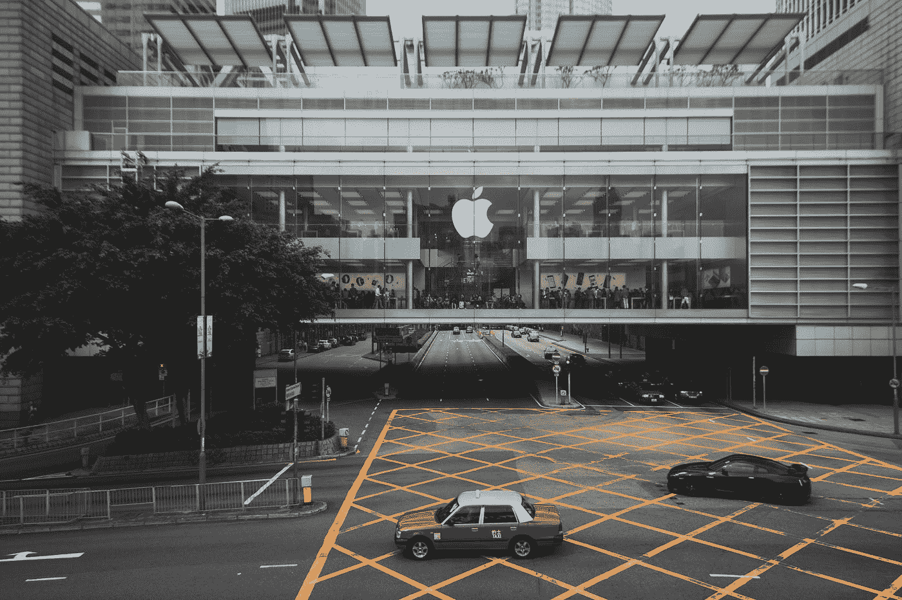
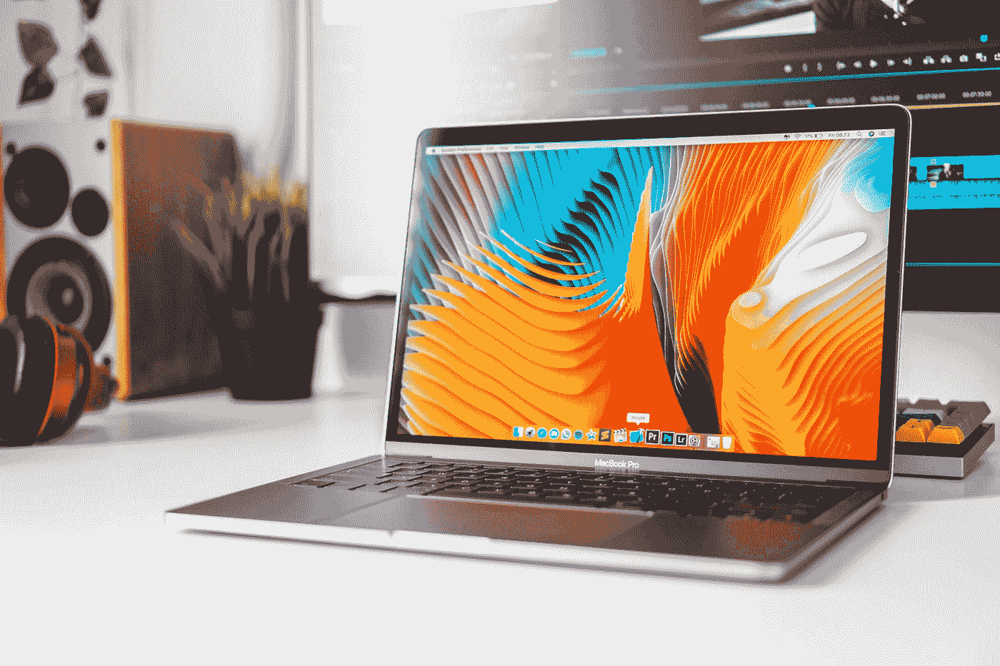

# 苹果不再是最具创新力的公司:一项分析

> 原文：<https://medium.com/swlh/apple-no-longer-the-most-innovative-company-an-analysis-e5ef56c4c741>

Photo by [Alexandr Bormotin](https://unsplash.com/@bormot?utm_source=medium&utm_medium=referral) on [Unsplash](https://unsplash.com?utm_source=medium&utm_medium=referral)

*Fast Company* ，全球领先的杂志和数字媒体出版品牌，总部位于美国，专注于*技术、创新、商业、创意、设计和工作生活(平衡)*，经营年度特许经营，名称为**[**全球 50 家最具创新力公司**](https://www.fastcompany.com/most-innovative-companies)**，经过数千家公司的评估和审查后编制而成，并不断发展。正是在 2018 年，苹果作为 [*全球最具创新力的公司*](https://www.fastcompany.com/most-innovative-companies/2018) 登上榜首，但未能保住其位置，并在 2019 年的榜单上大幅下滑，成为[第 17 位最具创新力的公司](https://www.fastcompany.com/most-innovative-companies/2019)。从第 1 位跌至第 17 位对许多人来说似乎微不足道，但苹果的排名下降了 94%。这家美国跨国技术制造公司以推出重新定义技术未来的产品而闻名于世(是的，这是比喻，但实际上是全球范围的)，而这 94%是*“游戏规则改变者”*。****

********

****Photo by [Alvaro Reyes](https://unsplash.com/@alvaroreyes?utm_source=medium&utm_medium=referral) on [Unsplash](https://unsplash.com?utm_source=medium&utm_medium=referral)****

****今年，该公司没有根据其旗舰智能手机系列的产品发布获得排名——iPhone，或 Macbooks，或 iPads 和 iPods，而是因为[设计了自己的硅](https://www.fastcompany.com/90299003/apple-most-innovative-companies-2019)——六核 [***A12 仿生***](https://www.apple.com/iphone-xr/a12-bionic/) 应用处理器，内置于 64 位架构中，iPhone XS，XS Max 和 XR， 它在独立速度基准测试分数上击败了竞争对手的处理器(如高通的[骁龙 850](https://www.qualcomm.com/products/snapdragon-850-mobile-compute-platform) 或三星自己的 [Exynos 9 系列(9820](https://www.samsung.com/semiconductor/minisite/exynos/products/mobileprocessor/exynos-9-series-9820/) )内的旗舰 Galaxy 系列智能手机 S10)，并适合处理各种各样的功率密集型应用程序，如工作室质量摄影*(提示:*[*iPhone XR*](https://www.apple.com/lae/iphone-xr/)*)*。****

******批评的作用******

****当苹果在 2018 年的榜单上名列榜首时，对推出一款卓越产品而没有冲击市场的批评仍然盛行。所以有人可能会问，是这些批评影响了苹果 2019 年的排名吗？答案是**“没有”**。****

********

****Photo by [Frankie Valentine](https://unsplash.com/@frankievalentine?utm_source=medium&utm_medium=referral) on [Unsplash](https://unsplash.com?utm_source=medium&utm_medium=referral)****

******问题出在哪里？******

> ****“显然会有一个压力点，在这个点上，它不再是可持续的，但在这个点上，看起来没有人会眨眼。”****

****在《华盛顿邮报》的[新闻文章](https://www.washingtonpost.com/business/economy/rank-and-file-democrats-reject-trumps-invitation-to-shutdown-talks-backing-leaders-in-united-opposition-to-border-wall/2019/01/15/2539482e-18d2-11e9-9ebf-c5fed1b7a081_story.html?utm_term=.e4727d42657e)中引用了无党派美国参议院小组成员谢莉·摩尔·卡皮托关于特朗普召回 46，000 名休假的联邦政府工作人员恢复无薪工作生活的报道。虽然在上述情况下引用，这个短语可以应用于技术公司的两难处境。蒂姆·库克(Tim Cook)认为公司在收入方面有很好的表现，他需要阻止苹果设计和产品团队的“噪音”,并对一些伟大的想法说“不”,这些想法可能会导致未来几年的不利影响。****

******苹果不考虑批评吗？******

****有人可能会说，苹果没有考虑批评，就像 PayPal 在成立的最初几年那样，几乎没有争议解决和投诉处理。但是蒂姆·库克透露*“永远是产品和人”*，苹果[的员工阅读顾客寄给他的信件](https://www.cnbc.com/2019/02/23/apple-employees-read-customer-letters-to-tim-cook-inspire-change.html)，并从变化中分辨出噪音。****

********

****Photo by [dhe haivan](https://unsplash.com/@dhehaivan?utm_source=medium&utm_medium=referral) on [Unsplash](https://unsplash.com?utm_source=medium&utm_medium=referral)****

****看起来科技公司让小火在外面燃烧，人们看不到。但另一方面，这些人有时可能会质疑公司处理增长的能力，不是一般的公司增长，而是具体的客户增长。****

********

****Photo by [Josh Calabrese](https://unsplash.com/@joshcala?utm_source=medium&utm_medium=referral) on [Unsplash](https://unsplash.com?utm_source=medium&utm_medium=referral)****

********

## ****这篇文章发表在 [The Startup](https://medium.com/swlh) 上，这是 Medium 最大的创业刊物，拥有+428，678 名读者。****

## ****订阅接收[我们的头条新闻](https://growthsupply.com/the-startup-newsletter/)。****

********