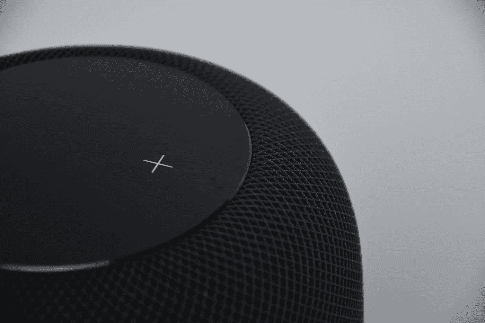

# 苹果在 2019 年 WWDC 奥运会上“轻松”地拿下了它

> 原文：<https://medium.com/swlh/apple-takes-it-siriously-with-wwdc-2019-3f04fc7f7bc1>

## 在精通技术的小发明极客的世界里，和你的语音助手聊天比和你真正的朋友聊天更容易被接受

到目前为止，亚马逊 Alexa、谷歌助手和**微软 Cortana** 都在人工智能驱动的语音应用市场取得了重大进展。与……