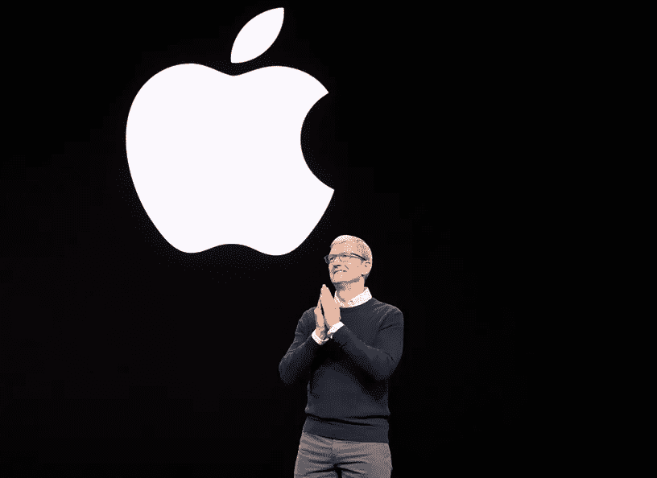
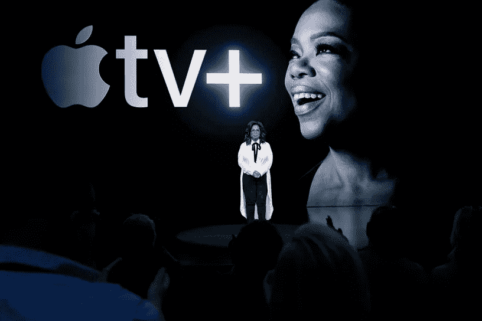

# 苹果 2019 年 3 月活动🎬

> 原文：<https://medium.com/swlh/apples-march-event-2019-ad53fed89de7>

史蒂夫·乔布斯剧院的公告

Tim Cook kicks off Apple’s March 2019 event.

嘿伙计们！！昨晚我在看[苹果 2019 年 3 月的活动](https://www.apple.com/in/apple-events/march-2019/)，只是想向观众展示一下✍from 的亮点。以下是苹果 2019 年 bag🧐.的简介

圣何塞将举办第 30 届苹果全球开发者大会。今年有很多期待，许多新的软件和技术将被发布和宣布 iOS 13，macOS 10.15，watchOS 6，tvOS 13，Mac Pro 等。希望好！！🤞

# 事件中最大的公告

苹果的大型发布会通常是为了闪亮的新玩意。但这一次，苹果上周对其 iPads、iMacs 和 AirPods 进行了一些小的更新，为今天在**“它的展示时间”上更柔和的展示让路！！！**👩‍💻。其中一大亮点是**在设备上跟踪**，这样除了你之外没人知道你的消费、阅读或其他习惯。

以下是此次活动中最重要的公告。

# **1。苹果卡:** *有意思的一张* ☝️

你可以把这称为苹果有史以来最薄最轻的身份象征*。不是吗😀？活动期间，苹果承诺通过更简单的申请、免费、更低的利率和更好的奖励来改善信用卡体验。*

*为了获得这张卡，用户将能够在他们的 iPhone 上的苹果钱包应用程序中注册，并获得一张数字卡，他们可以在任何接受 Apple Pay 的地方使用客户还可以跟踪购买情况，检查余额，并从应用程序中查看他们的账单何时到期。也将有一张实体钛卡，但是没有信用卡号码、CVV、有效期或签名。所有授权信息都直接存储在苹果钱包应用程序中。那就够酷的了！！🤩*

> *苹果公司还表示，它将使用机器学习和苹果地图来标记你在应用中使用的商店，并使用这些数据来跟踪诸如“食品和饮料”或“购物”等类别的购买*

**

*[Apple Card](https://www.apple.com/apple-card/)*

*每一次购买，你都可以获得每日现金。而且真的是现金。所以你可以用你的 iPhone 随心所欲地消费。**钛、激光蚀刻**、苹果设计的信用卡和万事达卡是我们的全球支付网络，因此您可以在世界各地使用它。对于应用程序和网站，钱包应用程序中有一个虚拟卡号。当您使用 Safari 时，它会自动填充。😎*

# *2.苹果新闻增强版:一次大胆的尝试😐*

*每月 9.99 美元，第一个月免费，家庭共享。今年晚些时候将在英国、澳大利亚和欧洲上映。我想，互联网上充斥着太多的免费新闻内容，这不可能取得巨大成功，所以我称之为大胆的尝试。但是，但是，但是它为苹果新闻的免费体验增加了一个更广泛的高质量故事集合，这是第一新闻应用 ，从**可靠来源提供时事报道。这是一项为新闻迷提供的点播服务。***

**

*A Snapshot from [Apple News Plus](https://www.apple.com/newsroom/2019/03/apple-launches-apple-news-plus-an-immersive-magazine-and-news-reading-experience/)*

*还将有多达 300 种杂志可供访问，这听起来很划算，但在视频日益成为我们消费一切的方式的时代，对这种服务的需求仍然很大。🙃*

*Apple News Plus 用新的“实时封面”展示杂志。*

# *3.APPLE TV PLUS 和频道:除了“ok”之外没什么新东西👌*

*新的 Apple TV 更新现在将包括对 HBO、PBS、CBS、Acorn TV 和 Tastemade 等频道的关注，而不会将用户转向第三方应用程序。此外，用户可以选择他们想要订阅的频道，并按频道付费，而不是传统的有线电视公司的大套餐。但是，在主题演讲中没有分享定价。*

> *“苹果平台允许我以一种全新的方式做我现在做的事情，”奥普拉在苹果发布会上说。*

**

*Oprah concludes the event at Steve Jobs Theater.*

*Apple TV Plus 是一项视频订阅服务，将提供苹果不断增长的原创电视节目和电影列表。当它在今年秋天推出时，Apple TV Plus 将是观看这些内容的唯一方式。苹果公司投入大量资金组建了一个众星云集的人才花名册，致力于制作有望与网飞最佳节目相媲美的节目。就连奥普拉也同意了。*

## *APPLE TV PLUS 不是什么？*

*苹果没有提到通过流行的桌面浏览器如 Chrome，Firefox，或微软 Edge，网飞，在 android 等上播放 Apple TV Plus 的方法。*

*   ***真正的网飞或亚马逊主要视频竞争对手***
*   ***在安卓或 Windows 上***
*   ***在网络上***

# *4.苹果街机:一项游戏订阅服务🤖*

*[**苹果街机**](https://www.apple.com/in/apple-arcade/)**——全球首个面向移动、桌面、客厅的游戏订阅服务。它将推出 100 多个新的独家游戏，包括著名创作者坂口博信、王合喜、威尔·莱特等的原创游戏。苹果街机游戏将重新定义游戏，并根据原创性、质量、创造性、趣味性及其对所有年龄玩家的吸引力进行策划。***

******

***Apple Arcade 将于 2019 年秋季在 150 多个国家推出，在 iOS、macOS 和 tvOS 的 App Store 上有一个新标签。与谷歌在 GDC 上宣布的云游戏服务不同，苹果的版本更像是通过 App Store 订购的游戏，而不是你可以在 PlayStation、Xbox 或任天堂 Switch 等设备上玩的传统游戏(当然，除非这款游戏也在 iOS 上提供)。***

***有兴趣被考虑为苹果街机的开发者应该访问****。*******

# *****正在注销…👋*****

*****这一切都被掩盖在一个简短的方式来了解苹果 3 月的活动。我希望这篇文章激发了你对这个事件的更多了解，或者教会了你一些新的东西。真心鼓掌！！👏。我会在页面末尾留下一个链接列表，欢迎评论或给我发送任何其他有用的视频或链接。要覆盖更多的草稿😎一会儿见！🤝*****

# *****有用的资源🔖*****

*   *******苹果卡**:[https://www.apple.com/apple-card/](https://www.apple.com/apple-card/)*****
*   *******苹果街机**:[https://www.apple.com/in/apple-arcade/](https://www.apple.com/in/apple-arcade/)*****
*   *******苹果电视+**:[https://www.apple.com/in/apple-tv-plus/](https://www.apple.com/in/apple-tv-plus/)*****
*   *******苹果新闻+**:[https://www . Apple . com/News room/2019/03/Apple-launchs-Apple-News-plus-an-immersive-magazine-and-News-reading-experience/](https://www.apple.com/newsroom/2019/03/apple-launches-apple-news-plus-an-immersive-magazine-and-news-reading-experience/)*****
*   *****[https://www . the verge . com/2019/3/25/18277461/apple-event-2019-TV-plus-arcade-credit-streaming-news-Oprah-recap-biggest-announcements](https://www.theverge.com/2019/3/25/18277461/apple-event-2019-tv-plus-arcade-credit-card-streaming-news-oprah-recap-biggest-announcements)*****
*   *****[https://www . the verge . com/2019/3/25/18281333/apple-TV-plus-streaming-many-questions-missing-details-event-2019](https://www.theverge.com/2019/3/25/18281333/apple-tv-plus-streaming-many-questions-missing-details-event-2019)*****
*   *****[https://www . apple . com/news room/2019/03/highlights-from-apple-keynote-event/](https://www.apple.com/newsroom/2019/03/highlights-from-apples-keynote-event/)*****
*   *****[https://www . apple . com/in/news room/2019/03/apple-introduces-apple-arcade-the-world-first-game-subscription-service-for-mobile-desktop-and-the-living-room/](https://www.apple.com/in/newsroom/2019/03/apple-introduces-apple-arcade-the-worlds-first-game-subscription-service-for-mobile-desktop-and-the-living-room/)*****
*   *****[https://www . the verge . com/2019/3/25/18280589/苹果-街机-游戏-订阅-发布-日期-定价-功能](https://www.theverge.com/2019/3/25/18280589/apple-arcade-gaming-subscription-release-date-pricing-features)*****
*   *****[https://www.apple.com/apple-tv-app/](https://www.apple.com/apple-tv-app/)*****
*   *****[https://www.engadget.com/2019/03/25/apple-tv-channels/](https://www.engadget.com/2019/03/25/apple-tv-channels/)*****

**********

## *****这篇文章发表在 [The Startup](https://medium.com/swlh) 上，这是 Medium 最大的创业刊物，拥有+437，678 名读者。*****

## *****在此订阅接收[我们的头条新闻](https://growthsupply.com/the-startup-newsletter/)。*****

**********