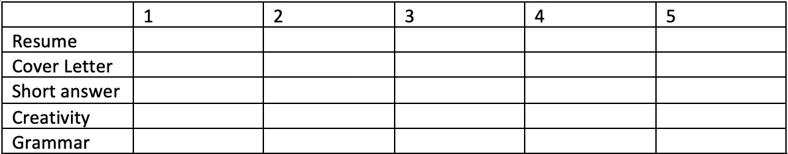

# 全职申请人的申请建议

> 原文：<https://medium.com/swlh/application-advice-from-a-full-time-applier-34d05d568f2>

我从六个月的实习经历中学到了什么

在长达六个月的紧张实习结束时，我终于可以松口气了。我在俄亥俄州立大学护理学院找到了一份市场营销和沟通实习。现在我可以开始我的恢复过程了，之前我被这个国家所有寻找作家的组织扇了耳光。值得庆幸的是，我非常相信事出必有因，所以我对即将到来的夏天充满渴望，也为我的结局感到高兴。

但是这个过程会让人精神衰弱，信心崩溃，筋疲力尽。我发现整件事完全是浪费时间，与我接连收到的拒绝毫无关系。我希望公司能在他们的网站上做广告:75%的职位给有关系的候选人，15%给证明比你至少多五年经验的简历，9%给身高超过 6 英尺的候选人，但 1%给像你这样的申请人，所以我们鼓励你申请！！

这些拒绝并不是我最大的挫折，尽管它们是我最大的担忧，因为夏天的声音一次比一次响亮。我最大的挫折是我从那些我投入了无数时间的公司那里学到的东西:几乎一无所获。通过自我反省，我能够从时间中挽回一些本来会被浪费掉的价值。但是我所学到的东西受到我理解一个比失业的我所能理解的更复杂的过程的能力的限制。

我申请的几个地方甚至都没有回复我。我知道他们不欠不合格申请背后的人任何人情。但是我把时间、精力和热情投入到他们的公司；回应不是帮忙，而是一种普通的礼貌。至少给我发封邮件，主题行写“去你的”，正文写“傻逼”！

我的申请有错误，我知道。但是我感到无助，因为我知道我的申请是不充分的，也没有办法获得反馈来改进它们。应用程序开始感觉更像是忙碌的工作，而不是时间的合理利用。谷歌是我最有价值的资源，这很有价值，但我想要针对我的工作*的反馈。相反，我得到了一个生成的响应，它被复制并粘贴到所有 100，000 个申请人。我总是接着说“谢谢你的考虑”和“我很乐意听到你能提供的任何反馈。”蟋蟀。*

我知道大公司有比跟踪被拒申请人更重要的事情要做。但是，他们已经在看我的申请了(我希望如此)，那么在他们审查的时候可以填写一个标题怎么样？

我在大约 60 秒内创建了这个标题。如果他们在寻找五种完全不同的资格，很好；做出一个解释，确切地说明什么是寻找申请人。即使是最忙的应用程序审查人员也可以在 10 秒或更短的时间内完成填写。我在你的申请上花了一个小时，你欠我 10 秒钟作为回报。

我被当地一家新闻电视台拒绝了。我太激动了，以至于在回复之前我需要花一分钟来克制自己不要表达太多的感激之情。为了做好准备，我在四月底收到了这封邮件。在那个时候，检查我的电子邮件是我出于需要不情愿做的事情。这是情感流失。每次我检查的时候，精神上的鼓舞成为标准的初步练习。我不断提醒自己，我的价值不是由收件箱决定的。

> 非常感谢你对 WBNS-10TV 的暑期实习感兴趣。在审查了收到的所有申请后，我很遗憾地通知你，你的申请没有被进一步考虑。
> 
> 和我们的遴选委员会一起，我真诚地感谢您在申请中投入的时间。随着你大学生涯的发展，我们鼓励你申请未来在 10TV 的实习经历。由于这是一次学习经历，如果您对此过程有任何疑问，请不要犹豫，直接联系我。再次感谢。

我真的不敢相信自己的眼睛。提供反馈？！这太不真实了。我想一路跑到她的办公室，撞开她的门，投入她的怀抱。我的英雄。

我非常想听听她对我的申请有什么看法。我确信这件事有什么可怕的不对劲，而且她不知道如何把这个消息告诉我。就像所有的简历都需要用紫色字体，而我的是黑色的——自动取消了我在美国所有公司的资格。我所有的拒绝完全取决于她的反馈。她给我回了邮件，让我知道她可以看出我是一个很强的作家，但她寻找的是专门从事广播新闻而不是一般经验的实习生。几个来回之后，她给了我一个机会去车站跟踪她一天。

我第一次明白，被拒绝也是可能的，而不是一个彻头彻尾的失败者！我的申请是我在纸上最令人印象深刻的自我表现。因为同样是这些论文给我带来了无情的拒绝，职业上的拒绝让我觉得是个人的。

唷！！！你成功了！作为对我勇敢地面对我对整个职业世界的怨恨的奖励，这里有一些来自一个申请经验多于工作经验的女孩的建议。这些是我认为给我带来最大成功的一些要点，我认为这些错误是我的一长串“我们已经决定追求其他候选人，但鼓励你在未来再次申请”电子邮件的原因。

1.  错别字和语法错误！！！！！

这是最容易避免的，也是应用程序中最明显的错误。当大规模申请时，很容易复制和粘贴相同的求职信，并忘记更新你为迎合特定公司而做的小改动。我是通过艰难的方式了解到这一点的:向迪士尼提交了一份申请，申请我在 NBC 的一个职位。在这个致命的错误之后(在我后来注意到的其他小错误中)，我设计了一个新的策略。我创建了一个红色字体的可变组件的模板求职信。通过这种方式，我清楚地知道哪些部分需要调整，*和*省去了我过去花在重读每份申请的求职信上的时间。我能够自信地提交它，因为我知道我已经编辑了 10 遍 90%的内容。这些变量包括:日期、地址，我在每个地方都写了公司名称、职位头衔、收件人(虽然通常只是招聘经理)和技能(根据职位的不同略有不同)。)

2.拍大的…但也拍小的

当然是申请你梦寐以求的工作。甚至向一些地方(华盛顿邮报、纽约时报、Buzzfeed、CNN)提交申请都给了我一种自信和成就感。是的，你就是那么好。你梦想中的公司雇佣的某个人正在阅读你的申请。那很大。但我认为，我在寻找实习机会时遇到的一些困难来自于我花在申请公司上的时间，这些公司实际上不接受很多冷漠的申请人。这些地方竞争如此激烈，以至于这些数字并不能让你的申请脱颖而出。我低估了进入小公司的价值，在此之前，我需要建立人脉和积累经验，以实现自己的梦想。我为我在《华盛顿邮报》的申请中投入的时间和精力感到自豪。这是我写的最好的作品之一。但我回过头来看它(这是我提交的第一份申请)，想到 WAPO 甚至根据我的简历给我面试机会，我就觉得好笑。

3.控制面试中的可控因素

在面试中，大多数事情都不在你的控制之下，但有些是。你的着装和准备都是可控的，当你走进门的时候，会让你感到无限的自信。相信我，我在早上从室友的衣柜里胡乱拼凑了几件衣服，然后赶去面试，对我申请加入的公司知之甚少。不要那样做。但是我认为大部分的申请人都表现出对这个职位的了解。这样做，但要做得更多；面试不是融入的地方。我发现我问的问题与我走出面试时的自信程度直接相关。我问的问题越直接、越相关，我就越觉得自己和面试官是平等的。记住，他们不是唯一做决定的人。你还应该决定它们是否适合你——即使它们似乎是你唯一的选择！不管你有多想要/需要这份工作，问问题会让你看起来不那么绝望，更多的是在寻找一个能满足你目标的工作场所。它总是让我觉得更令人向往。没有问题的候选人是在申请一份工作，而直接相关的问题会让面试官觉得你是在申请 T2 的这份工作。