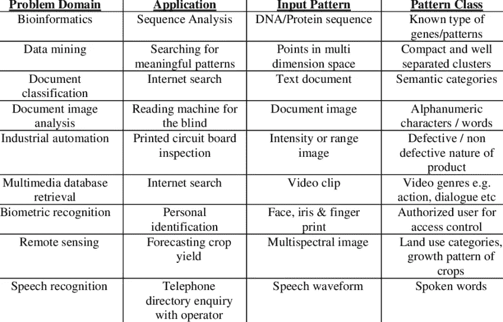
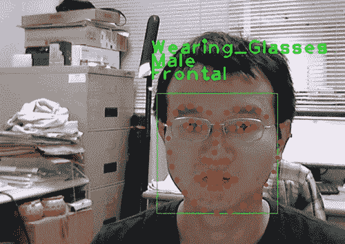
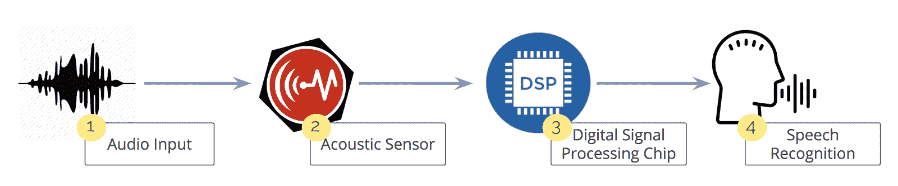
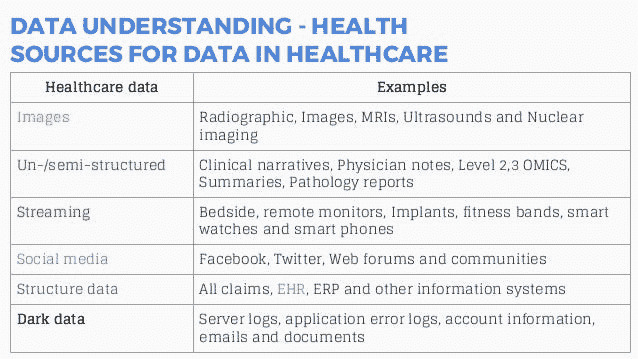

# 机器学习的应用

> 原文：<https://medium.com/swlh/applications-of-machine-learning-9f77e6eb7acc>

Photo by [Franck V.](https://unsplash.com/@franckinjapan?utm_source=medium&utm_medium=referral) on [Unsplash](https://unsplash.com?utm_source=medium&utm_medium=referral)

目前，人工智能(AI)已经发生了显著变化。因此，基于人工智能机器学习诞生了。因此，人工智能的机器学习结构能够学习新的数据，而不是编程。机器学习是数据挖掘科学的一个子集。

建立在机器学习算法上的智能系统具有从过去的经验或历史数据中学习的能力。在这篇文章中，我将讨论一些机器学习在实时场景中应用的例子。从财务、营销、健康和安全方面来看，它可用于识别地理问题等。

机器学习在任何基于模式识别的应用中都非常有用。这包括明显的应用程序，如面部识别软件和手写识别。

模式识别，这是什么？？？？

> **模式识别**是对数据中的**模式**和规律性的自动**识别**。**模式识别**与人工智能和机器学习，以及数据库中的数据挖掘和知识发现(KDD)等应用密切相关，经常与这些术语互换使用。

*—维基百科—*

用我的话来说，模式识别可以采取任何形式的视觉、听觉或数字数据，这取决于软件的预期用途。这些是一些受欢迎的机器学习竞赛主办网站的示例，包括:

*   ka ggle—([*https://www.kaggle.com*](https://www.kaggle.com/)*/*)
*   数字—([*https://numer.ai/*](https://numer.ai/))
*   topcoder—([https://www.topcoder.com/T21](https://www.topcoder.com/))
*   众数分析——([*https://www.crowdanalytix.com/*](https://www.crowdanalytix.com/))
*   驱动数据—([*https://www.drivendata.org/*](https://www.drivendata.org/)*)*

example of pattern recognition Applications

# 机器学习如何帮助创造更好的技术来推动今天的想法？

## 面部识别

Facial Recognition

面部识别是机器学习最常见的用途之一。使用面部识别有很多情况。例如，移动设备中的高质量摄像头使得面部识别成为认证和识别的可行选择。苹果的 iPhone X 就是一个例子。面部识别应用软件的工作原理是识别人脸上的 80 个节点。节点是用来测量人脸变量的端点，如鼻子的长度或宽度，眼窝的深度和颧骨的形状。

机器学习也可以用于图像识别。

facial recognition technology

## 声音识别

语音识别换句话说，语音识别是将语音/轮辐转换成文本。它也被称为自动语音识别(ASR)。我们可以寻找谷歌助手、Cortana、Siri 和 Alexa 的例子。语音识别是深度学习的范畴之一。该系统分析人类特有的声音，并使用它来微调对该人语音的识别，从而提高准确性。简单的语音命令可转换为解码命令，并可用于拨打电话、选择广播电台或播放兼容智能手机、MP3 播放器或装有音乐的闪存盘中的音乐。

举个例子，用你的智能设备打开谷歌助手(android)或者 Siri(IOS)，说“你好谷歌/Siri！”设备会对你做出反应。通过测量用户说话时发出的声音，语音识别软件可以测量独特的生物因素，这些因素结合起来，产生了她/他的声音。

voice recognition process

## 金融服务

机器学习在金融和银行领域有很大的潜力。它帮助银行金融机构。

比如塔菲特资本管理([http://taaffeitecm.com/](http://taaffeitecm.com/))。Taaffeite Capital 使用专有的机器学习系统，以完全系统化和自动化的方式进行交易。这里有一个使用机器学习的基金和交易公司的列表。

通过适当的数据挖掘为正确的客户设计新产品和服务，支持简单、灵活和集成的流程，以了解客户的购买习惯，然后了解客户参与的渠道以及关键影响因素，这对于银行的销售至关重要。应用机器学习来生产个性化产品是下一代银行业的关键。

根据客户的国籍、职业、工资范围、经验、工作行业、信用记录等确定客户的风险评分。对于银行来说，在向客户提供产品或服务之前，这一点非常重要。该风险分数是银行为客户决定利率和其他产品行为的重要 KPI。

## 卫生保健

医疗保健行业有许多手动流程。在这方面，技术总是有助于更好地了解病人的情况。使用这些类型的高级分析，我们可以在患者护理点为医生提供更好的信息。方便快捷地获取患者的血压、心率、实验室测试、DNA 测试等。

examples of health care

在医疗程序的临床试验阶段，机器学习也有很大的价值。

## 结论

我们讨论了机器学习如何与实时应用相结合。机器学习正在改变日常生活，并改善基于人工智能、人工智能和深度学习的技术，例如。现在我们知道机器学习可以做很多事情，但我在我的文章中只提到了几个应用，我们大多数人都已经在经历这项技术的崛起，而没有意识到这一点！机器学习在各个行业的几个应用是非常明显的。但在未来，机器学习只能通过时间来确定。

## 这篇文章发表在 [The Startup](https://medium.com/swlh) 上，这是 Medium 最大的创业刊物，拥有+419，678 名读者。

## 订阅接收[我们的头条新闻](http://growthsupply.com/the-startup-newsletter/)。

