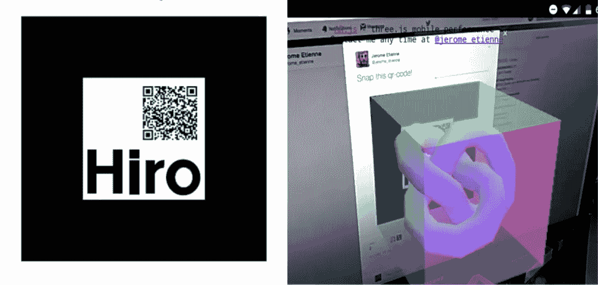
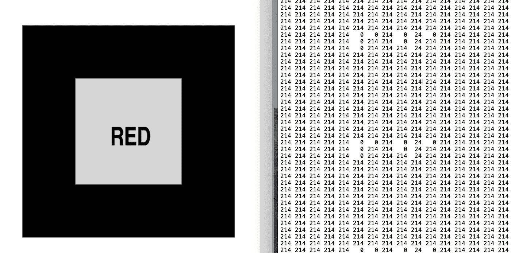
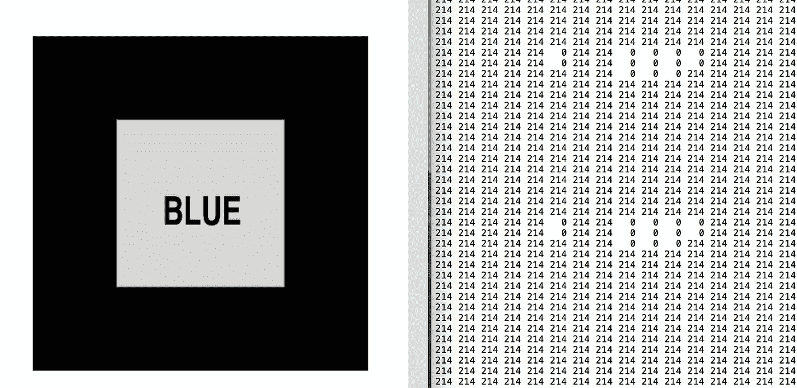
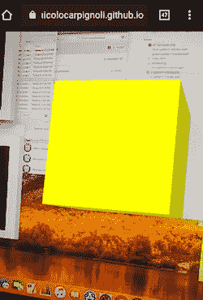

# ar . js——在网络上实现跨浏览器增强现实的最简单方式

> 原文：<https://medium.com/swlh/ar-js-the-simplest-way-to-get-cross-browser-augmented-reality-on-the-web-10cbc721debc>

## 更新版本——如何以开源、简单和跨浏览器的方式在网络上交付增强现实内容。

这是关于 AR.js 的系列文章的第一部分，下面是迄今为止所写文章的列表:

*   [ar . js——在网络上实现跨浏览器增强现实的最简单方式](/@nicolcarpignoli/ar-js-the-simplest-way-to-get-cross-browser-augmented-reality-on-the-web-10cbc721debc)
*   [如何只用二维码在网上交付 AR](/@nicolcarpignoli/how-to-deliver-ar-on-the-web-only-with-a-qr-code-139bb90e82f1)
*   [如何处理 AR.js 上的点击事件](/@nicolcarpignoli/how-to-handle-click-events-on-ar-js-f397ea5994d)
*   [提高你的 AR.js 表现的 10 个技巧](/@nicolcarpignoli/10-tips-to-enhance-your-ar-js-app-8b44c6faffca)。

关于 AR.js 和 Web AR 的最新消息，可以[关注](https://twitter.com/nicolocarp)我！

> 声明:AR.js v3 已经发布，新的文档可以在[https://ar-js-org.github.io/AR.js-Docs/](https://ar-js-org.github.io/AR.js-Docs/)找到。如果您发现本教程有问题，可以在那里了解更多信息。

# 只是又一个 AR 库？

对于那些还不知道的人来说， [AR.js](https://github.com/jeromeetienne/AR.js) 是一个伟大的项目，Github 上有超过 13k 颗星星，这使得使用 web 技术开发增强现实应用程序变得简单而有趣。通过几行简单的 Javascript 和一些 3D 建模，开发一个增强现实网络应用几乎是立竿见影的。

它最有趣的特点是:

*   性能，在我用了两年的手机上大约 60 FPS(！)
*   兼容性，它是跨浏览器的，它可以在支持 [webgl](https://caniuse.com/#feat=webgl) 和 [webrtc](https://caniuse.com/#feat=stream) 的所有手机浏览器(显然还有桌面)上工作(所以基本上所有 Android 手机和 iOS 11 以上的 iphone)
*   简单，它是不同框架的包装器，使 web AR 开发非常容易。它建立在[人字架](https://aframe.io/docs/0.8.0/introduction/)和 [three.js](https://threejs.org/) 之上。

所以我们不需要 Hololens、纸板或者昂贵的手机；我们只需要到达一个 AR.js webapp，然后就可以体验 AR 了。

这怎么可能呢？好吧，事实证明 AR.js 可以使用标记([不总是](/arjs/ar-js-supports-tango-on-a-frame-too-2c098de4df34)，但是如果我们想要跨浏览器，我们必须使用标记)。



A default marker containing a qr-code on the left and AR.js magic on the right — image from [this](/arjs/ar-code-a-fast-path-to-augmented-reality-60e51be3cbdf) Jerome Etienne’s story.

# 标记

标记是一种简化的二维码。在 AR.js 上，我们为特定的标记定义了特定的 3D 场景，因此当相机识别出标记时，web 应用程序会在其上显示 3D 模型。此外，标记可能包含 qr 码。

## 图案标记

AR.js 的一个重要特性是可以使用自定义标记，默认类型是“模式”。我对图案标记的局限性做了一些研究，关于它们的大小和形状。我了解到:

*   标记的最大分辨率是 16x16 像素
*   它们的形状必须是方形的
*   它们不能有白色/透明区域，只能有浅灰色(例如#F0F0F0)
*   它们不能包含颜色，只能是黑色和浅灰色
*   它们必须包含简单的文本，比如一个字母、一个数字或一个符号。

您可以使用[这个在线工具](https://jeromeetienne.github.io/AR.js/three.js/examples/marker-training/examples/generator.html)来生成您的自定义标记。如果你分析一下”。patt”输出文件，你会发现给定的图像是用一组字符描述的。因此，为了获得好的结果，最好对不同的标记使用不同的图像，避免过于复杂的图像或包含文字的图像。

另一个需要记住的重要方面是标记的“背景”和周围环境之间要有高对比度；例如，如果标记在黑色背景上具有浅灰色符号，那么如果标记被打印并放置在黑色桌子上或显示在黑色屏幕上，照相机将难以识别该标记。

## 条形码标记

标记也可以是条形码。他们将一个数字表示为一个符号，用矩阵上的微积分创建。建议基于具有高“汉明距离”的矩阵生成标记(见[此表](https://github.com/artoolkit/artoolkit-docs/blob/master/3_Marker_Training/marker_barcode.md))，这样摄像机可以更好地识别它们。矩阵还定义了可能标记的最大数量(例如，“AR_MATRIX_CODE_3x3_PARITY65”矩阵可以生成 32 个不同的条形码标记)。

请记住，如果可能的话，最好避免在条形码标记中使用白色/透明色(这一点在条形码标记上没有得到证实，但它是基于经验)。

[这个](http://au.gmented.com/app/marker/marker.php)是我在下面例子中使用的条形码标记的在线生成器。

我将向您展示一些来自 AR.js 文档和博客的基本代码，以及一些变通方法，因为目前有一些关于自定义标记的公开问题。

在这个简单的 HTML 中，我们:

*   导入库
*   告诉 AR.js 识别用 3×3 矩阵生成的条形码模式(第 14 行)
*   定义两个<a-marker>标签，每个标签由两个不同的条形码值(20 和 24)标识</a-marker>
*   定义一个静态相机实体(第 32 行)。

为了避免问题，请使用如上所示的特定标签和属性。在撰写本文时(2019 年 4 月),这个示例有效，它基于 AR.js 的最新版本(版本 1.6.2)。还要求对模式资源使用远程 URL，而不是相对 URL。**请注意，由于浏览器的安全限制，您的服务器必须通过 https 提供这些资源。**

如果要使用自定义标记而不是条形码标记，可以使用之前链接的工具生成它们，而不是使用

```
<a-marker type="barcode" value="6" (...)
```

你可以用

```
<a-marker type="pattern" preset="custom" url="...." (...)
```

其中“url”是您的远程绝对 URL。patt”文件，位于远程的某个地方(例如，在 HTML 文件的同一个存储库中)。

## 细节模式

为了简化摄像机对标记的检测，记住一些创建条形码/图案标记的简单规则是很有用的。

例如，为“蓝色”图像和“红色”图像生成的图案非常相似(您可以在以下图像上检查它们)；这将使检测变得非常困难。



“Red” marker on the left and the correspondent pattern used by AR.js on the right.



“Blue” marker on the left and the correspondent pattern used by AR.js on the right.

如果图像非常复杂，检测也可能失败，因为输出看起来像一组随机字符。从我玩标记的一点点经验中，我发现条形码标记和图案标记一样容易识别。对于后者，可以进行更多的定制，但也更容易创建一组类似的标记，这些标记可能会混淆相机，或者使用复杂的图像作为标记。

## 那么，AR.js 值得吗？

我回答“绝对”。它的简单令人惊叹。基于标记的方法并不是真正的限制，而是一种非常适合各种用例的范例。标记可以显示在手机和桌面显示器上，也可以打印出来挂在墙上或板上。



Screenshot taken from my AR.js demo app, while the marker is shown on another display. The yellow 3D box pops up when the camera recognizes the correspondent pattern.

正如 AR.js 向我们展示的那样，没有必要通过手机上的另一个设备来体验 AR，也没有必要下载第三方应用程序(普通用户肯定会很快卸载，或者他们可能根本不会下载)。在网络上提供增强现实，并使它容易适合每个人(字面上！)是让这项技术普及的关键。

非常特别地感谢 [xho](https://twitter.com/xho) 审阅了这篇文章，在他之前这篇文章不太可读:)

> **Chialab** 是一家设计公司。通过开发战略、设计、软件和内容，我们在品牌和人之间建立了令人兴奋的关系。 [https://www.chialab.i](https://chialab.it) t。