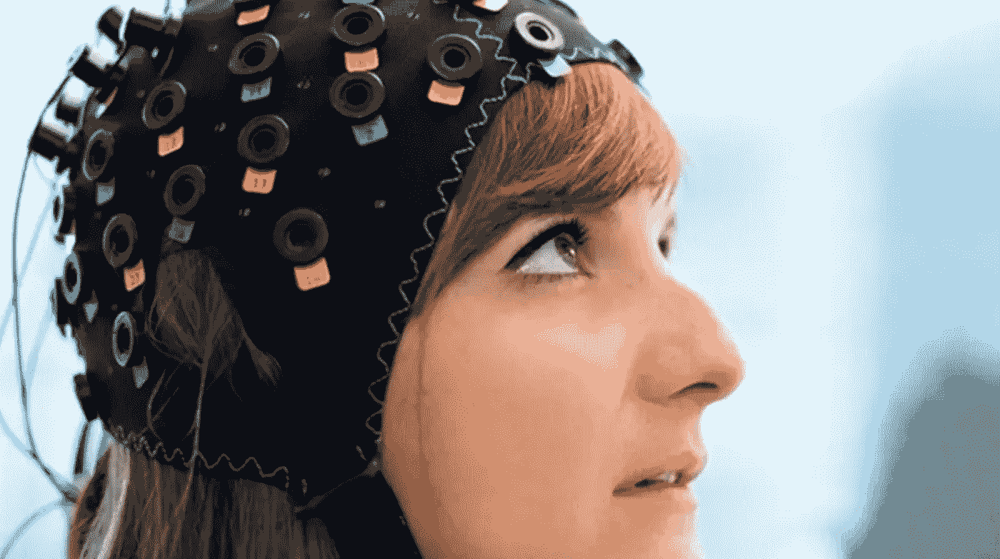

# 算法正在塑造我们的思维方式吗？

> 原文：<https://medium.com/swlh/are-algorithms-shaping-the-way-we-think-fb754badd9a0>

他们知道我的一切——我想听什么音乐，我应该买什么东西，我应该计划去什么度假目的地等等。等等。-清单是无止境的。几天前，当我坐在一位男同事旁边时，我的电脑上不断被一些难以忽视的内衣广告轰炸。当时我诅咒自己没有足够的精力阻止谷歌跟踪我。