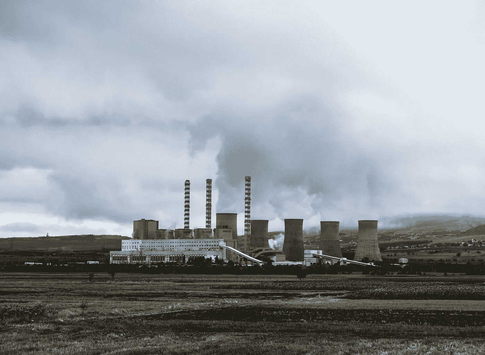

# 企业与非营利组织的合作关系总是一件好事吗？

> 原文：<https://medium.com/swlh/are-corporate-nonprofits-partnerships-always-a-good-thing-77d7bdfbcae>

Credit: Jason Blackeye on Unsplash

非营利组织的世界现在充满了大牌公司的合作关系。访问任何大型非营利组织的网站，你会看到著名的财富 500 强公司的标志贴满了他们的“合作伙伴”页面。为什么不呢？企业提供大量可靠的捐赠，并有各种实物贡献——非营利组织不接受他们的提议就是疯了。

但是，在什么情况下，这种合作关系会对非营利组织的使命不利呢？

让我们不要忘记——非营利组织的存在是为了解决一个*社会或环境问题。*就是这样，这是它们唯一的功能。另一方面，公司的存在是为了产生利润，并且经常是社会和环境问题的主要*驱动者。此外，企业社会责任部门的存在几乎完全是为了转移公众对后一事实的注意力。虽然这种说法的真实性肯定是程度问题——公司*的确*有不同程度的社会责任感，如果你愿意的话——总的来说，他们的社会和环境优先事项被排在名单的后面，尽管他们华丽的可持续发展网站可能会让你相信。*

如果我们真的认为企业社会责任经常被一家公司用来转移对其不太正当的活动的注意力，并防止公众四处挖掘以揭露众所周知的香肠制作，并且我们承认非营利伙伴关系现在是许多企业社会责任战略的一个关键支柱，那么在我看来，非营利组织有责任问自己，他们是否真的在为他们正在努力解决的问题做出贡献——尽管是间接的和逐渐增加的。他们是不是给了一些最大的违规者一些藏身之处，从而助长了问题的延续？

需要澄清的是，我一点也不反对这些关系，也不指责非营利组织参与其中。我只是惊讶于他们似乎很少被这样考虑，即使当一个非营利组织从一个似乎与其使命直接对立的公司那里拿钱。

以非营利组织“保持美国美丽”为例，其使命是“激励和教育人们每天采取行动，改善和美化他们的社区环境。”“保持美国美丽”做了各种各样奇妙的工作——美国大扫除、全国植树节、回收站等等。——这一切都是为了创造一个更清洁、更健康的美国。我们都同意这些都是伟大的倡议，保持美国美丽是一项有价值的努力。

导航到他们的企业合作伙伴页面，你会立即看到一些大的名字，其中包括陶氏化学，雀巢，以及——也许是你从未听说过的最大的污染者——美国铝业。让我们来看看这三个。

就在最近，[陶氏要求特朗普政府忽视政府的研究](http://fortune.com/2017/04/20/white-house-environment-dow-chemicals/)),该研究表明，一组常用杀虫剂对 1800 种濒危和严重受威胁的动物物种有害。当然，这并不奇怪；陶氏化学数十年来一直行为不端，其犯罪记录包括橙剂、参与博帕尔事件的掩盖，以及向环保局隐瞒信息。全球铝生产的领导者美国铝业公司是[公共诚信中心认定](https://www.publicintegrity.org/2016/09/29/20248/america-s-super-polluters)为“超级污染者”的 22 家公司之一，即那些在“有毒”和“温室气体”污染方面排名前 100 的公司。考虑到亚马逊(别忘了，亚马逊也算“美国”)的矿山导致的森林砍伐，美铝可能是对“保持美国肮脏”贡献最大的公司之一。

还有雀巢，它的名字已经成为对环境不负责任的代名词。如果我们要列出它的罪过，这将是一个长达一小时的阅读，但仅举几个例子，制造需求和塑料水瓶的扩散，特别是通过在贫穷国家的廉价分销；从危机四伏的弗林特和干旱肆虐的加利福尼亚抽出干净的水；水的过度提取；使用不可持续的棕榈油；用马肉冒充牛肉；印度尼西亚的森林砍伐。好吧，我喘不过气来——但关键是他们几乎不是环境保护者。

> [非营利组织]通过给一些最大的违规者提供隐藏的东西，帮助延续了这个问题吗？

诚然,“保持美国美丽”可能不是一个很好的例子，因为它实际上是以公司联盟的形式开始的，但是我们可以为一大批非营利组织做这个练习，并找到大量类似的例子。

我认为，非营利组织需要考虑的重要问题是*这种合作关系能在多大程度上帮助企业避开公众。我们都知道，拥有一个面向公众的企业社会责任部门现在对公司来说是没有商量余地的，但这些伙伴关系是否在允许公司相对不受阻碍地继续其恶行方面发挥了作用，这很难梳理清楚。*

***如果*——这是一个很大的“如果”——这些合作关系确实在企业的隐藏能力中发挥了重要作用，那么非营利组织需要认真思考企业合作伙伴的行为模式是如何与他们自己的使命和目标直接对立的。**如果它们没有对齐，那么这种合作关系实际上可能会使指针向*另一个*方向移动。

此外，如果在特定领域工作的所有非营利组织都认为某些公司的行为不利于他们的使命，因此拒绝与他们合作，这是否最终会迫使一些公司实际上改变他们的行为？