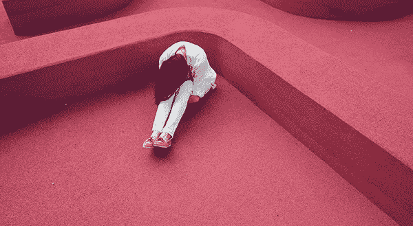

# 恐惧战术真的有用吗？

> 原文：<https://medium.com/swlh/are-fear-tactics-ever-okay-d649d84d4a5>

## 其实，也许是这样…

Photo by [Verne Ho](https://unsplash.com/@verneho?utm_source=unsplash&utm_medium=referral&utm_content=creditCopyText) on [Unsplash](https://unsplash.com/search/photos/afraid?utm_source=unsplash&utm_medium=referral&utm_content=creditCopyText)

这是一个你们中的一些人会感到愤怒的小事实。准备好了吗？

负面情绪比正面情绪更畅销。

嗯。那让你有什么感觉？

我听一些人说，你对在营销中使用恐惧或消极态度犹豫不决。这感觉不像是一种[道德营销实践](https://jessierlewis.com/ethical-marketing-business/)。我明白了-一个…