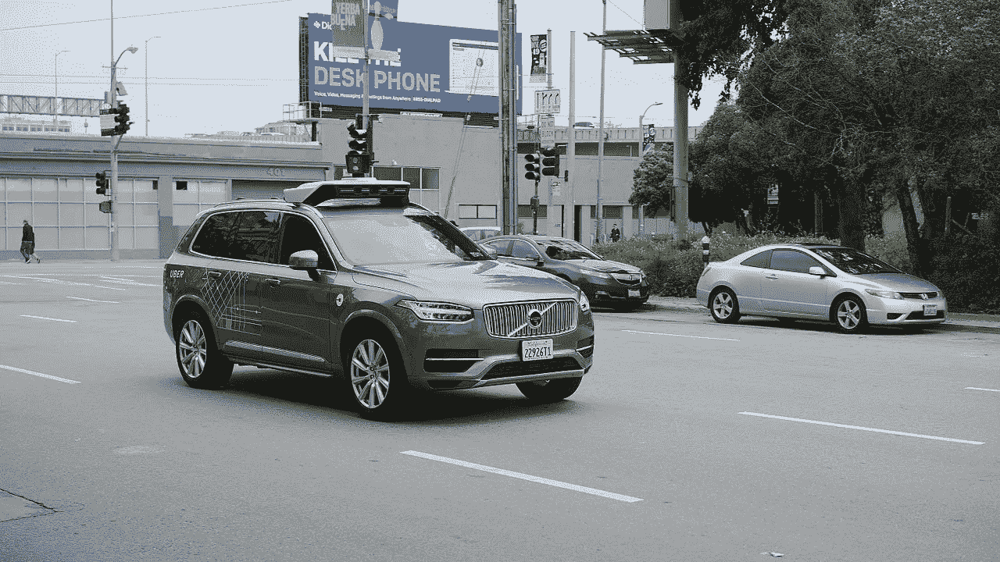
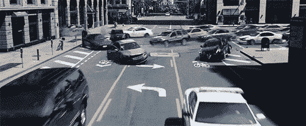

# 完全自动驾驶汽车是个好主意吗？

> 原文：<https://medium.com/swlh/are-fully-self-driving-vehicles-a-good-idea-61556a040e8f>

当大多数人在新闻或社交媒体上看到自动驾驶汽车时，他们会自动想到主要的积极因素，即他们不再需要专注于驾驶。只考虑自动驾驶汽车如何让驾驶变得更加简单，这与每个人都应该做的事情相反，我们应该纵观全局，并试图准确理解它们将如何以积极和消极的方式影响我们。我希望这个故事将有助于引发关于这个话题的思考和有趣的讨论。

# 我们在路上会更安全吗？

全自动驾驶汽车有很多好处，其中一个主要好处就是安全性。目前，道路交通事故的主要原因是人为错误，把人为因素排除在外，理论上，事故就会少得多。

当我们开车时，我们不断依赖其他司机遵守法律，安全驾驶，并准确指示他们要去的地方。依赖其他司机是一项艰巨的工作，尤其是当许多司机选择自己设定速度限制，似乎还没有弄清楚如何使用这些指标。自动驾驶汽车解决了这个问题，是的，汽车仍然依赖其他车辆提供准确的信息，但自动驾驶汽车提供错误信息的可能性要小得多。

自动驾驶汽车也不会分心，它们总是在寻找可能的危险。汽车总是意识到他们的周围环境，这大大降低了与行人等发生碰撞的风险。我说大幅降低而不是消除风险，因为人类是非常不可预测的。汽车根本不可能知道每个行人在想什么。例如，如果一名行人突然决定看也不看就过马路，汽车除了尽快做出反应之外没有太多其他办法，对于自动驾驶汽车来说，这比人类司机的反应快得多。

# 谁生谁死？

对于自动驾驶汽车来说，这是一个古老的问题，如果发生事故，汽车救了谁，乘客还是另一方。道德问题是不可能明确回答的。

The Good Place — Trolley Problem

这个问题实际上从 1967 年就开始被广泛讨论，被称为 Trolly 问题。电车问题是这样问的:

> 你看到一辆失控的电车正朝躺在铁轨上的五个被捆绑(或丧失行为能力)的人移动。你站在控制开关的杠杆旁边。如果你拉动拉杆，电车将被重新引导到一条侧轨上，主轨上的五个人将得救。然而，有一个人躺在旁边的轨道上。你有两个选择:
> 
> 什么都不做，让电车杀死主轨道上的五个人。
> 
> 拉动控制杆，将手推车转移到侧轨上，在那里它会杀死一个人。
> 
> 哪个选项更符合伦理道德？

在这种情况下你会怎么做？救五个人还是救一个人？在对这些人一无所知的情况下，你可能会选择去救那五个人，因为五个人的生命比一个人的生命更重要。但是五个人的生命真的比一个人的生命伟大吗？你不能给生命定价，所以你怎么能决定拯救更多的生命比拯救一个生命更好。

无轨电车问题当然是一个理论难题，但自动驾驶汽车必须为一个非常相似的真实问题找到答案。这个问题本身引出了更多的问题，我们信任谁来编写做出这个决定的代码？我们甚至想让另一个实体代表我们做这个决定吗？

当谈到编写代码时，我们必须信任开发车辆的公司，因为没有其他选择，可以说我们的生命掌握在他们手中。说到由谁来做决定，就我个人而言，我宁愿自己做决定。驾驶员倾向于本能地急转弯以避免事故，即使这对他们的安全不利，这是自动驾驶汽车也应该做的吗？

麻省理工学院开发了一项名为[道德机器](http://moralmachine.mit.edu/)的实验。在实验中，你会看到各种场景，你必须决定自动驾驶车辆应该做什么。在几个场景之后，你会很快理解这个问题有多棘手。我强烈推荐去[网站](http://moralmachine.mit.edu/)，自己判断你认为这些场景应该如何发展。我还推荐阅读更多麻省理工学院迄今为止的研究成果和电车实验。我认为，随着一个充满自动驾驶汽车的世界越来越近，每个人都必须尽最大能力理解这个问题。

# 应该有驾驶员输入吗？

简而言之，是的，我认为应该有驾驶员输入。在我看来，自动驾驶汽车应该只是部分自动驾驶。我的意思是，他们应该能够手动驾驶一些自主功能或完全自主模式。我有几个理由来解释为什么我会这样想，但是我也知道这会引起一些问题。

我的主要原因是世界上有很多人真正喜欢驾驶。专门出去开车，没有目的地放松和享受生活的人。这种对驾驶的热情推动了许多运动，如果禁止人类驾驶的汽车，这些运动将永远受到损害。

这方面的主要问题是，在自动化水平参差不齐的地方，我们如何管理道路。我的解决方案是不同的自动化区域，比如说三个不同的区域。一个区域要求车辆完全自主，一个区域只需要部分自主，一个区域不需要自动化。

完全自治区域可以是像城市、大镇和高速公路这样的区域，那里有大量的车辆和较高的事故风险。部分自治可以是人口密度较低的地区，如郊区和较小的城镇，在那里发生事故的风险为中等。最后，在村庄和乡村不需要自动化，碰撞的风险大大降低。现在，尽管由于道路上的车辆数量较少，农村地区发生事故的风险较低，但受伤的风险却高得多。受伤的风险更高，因为在农村地区的汽车往往比在建筑物较多的地区行驶速度更高。这种增加的风险就是为什么我说我认为车辆应该能够手动驾驶，但要有一些自主功能。这些汽车应该仍然具有自主安全功能，如果检测到中度至高度危险，它将接管控制权。假设你正沿着一条单车道行驶，车辆应该仍在与范围内的其他车辆进行通信，这样当你遇到一个死角时，它就知道是否有东西从另一个方向过来。因为它知道如果有什么东西来了，它就可以计算出司机是否通过减速对死角做出了安全的反应。如果司机没有做出安全的反应，那么汽车应该接管控制权，以避免致命的正面碰撞。

我们离多个自治区域成为可能还有很长的路要走。要做到这一点，所有的汽车都需要一定程度的自动化，而且自主技术的发展也需要进步。对我来说，在一个理想的世界里，区域和部分自动驾驶汽车是让大多数司机满意的最佳方式，同时还能大幅提高安全性。

# 我们的车会被黑吗？

Fast and Furious 8 Car Take Over Scene

是的，自动驾驶汽车会被黑。任何有电脑芯片的东西都可以被黑，这个世界上总会有人出于恶意想要这么做。这里真正的问题是，我们如何防止有人完全控制车辆，这样我们就不会陷入像《速度与激情 8》那样的境地。我不是安全专家，对黑客攻击也不是很了解，所以我不知道黑客攻击问题的可能解决方案是什么。

# 交通会成为过去吗？

这是一个很难回答的问题，因为交通中有许多因素。一个因素纯粹是路上行驶的汽车数量。自动驾驶汽车不太可能减少道路上的车辆总数。自动驾驶汽车可以解决一些因素，让我们从交通的主要原因之一开始，不必要的制动和变道。

你有多少次在高速公路上开车时，有人随意刹车或变道却毫无收获？我经常看到这种情况。当时，轻微的刹车可能看起来无害，但它会引起多米诺骨牌效应，一波刹车可以延伸数英里并导致拥堵。自动驾驶汽车不会这样做，理论上，它们只会在需要的时候坏掉，因此永远不会引发多米诺骨牌效应。交通的另一个原因是事故，这又回到了安全方面。自动驾驶汽车应该会导致更少的碰撞，从而减少因车辆损坏而导致的车道关闭。

最后，我们反应迟钝。人类对事物的反应很慢，比如交通灯。自动驾驶汽车应该对绿灯的开启做出更快的反应，汽车也应该对前面行驶的汽车做出更快的反应。这些更快的反应时间将使交通灯更有效，更多的车辆能够在交通灯再次改变之前通过。好处不止于此，交叉路口和环形路也应该变得更有效率。

# 驾驶会变得更容易吗？

我相信自动驾驶汽车将为残疾人创造奇迹。无人驾驶汽车可以让残疾人获得更多自由，他们不再需要依赖他人代步。

# 驾驶执照是如何工作的？

我们不能完全取消驾照，因为作为司机你仍然需要知道一些事情，例如如何检查汽车以确保车辆在道路上是安全的。我认为应该增加一个新的层次。在英国，我们目前有不同的手动和自动汽车牌照，一个新的自动驾驶专用层可能会实施。

这是一个轻微的旁注，但当我们谈到许可证的话题时，我也认为常规的应该每隔几年重新测试一次。我认为他们应该重新测试的原因是，这将提高每个人在道路上的安全性。众所周知，随着年龄的增长，我们的视力和注意力、快速反应和判断危险的能力会下降。我们的感官恶化在日常生活中是好的，但是当需要瞬间判断来决定生死情况的结果时，这是一个重大的问题。每隔几年重新测试将确保每个有驾照的人仍然是安全的，也让每个人都了解最新的规则和驾驶所需的知识。

另一种看法是这样的，卡车、叉车、高架工作平台、飞机、火车和建筑机械的司机都必须每一年或两年重新参加考试，或者被要求参加年度培训。汽车为什么不一样？尤其是当汽车占了所有伤亡事故的大部分时。

# 自动驾驶汽车会对环境有帮助吗？

总之，这高度依赖于电动汽车的发展。我是电动汽车的大力倡导者，我相信它们是未来，但我也知道它们要成为主流还有很长的路要走。很可能自动驾驶汽车将有助于环境，或者至少不会像汽油和柴油驱动的汽车那样糟糕，这是因为很可能绝大多数自动驾驶汽车将是电动的。对环境的任何好处在很长一段时间内都不会被看到，至于真正的改变，需要电动汽车的广泛采用。

在我看来，最显著的好处将来自自动化电动公共交通。从理论上讲，拥有良好的、自动化的、可再生能源驱动的公共交通系统将减少道路上的汽车数量，从而减少正在制造的汽车数量，这反过来将导致更少的污染物被释放到我们的大气中。

# 人会失业吗？

简单的答案是肯定的，但这是非常依赖于行业的。自动化将允许公司使用无人驾驶的精选车辆，这意味着某些行业的特定领域不再需要人类，比如出租车。我读到了很多关于大规模失业问题的担忧，就像我说的，一些类型的工作会比其他工作受到更大的影响。

我见过的最令人担忧的行业之一是卡车运输行业，因为将人类从等式中移除将使一切变得更有效率，因为成本将更低，也没有必要担心工人的工作时间。在英国有 30 多万名重型货车司机，在美国大约有 350 万名卡车司机(是所有国家中数量最多的)，在全球范围内，估计有 500 万到 600 万名商用卡车司机。总的来说，这是一个可怕的失业人数。然而，我觉得卡车运输行业是受自动驾驶汽车威胁最小的行业之一，因为我们仍然需要知道如何正确挂接拖车、执行安全检查、驾驶 moffets 和诊断问题的技术人员。

即使有潜在的大量失业，新的工作岗位也会被创造出来，但是我不认为会有足够多的新工作岗位被创造出来来抵消所有那些将不复存在的工作岗位的影响。

# 天气怎么样？

我们星球的自然元素是自动驾驶汽车最大的缺点之一，其中最大的缺点是雪。任何去过下雪的地方的人都会知道，当下雪时，道路上的车道很快就变成了一条，在一些地方，道路本身甚至会变得与其他景观难以区分。自动驾驶汽车在很大程度上依赖于车道标志，那么当没有车道标志时，它们是如何工作的呢？目前，据我了解，这个问题似乎还没有解决方案。我甚至不确定这是不是一个可以解决的问题，除了车道标线，还有什么可以告诉车辆它可以开到哪里？

# 结论

我只是刚刚触及了自动驾驶汽车的表面。自动驾驶汽车仍处于早期阶段，我们至少还需要十年才能真正开始看到它们将产生的影响。这并不意味着我们应该等到那时才开始尝试找出如何处理它们将导致的问题，并帮助公司朝着正确的方向发展它们。然而这并不都是问题，也有积极的一面，巨大的变化即将到来，担心是很自然的，但是变化并不总是坏事。