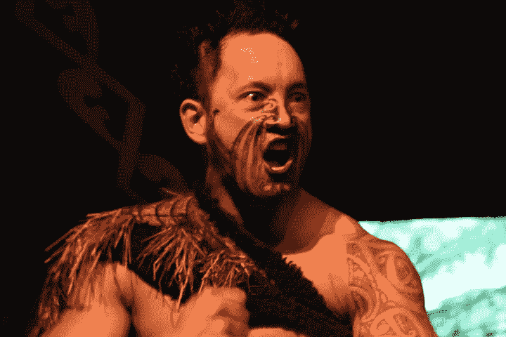

# 毛利人比澳大利亚的土著人更好地融入新西兰社会。原因如下。

> 原文：<https://medium.com/swlh/are-nz-maoris-better-integrated-than-australian-aboriginals-in-their-countries-89525b698bfe>

## 世界各地的土著人日子都不好过。为什么毛利人的整流罩比土著人“没那么糟糕”？

Maori Haka in action

不久前，我在惠灵顿上班，走在商业区的主要街道上，遇到一个在街头卖艺的人