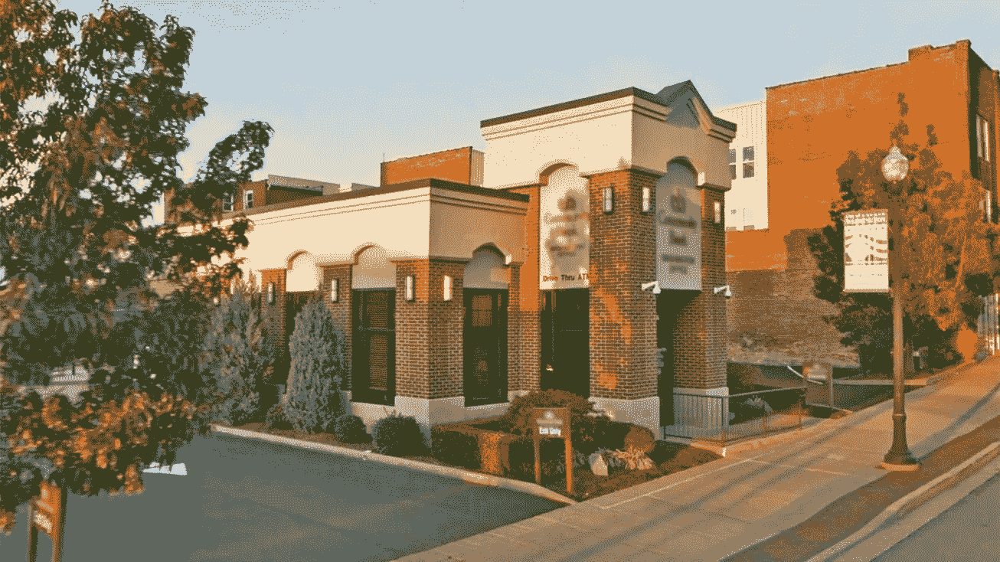

# 零售银行为生存做了足够的努力吗？

> 原文：<https://medium.com/swlh/are-retail-banks-doing-enough-to-survive-8662462aab0b>

我叫雅各布。我 18 岁了。在我的生活中，除了选择上大学之外，我还没有做过很多重大的购买或财务决定，而且我现在也没有钱做任何实质性的事情。

我找到了一份工作，赚了足够的钱来付房租，周末出去玩，但我的学生贷款越积越多，我一直忽视这种挥之不去的感觉，事情会变得很多…