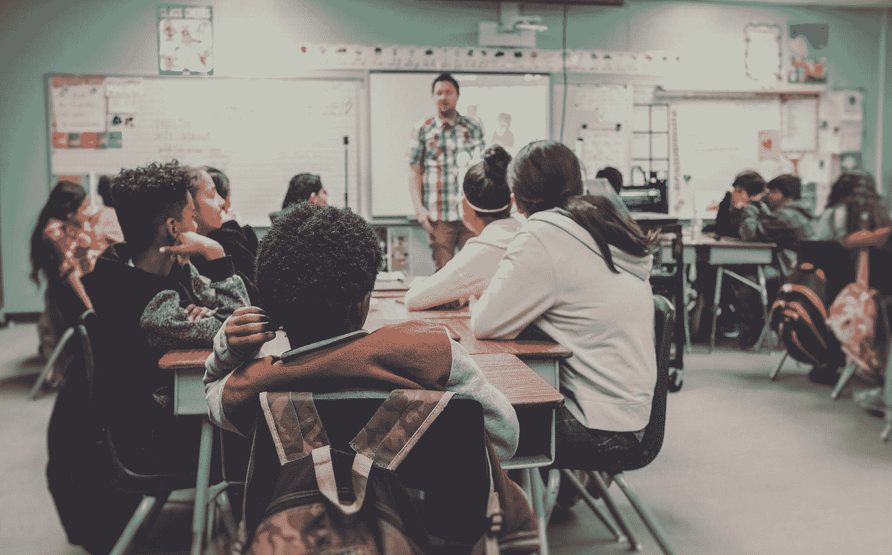

# 学校是在设置学生不及格吗？

> 原文：<https://medium.com/swlh/are-schools-setting-up-students-to-fail-b3084473fdf5>

## 一个简单的战略转变如何能极大地提高下一代的机会

Photo by [NeONBRAND](https://unsplash.com/@neonbrand?utm_source=medium&utm_medium=referral) on [Unsplash](https://unsplash.com?utm_source=medium&utm_medium=referral)

高三的时候，经济老师让全班同学，如果有目标就举手。大多数学生举起了手。然后他让我们如果写下了我们的目标，就一直举着手。我很惊讶我是唯一的…