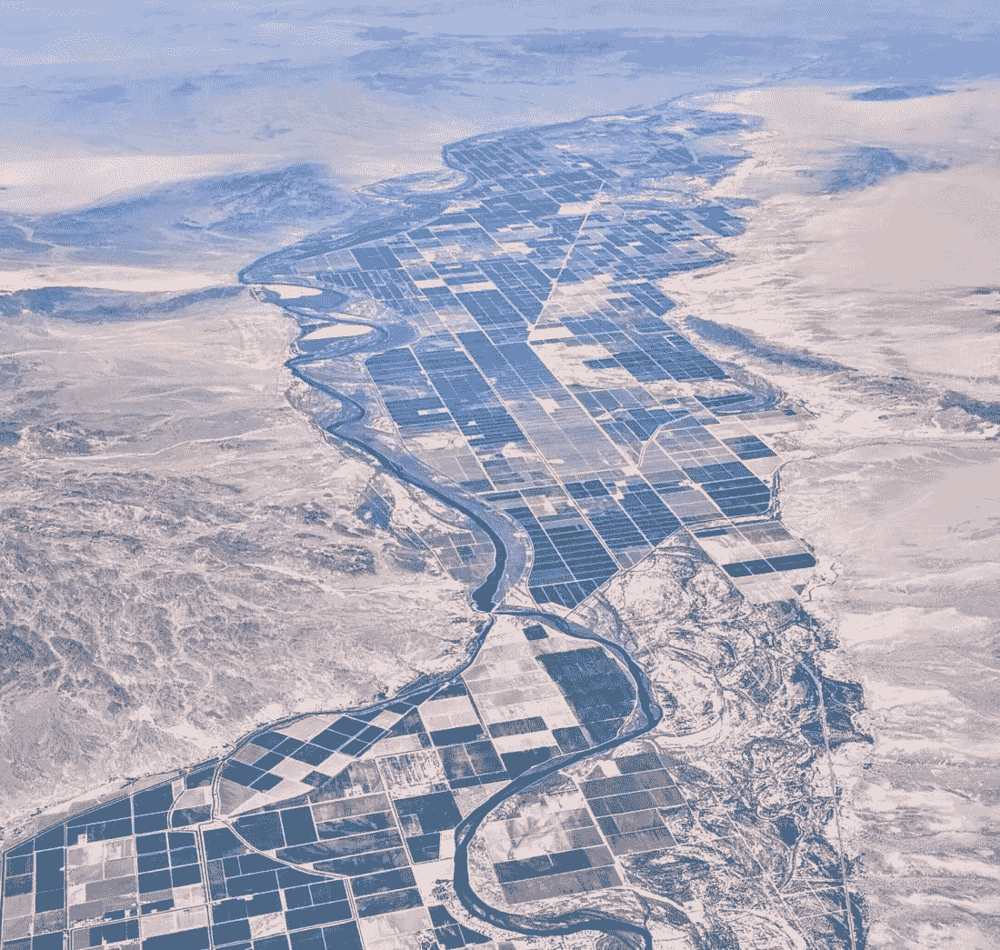

# 沙特人在喝我们的奶昔吗？

> 原文：<https://medium.com/swlh/are-the-saudis-drinking-our-milkshake-d3f7d1e0b75>

`*Photo of the Palo Verde Valley, Calif., Dick Lyon, creativecommons.org*`

一家公开上市的沙特阿拉伯公司 [Almarai](https://www.almarai.com/en/) 在遭受严重干旱的加利福尼亚州帕洛维德山谷拥有水权，国内甚至国际上对该公司的报道有所增加。英国《卫报》最近的一篇[文章](https://www.theguardian.com/us-news/2019/mar/25/california-water-drought-scarce-saudi-arabia)问道:

> **一家外国公司有什么生意可以从美国的沙漠中汲取宝贵的资源来弥补地球另一端的资源短缺？**

如果这个问题要作为一个政策问题来解决，那么任何持久的解决办法都需要更少地被视为一个接近自然资源的问题，而更多地被视为一个获得自然资源是否是一项基本人权的问题。答案并不那么直截了当。

我们都需要饮用水来生存。通过担心谁应该“拥有”对水的权利，我们暗示“权利”是商品。在这个等式中，我们被迫购买生活所需。它不会在那里等着我们，除非我们能生产出有价值的东西来换取它的使用权。但是“权利”在这个国家有着更高的意义，因为宪法保障我们追求幸福的权利。如果我们死了或生病了，我们就不太可能快乐，这就是当我们无法获得饮用水时会发生的事情。

沙特人需要购买水来种植苜蓿来喂养沙特的奶牛。奶牛，在沙漠里。Almarai 是世界上最大的奶牛养殖企业之一，根据其[维基页面](https://en.wikipedia.org/wiki/Almarai)，其*是最大的*垂直整合企业。让它深入人心。奶牛。沙漠。地球上最大的乳品厂。仅 Almarai(这是沙漠中几个这样的牛奶场之一)就有超过 150，000 头牛。空调奶牛？当然了。沙漠。每头牛每天要喝 150 升水。沙漠。你明白了。

紫花苜蓿需要大量的水。沙特阿拉伯是一个沙漠(你知道的)。2016 年，SA 王国宣布种植苜蓿为非法，因为这会耗尽他们的水供应。相反，他们买下了我们的用水权。流经干旱沙漠山谷的水。我们允许无限制地使用水，因为不像沙特人，我们没有对它施加限制，而且考虑到大型农业利益集团的政治影响力——包括 Almarai，它包括 Palo Verde 灌溉区所有水权的 16%——限制不会很快到来，如果有的话。

PVID 是现代的“先到先得奖”,是 19 世纪旧金山的勘探者 Thomas Blythe 从美国联邦政府手中买下的。布莱斯支付了这条河的采矿和农业的专有权，现在，因为这是历史上该州对这条河的水域的第一次所有权，无论谁拥有它，都仍然可以无限制地优先使用这条河。这意味着 PVID 的成员要为每英亩水支付大约 75 美元。正如《卫报》所指出的，这种安排无助于阻止水资源的浪费，因为不管用了多少水，价格都是一样的。

山谷里的农民唯一需要支付的是供水的管理费用。

哦，顺便说一下……科罗拉多河的水位正处于历史最低点。

让我们先回顾一下，看看为什么奶牛生活在沙漠中，为什么沙特人想要我们国家的水供应来维持它们。20 世纪 70 年代末，苏丹·本·穆罕默德·本·沙特·阿尔·卡比尔王子试图在他的国家实现粮食自给自足。由于长距离进口新鲜乳制品是一件棘手的事情，所以沙特沙漠的乳制品行业是否真的是一种自我维持的农业形式，这是一个值得探讨的问题，实现当地乳制品自给自足的唯一途径是从其他地方寻找和进口水和饲料。更具讽刺意味的是，这项技术起源于加利福尼亚和亚利桑那沙漠。

Almarai 在 Palo Verde 山谷有它的粉丝。它是该地区的主要雇主，提供医疗保健计划和假期等福利，它也从其他农场购买苜蓿。这是《卫报》文章中的一段引文

> “沙特人，他们在这里买了一个好价钱，”(帕洛维德灌溉区的助理经理)解释道。“他们和其他人一样。他们买当地的。这对经济来说是一剂强心针。”

但是它做这些“好事”是从一个系统中获利，如果不加以控制，这个系统将会通过抽干水来摧毁山谷。那么谁赢了？要想对沙特和其他中东国家的大型奶牛场所依赖的资源的密集使用有一个惊人的了解，这里是 CNN.com 在 2013 年发表的一篇文章[。就在这个月，](https://www.cnn.com/2013/12/18/world/meast/milking-the-desert-saudi-dairy-farms/index.html)[国家地理](https://www.nationalgeographic.com/environment/freshwater/saudi-arabia-water-use/)报道说，这个王国已经吸干了太多自己的水源来满足它的饮用习惯，那里五分之四的地下淡水供应都在 G-O 东北。我提到过那是一个沙漠吗？因为沙漠很少下雨，国家地理报道:

> 地球上最大、最古老的淡水资源之一，位于地球上最热、最干燥的地方之一，在不到一代人的时间里，就几乎被耗尽了。

Almarai 在亚利桑那州拥有更多的水权，在阿根廷甚至更多，阿根廷也有自己的[水挑战](https://iwa-network.org/water-challenges-in-argentina-development-of-the-national-water-plan/)。尽管沙特否认，但他们被指控在埃塞尔比亚等地寻找水源时严重侵犯了人权。

虽然没有人宣布加州存在侵犯人权的行为，但美国公共卫生杂志报道称，与干旱恐惧直接相关的心理健康问题是真实存在的，并且呈上升趋势。

与此同时，沙特王国推送新闻报道，比如[这篇](http://www.arabnews.com/node/1275981/saudi-arabia)庆祝其*出售给遭受旱灾的加州的海水淡化技术！*

请允许我指出显而易见的事实。这是*疯了*。我们向外国人出售我们的淡水资源，他们可能会也可能不会把我们的最佳利益放在心上，然后我们从他们那里购买海水淡化技术，而我们可能会做的是更好地管理我们刚刚出售给我们的淡水，这些人向我们出售使海洋可以饮用的技术。

这正是我们决策中固有的那种认知失调，让人焦虑沮丧。它还会导致匮乏心理、对他人的怀疑以及对是否有足够食物的担忧。顺便说一句，这不够分给大家的。如果有，那么沙特人就不需要知道如何淡化海水。

硅谷还有其他一些考虑因素。一个是 Almarai 和百事可乐都是总部位于埃及的最大乳制品生产商 [Beyti](https://www.beytiegypt.com/) 的母公司，这使得 Almarai 成为了整合的国际巨头。另一个原因是,[的法律诉讼在 PVID 和代表依赖该区市政供水的各个城市的实体之间飞来飞去。争论的焦点是，这些城市是否在集体购买农田休耕，同时将水引向城市。此外，](https://www.desertsun.com/story/news/environment/2017/09/28/water-fight-california-desert-colorado-river-lawsuit/655630001/)[附近的帝国灌溉区和川普政府最近就总统签署成为法律的干旱计划是否违反加州环境法的问题发生了争执。](https://www.desertsun.com/story/news/environment/2019/04/17/iid-sues-halt-colorado-river-drought-plan-says-mwd-ignored-salton-sea/3496955002/)

这些因素是密切相关的，因为它们是这场争论中更深层次的断层线的表现:我们重视获利的权利胜过生存的权利吗？

重点应该是我们如何定义“权利”这个词。

一旦这位亿万富翁沙特王子在他的祖国建立了食品“可持续性”，不管多么可疑，他继续把他的公司建设成世界上最大和最赚钱的牛奶场——加州人现在正在争夺水，因为加州人把它卖给了他的公司。

为什么他有“权利”要求购买这些水，为什么加利福尼亚人有“权利”出售这些水？当其他人正在为生存而奋斗的时候，任何人都有权利获得指数级的利润吗？因为这些利润的来源被切断了或者受到了极大的限制。如果 PVID 的官员只向致力于可持续水管理实践的组织出售水权，这是否侵犯了任何人的权利？

这些是我们需要解决的真正问题，不仅是在加州，而是作为一个国家。我们如何回答这些问题将决定我们是否能够围绕资源的获取制定有效的政策，或者我们是否会继续让自己变得疯狂。

从*开始会有血:*