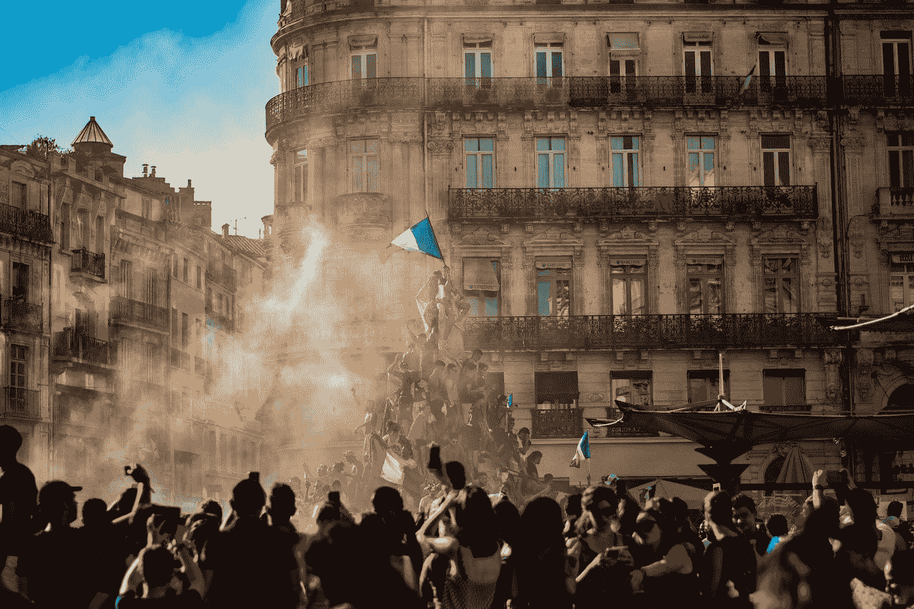

# 我们真的在为正确的英雄喝彩吗？

> 原文：<https://medium.com/swlh/are-we-actually-applauding-the-right-heroes-8e0e346ad2ca>

## 每种文化都有它应得的英雄

Photo by [Pierre Herman](https://unsplash.com/@lepipotron?utm_source=medium&utm_medium=referral) on [Unsplash](https://unsplash.com?utm_source=medium&utm_medium=referral)

法国作家、律师和外交官约瑟夫-玛丽·德·梅斯特(Joseph-Marie de Maistre)当然对这个政治上有趣的时代并不陌生。

作为一个贵族和“反启蒙运动”的关键人物，约瑟夫·德·迈斯特尔经历了法国大革命。